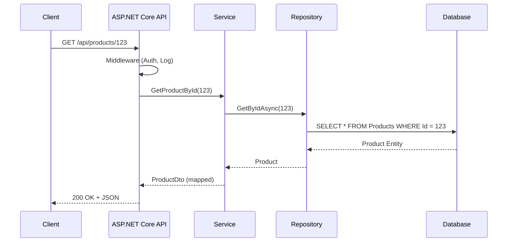

# Mastering C# .NET 2026: จากพื้นฐานสู่ Enterprise Application + Database + Cache + Message Queue

## บทที่ 1: บทนำ – หนังสือเล่มนี้เหมาะกับใคร, ภาพรวม C# .NET 2026, วิธีอ่านหนังสือ, แหล่งอ้างอิง

### 1.1 หนังสือเล่มนี้เหมาะกับใคร

หนังสือ “Mastering C# .NET 2026” ออกแบบสำหรับผู้ที่ต้องการเป็นนักพัฒนา .NET ระดับมืออาชีพ ตั้งแต่เริ่มต้นจนถึงระดับสร้างระบบ Enterprise ที่ใช้ฐานข้อมูลหลายชนิด (SQL Server, Oracle, PostgreSQL, MongoDB), ระบบแคช (Redis), และระบบคิวข้อความ (RabbitMQ)

**กลุ่มเป้าหมาย:**
- นักศึกษาหรือผู้เริ่มต้นที่ต้องการเรียนรู้ C# อย่างเป็นระบบ
- นักพัฒนา .NET ที่มีพื้นฐานแล้วแต่ต้องการเพิ่มทักษะด้านฐานข้อมูล, Cache, Message Queue
- ผู้เตรียมสอบหรือสัมภาษณ์งานด้าน .NET

### 1.2 ภาพรวม C# .NET 2026

C# เป็นภาษาโปรแกรมของ Microsoft ปัจจุบัน (2026) ทำงานบน .NET 9/10 ซึ่งรองรับ Windows, Linux, macOS จุดเด่นคือประสิทธิภาพสูง, ระบบชนิดข้อมูลแข็งแกร่ง, และนิเวศวิทยาสมบูรณ์ (NuGet)

**โครงสร้างหนังสือ 5 ภาค:**

| ภาค | หัวข้อ | บทที่ |
|------|----------------|-------|
| 0 | เครื่องมือและแนวทางการเรียนรู้ | 1–6 |
| 1 | พื้นฐานภาษา C# | 7–84 |
| 2 | ฐานข้อมูลและ ORM | 85–99 |
| 3 | Caching และ Message Queue | 100–112 |
| 4 | หัวข้อขั้นสูง | 113–120 |

### 1.3 วิธีอ่านหนังสือให้ได้ผล

1. อ่านตามลำดับ โดยเฉพาะภาค 1
2. ลงมือเขียนโค้ดทุกตัวอย่าง
3. ทำแบบฝึกหัดท้ายบท (เฉลยในบทที่ 120 และ GitHub)
4. ใช้แหล่งอ้างอิงประกอบ

### 1.4 สัญลักษณ์ในหนังสือ

| สัญลักษณ์ | ความหมาย |
|-----------|-----------|
| 💡 เคล็ดลับ | ข้อแนะนำ |
| ⚠️ ข้อควรระวัง | จุดที่ผิดพลาดบ่อย |
| 📝 หมายเหตุ | ข้อมูลเพิ่มเติม |
| 🧪 แบบฝึกหัด | โจทย์ให้ทำ |
| 🔗 แหล่งอ้างอิง | ลิงก์เอกสาร |

---

## บทที่ 2: นิยามพื้นฐาน – .NET, C#, ORM, DTO, CRUD, Cache, Message Queue, Broker

### 2.1 .NET Runtime และ SDK

**.NET Runtime** (CLR) เป็นเครื่องเสมือนที่รันโค้ด C#, จัดการหน่วยความจำ, เธรด, ข้อยกเว้น **.NET SDK** คือชุดเครื่องมือพัฒนาที่รวมคอมไพลเลอร์, `dotnet` CLI, เทมเพลตโปรเจกต์

### 2.2 C# คืออะไร

C# เป็นภาษาเชิงวัตถุที่ทันสมัย ทำงานบน .NET มีระบบชนิดข้อมูลแข็งแกร่ง, LINQ, async/await, garbage collection

### 2.3 ORM (Object-Relational Mapping)

ORM เชื่อมระหว่าง C# object กับตารางฐานข้อมูล Entity Framework Core เป็น ORM หลักของ .NET

### 2.4 DTO (Data Transfer Object)

DTO เป็นคลาสสำหรับขนส่งข้อมูลระหว่างชั้น ต่างจาก Entity ที่ผูกกับฐานข้อมูล

### 2.5 CRUD

CRUD คือการดำเนินการพื้นฐาน 4 ประการ: Create, Read, Update, Delete

### 2.6 Cache

Cache คือหน่วยความจำเร็วสำหรับเก็บข้อมูลที่เรียกใช้บ่อย ลดภาระฐานข้อมูล

### 2.7 Message Queue และ Broker

Message Queue (RabbitMQ) ช่วยให้ระบบทำงานแบบ asynchronous, decoupling ส่วนประกอบ

### 2.8 ตารางสรุปนิยามพื้นฐาน

| คำศัพท์ | คำอธิบายสั้น |
|---------|--------------|
| .NET | แพลตฟอร์มสำหรับรันแอปพลิเคชัน |
| C# | ภาษาโปรแกรมที่ทำงานบน .NET |
| ORM | ตัวเชื่อม C# object กับฐานข้อมูล |
| DTO | คลาสสำหรับขนส่งข้อมูล |
| CRUD | Create, Read, Update, Delete |
| Cache | หน่วยความจำเร็วเก็บข้อมูลใช้บ่อย |
| Message Queue | คิวสำหรับส่งข้อความ asynchronous |
| Broker | ตัวกลางจัดการคิวข้อความ |

---

## บทที่ 3: หัวข้อสำคัญของหนังสือ (Roadmap)

### 3.1 สายงานนักพัฒนา .NET

- **Backend API** – ASP.NET Core, EF Core, Redis, RabbitMQ
- **Full-stack** – Angular + ASP.NET Core
- **Desktop** – WPF, MVVM
- **Game** – Unity
- **Cloud/DevOps** – Docker, CI/CD

### 3.2 สถาปัตยกรรมซอฟต์แวร์

| คุณสมบัติ | Monolith | Modular Monolith | Microservices |
|-----------|----------|------------------|---------------|
| ความซับซ้อน | ต่ำ | ปานกลาง | สูง |
| การปรับขนาด scale | ทั้งแอป | ทั้งแอป | แต่ละ service |
| เหมาะกับทีม | 1-5 คน | 5-20 คน | 20+ คน |

### 3.3 ฐานข้อมูลที่ใช้ในหนังสือ

| ฐานข้อมูล | Type | License | .NET Provider | EF Core |
|-----------|------|---------|---------------|---------|
| SQL Server | RDBMS | Commercial | SqlClient | ✅ |
| Oracle | RDBMS | Commercial | Oracle.ManagedDataAccess | ✅ |
| PostgreSQL | RDBMS | Open source | Npgsql | ✅ |
| MongoDB | NoSQL | Open source | MongoDB.Driver | ❌ (third-party) |

### 3.4 Redis Use Cases

- Cache (String + TTL)
- Rate limiting (INCR + EXPIRE)
- Leaderboard (Sorted Set)
- Pub/Sub (real-time notification)
- Distributed lock (SETNX)

### 3.5 RabbitMQ Exchange Types

| Exchange | Routing logic | ใช้เมื่อ |
|----------|---------------|---------|
| Direct | routing key == binding key | แยกตาม severity |
| Fanout | ignore routing key, ส่งทุก queue | broadcast |
| Topic | wildcard matching | ระบบ log ที่ซับซ้อน |
| Headers | match header attributes | advanced routing |

### 3.6 Testing – ประเภทและแนวปฏิบัติ

- **Unit Test** – ทดสอบเมธอดเดี่ยว (xUnit, NUnit)
- **Integration Test** – ทดสอบการเชื่อมต่อ DB, API (Testcontainers)
- **TDD** – Red-Green-Refactor

---

## บทที่ 4: การออกแบบคู่มือ

### 4.1 รูปแบบโครงสร้างหนังสือ

แต่ละบทประกอบด้วย:
1. หัวข้อหลัก + สารบัญย่อย
2. คำอธิบายแนวคิด
3. ตัวอย่างโค้ดที่รันได้จริง
4. ตารางสรุป
5. แบบฝึกหัด 3–5 ข้อ
6. แหล่งอ้างอิง
7. สรุปท้ายบท

### 4.2 สัญลักษณ์ที่ใช้

| สัญลักษณ์ | ความหมาย |
|-----------|-----------|
| 💡 | เคล็ดลับ |
| ⚠️ | ข้อควรระวัง |
| 📝 | หมายเหตุ |
| 🧪 | แบบฝึกหัด |
| 🔗 | แหล่งอ้างอิง |
| ✅ | จุดตรวจสอบ |
| ⭐ | หัวข้อสำคัญ |

### 4.3 มาตรฐานการเขียนโค้ด

- **PascalCase** – คลาส, เมธอด, property
- **camelCase** – ตัวแปรท้องถิ่น, พารามิเตอร์
- **_camelCase** – ฟิลด์ private
- **Allman braces** – วงเล็บปีกกาขึ้นบรรทัดใหม่
- **4 spaces** – การย่อหน้า

---

## บทที่ 5: การออกแบบ Workflow สำหรับนักพัฒนา

### 5.1 Git Workflow

**Git Flow** (เหมาะกับ release เป็นรอบ): main, develop, feature/*, release/*, hotfix/*
**GitHub Flow** (เหมาะกับ deploy บ่อย): main เท่านั้น, feature branches แล้ว merge ผ่าน PR

### 5.2 CI/CD Workflow (GitHub Actions)

```yaml
name: .NET Build and Test
on: [push, pull_request]
jobs:
  build:
    steps:
    - uses: actions/checkout@v4
    - name: Setup .NET
      uses: actions/setup-dotnet@v4
      with: { dotnet-version: '9.0.x' }
    - run: dotnet restore
    - run: dotnet build --configuration Release
    - run: dotnet test
```

### 5.3 Testing Workflow – TDD (Red-Green-Refactor)

1. **Red** – เขียน test ที่ล้มเหลว
2. **Green** – เขียนโค้ดน้อยที่สุดให้ test ผ่าน
3. **Refactor** – ปรับปรุงโค้ดโดย test ยังผ่าน

### 5.4 เทมเพลต Task List และ Checklist

(ดาวน์โหลดจาก GitHub repository)

---

## บทที่ 6: แผนภาพการทำงาน + Dataflow Diagram ด้วย Draw.io

### 6.1 สัญลักษณ์ Flowchart

| สัญลักษณ์ (ASCII) | ชื่อ | ความหมาย |
|-------------------|------|----------|
| ▭ (สี่เหลี่ยม) | Process | การทำงาน |
| ◇ (ขนมเปียกปูน) | Decision | จุดตัดสินใจ |
| ⬭ (วงรี) | Terminator | เริ่ม/จบ |
| ▭ (ขอบขนาน) | Database | ฐานข้อมูล |
| → (ลูกศร) | Flow Line | ลำดับการไหล |

### 6.2 ตัวอย่าง Dataflow Diagram (HTTP Request → Response)



---

(จบภาค 0 – บทที่ 1–6)

**โปรดแจ้ง "ต่อไป" เพื่อรับบทที่ 7–20 ในข้อความถัดไปครับ**