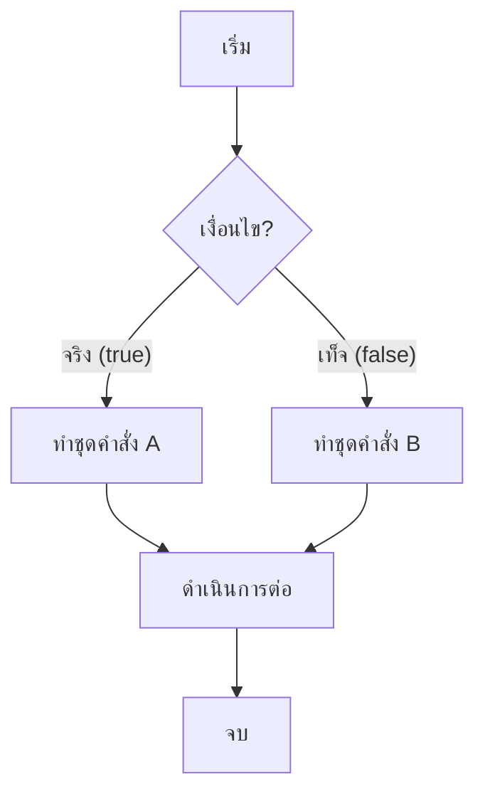
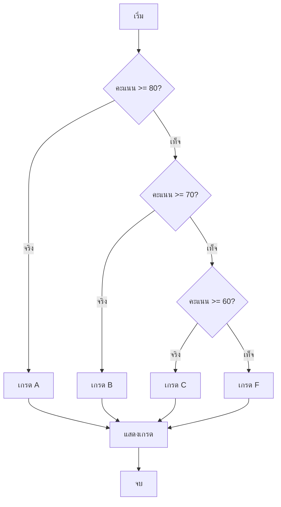
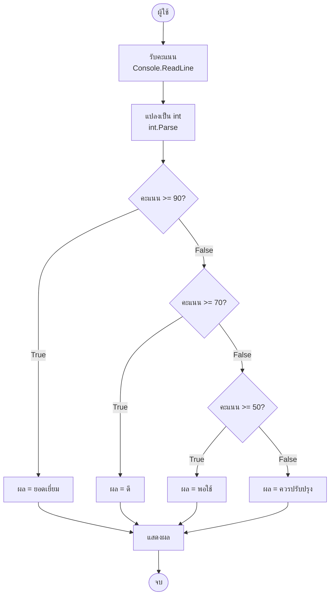

# Mastering C# .NET 2026: จากพื้นฐานสู่ Enterprise Application + Database + Cache + Message Queue

## บทที่ 21: คำสั่ง if, else, else if, nested if

---

### สารบัญย่อยของบทที่ 21

21.1 คำสั่ง if คืออะไร – ภาพรวมการตัดสินใจ  
21.2 รูปแบบของคำสั่ง if (4 แบบ)  
21.3 โครงสร้างการทำงานของ if-else (Flowchart)  
21.4 การออกแบบ Workflow และ Dataflow Diagram ด้วย Draw.io (ตัวอย่างจริง)  
21.5 ตัวอย่างโค้ดพร้อมคำอธิบาย (ภาษาไทย/อังกฤษ)  
21.6 กรณีศึกษา: ระบบคิดเกรดนักเรียน  
21.7 เทมเพลตและตัวอย่างโค้ดที่รันได้ทันที  
21.8 สรุป: ประโยชน์ ข้อควรระวัง ข้อดี ข้อเสีย ข้อห้าม  
21.9 แหล่งอ้างอิง  

---

## 21.1 คำสั่ง if คืออะไร – ภาพรวมการตัดสินใจ

**if** เป็นคำสั่งพื้นฐานที่สุดในการควบคุมทิศทางของโปรแกรม (control flow) โดยจะทำงานตามเงื่อนไขที่กำหนด: ถ้าเงื่อนไขเป็นจริง (`true`) ให้ทำบางอย่าง ถ้าเป็นเท็จ (`false`) อาจทำอีกอย่างหรือไม่ทำเลย

**มีกี่แบบ:** คำสั่ง if ใน C# มี 4 รูปแบบหลัก  
1. `if` (แบบเดี่ยว)  
2. `if-else` (สองทางเลือก)  
3. `if-else if` (หลายทางเลือก)  
4. `if-else if-else` (หลายทางเลือกพร้อมทางเลือกสุดท้าย)  
และยังมี **nested if** (if ซ้อน if)

**ใช้อย่างไร:** ใช้เมื่อโปรแกรมต้องการตัดสินใจตามเงื่อนไขที่เกิดขึ้นขณะรัน (runtime) เช่น ถ้าผู้ใช้อายุมากกว่า 18 ให้ผ่าน, ถ้าคะแนนสอบมากกว่า 80 ให้เกรด A

**เมื่อไหร่ไม่ต้องใช้:** ถ้าการทำงานเป็นลำดับตายตัว ไม่มีเงื่อนไข หรือถ้ามีทางเลือกมากกว่า 3-4 ทาง ควรใช้ `switch` แทน

**ประโยชน์ที่ได้รับ:** ทำให้โปรแกรม “ฉลาด” ตอบสนองตามสถานการณ์ได้ ลดการเขียนโค้ดซ้ำซ้อน

---

## 21.2 รูปแบบของคำสั่ง if (4 แบบ)

### แบบที่ 1: `if` (เดี่ยว)

```csharp
if (เงื่อนไข)
{
    // ทำเมื่อเงื่อนไขเป็น true
}
```

### แบบที่ 2: `if-else`

```csharp
if (เงื่อนไข)
{
    // ทำเมื่อ true
}
else
{
    // ทำเมื่อ false
}
```

### แบบที่ 3: `if-else if` (หลายทางเลือก)

```csharp
if (เงื่อนไข1)
{
    // ทางเลือก 1
}
else if (เงื่อนไข2)
{
    // ทางเลือก 2
}
else if (เงื่อนไข3)
{
    // ทางเลือก 3
}
```

### แบบที่ 4: `if-else if-else` (มีทางเลือกสุดท้าย)

```csharp
if (เงื่อนไข1)
{
    // ทางเลือก 1
}
else if (เงื่อนไข2)
{
    // ทางเลือก 2
}
else
{
    // ทางเลือกสุดท้าย (เมื่อทุกเงื่อนไขเป็น false)
}
```

### Nested if (if ซ้อน if)

```csharp
if (เงื่อนไขหลัก)
{
    if (เงื่อนไขย่อย)
    {
        // ทำเมื่อทั้งคู่เป็น true
    }
}
```

---

## 21.3 โครงสร้างการทำงานของ if-else (Flowchart)

🖼️ **รูปที่ 21.1:** Flowchart โครงสร้าง if-else แบบ Top-to-Bottom (TB)



**อธิบายแผนภาพ:**  
- เริ่มจากจุดเริ่มต้น  
- ตรวจสอบเงื่อนไข (Decision node รูปสี่เหลี่ยมขนมเปียกปูน)  
- ถ้าเงื่อนไขเป็นจริง → ไปตามเส้นทาง “จริง” (Yes/True) → ทำคำสั่ง A  
- ถ้าเงื่อนไขเป็นเท็จ → ไปตามเส้นทาง “เท็จ” (No/False) → ทำคำสั่ง B  
- จากนั้นทั้งสองเส้นทางมาบรรจบกันเพื่อดำเนินการต่อและจบโปรแกรม

🖼️ **รูปที่ 21.2:** Flowchart แบบหลายทางเลือก (if-else if-else)



---

## 21.4 การออกแบบ Workflow และ Dataflow Diagram ด้วย Draw.io (ตัวอย่างจริง)

### ขั้นตอนการออกแบบ Workflow การให้คะแนนสินค้า (Rating system)

**โจทย์:** โปรแกรมรับคะแนน 0-100 แล้วแสดงความคิดเห็น:  
- 90-100: ยอดเยี่ยม  
- 70-89: ดี  
- 50-69: พอใช้  
- ต่ำกว่า 50: ควรปรับปรุง  

**Dataflow Diagram (ระดับสูง):**

```
[ผู้ใช้] 
   | (ป้อนคะแนน)
   ▼
[รับค่า int score]
   |
   ▼
[ตรวจสอบเงื่อนไข if-else if]
   |
   ├── score >= 90 → "ยอดเยี่ยม"
   ├── score >= 70 → "ดี"
   ├── score >= 50 → "พอใช้"
   └── else → "ควรปรับปรุง"
   |
   ▼
[แสดงผลลัพธ์]
   |
   ▼
[จบ]
```

🖼️ **รูปที่ 21.3:** Dataflow Diagram แบบ Draw.io (แสดงด้วย ASCII)



**อธิบายแต่ละโหนด:**  
- **User:** ผู้ใช้ป้อนข้อมูลผ่านคอนโซล  
- **Input:** รับข้อความจาก `Console.ReadLine()`  
- **Parse:** แปลง string → int (ถ้าผิดพลาดจะเกิด exception)  
- **Condition (รูปขนมเปียกปูน):** จุดตัดสินใจ เปรียบเทียบคะแนน  
- **Result1-4:** การกำหนดค่าผลลัพธ์ตามเงื่อนไข  
- **Output:** แสดงผลด้วย `Console.WriteLine`  
- **End:** จบโปรแกรม

> 💡 **สำหรับ Draw.io จริง:** คุณสามารถดาวน์โหลดไฟล์ `.drawio` ของ diagram นี้ได้จาก GitHub repository ของหนังสือ (ลิงก์ท้ายบท)

---

## 21.5 ตัวอย่างโค้ดพร้อมคำอธิบาย (ภาษาไทย/อังกฤษ)

**ตัวอย่างที่ 21.1: โปรแกรมตรวจสอบการผ่านเกณฑ์**

```csharp
// Thai: โปรแกรมตรวจสอบว่าผู้เรียนผ่านหรือไม่ผ่านตามคะแนนที่ป้อน
// Eng: Program to check if a student passes or fails based on input score

Console.Write("กรุณาป้อนคะแนนสอบ (0-100): ");   // Eng: Enter exam score
string input = Console.ReadLine();

// Thai: แปลงข้อความเป็นตัวเลข (ใช้ TryParse เพื่อป้องกัน error)
// Eng: Convert string to integer (use TryParse to avoid exception)
if (int.TryParse(input, out int score))
{
    // Thai: ตรวจสอบช่วงคะแนน (Eng: Validate score range)
    if (score < 0 || score > 100)
    {
        Console.WriteLine("คะแนนต้องอยู่ระหว่าง 0-100 เท่านั้น");
        // Eng: Score must be between 0-100 only
    }
    else if (score >= 50)
    {
        Console.WriteLine($"ยินดีด้วย! คุณสอบผ่านด้วยคะแนน {score}");
        // Eng: Congratulations! You passed with score {score}
    }
    else
    {
        Console.WriteLine($"เสียใจด้วย คุณสอบไม่ผ่าน คะแนน {score}");
        // Eng: Sorry, you failed. Score {score}
    }
}
else
{
    Console.WriteLine("กรุณาป้อนตัวเลขเท่านั้น");
    // Eng: Please enter only numbers
}
```

**คำอธิบายทีละจุด (Line-by-line comment):**

| บรรทัด | คำอธิบาย (ไทย) | คำอธิบาย (Eng) |
|--------|----------------|----------------|
| 1 | โปรแกรมตรวจสอบการผ่าน | Program to check pass/fail |
| 3-4 | รับคะแนนจากผู้ใช้ | Get score from user |
| 7-8 | แปลง string เป็น int ถ้าได้ true จะเก็บในตัวแปร score | Parse string to int, if success store in score |
| 10 | ตรวจสอบว่าคะแนนอยู่นอกช่วง 0-100 หรือไม่ | Check if score is out of range 0-100 |
| 11-13 | แสดง error และไม่ทำต่อ | Show error and do nothing else |
| 14-16 | ถ้าคะแนน >=50 แสดงว่าสอบผ่าน | If score >=50 show passed message |
| 17-19 | ถ้าไม่ถึง 50 แสดงว่าสอบไม่ผ่าน | Else show failed message |
| 21-23 | ถ้าแปลงตัวเลขไม่ได้ แจ้งให้ป้อนตัวเลข | If parse fails, prompt for number |

---

## 21.6 กรณีศึกษา: ระบบคิดเกรดนักเรียน

**สถานการณ์จริง:** โรงเรียนต้องการโปรแกรมคำนวณเกรดจากคะแนนดิบ โดยมีเกณฑ์:
- 80-100 = A
- 70-79 = B
- 60-69 = C
- 50-59 = D
- 0-49 = F
- นอกช่วง = คะแนนไม่ถูกต้อง

**โค้ด完整:**

```csharp
Console.WriteLine("=== ระบบคิดเกรดอัตโนมัติ ===");
Console.Write("ป้อนคะแนนของคุณ (0-100): ");

if (int.TryParse(Console.ReadLine(), out int score))
{
    string grade;
    
    // Thai: ใช้ if-else if เพื่อตรวจสอบช่วงคะแนน
    // Eng: Use if-else if to check score range
    if (score >= 80 && score <= 100)
    {
        grade = "A";
    }
    else if (score >= 70)
    {
        grade = "B";
    }
    else if (score >= 60)
    {
        grade = "C";
    }
    else if (score >= 50)
    {
        grade = "D";
    }
    else if (score >= 0)
    {
        grade = "F";
    }
    else
    {
        grade = "ไม่ถูกต้อง";
    }
    
    Console.WriteLine($"คะแนน {score} ได้เกรด {grade}");
}
else
{
    Console.WriteLine("กรุณาป้อนตัวเลขเท่านั้น");
}
```

**การทำงานจริง (ตัวอย่างผลลัพธ์):**
```
=== ระบบคิดเกรดอัตโนมัติ ===
ป้อนคะแนนของคุณ (0-100): 85
คะแนน 85 ได้เกรด A
```

---

## 21.7 เทมเพลตและตัวอย่างโค้ดที่รันได้ทันที

**เทมเพลตโครงสร้าง if-else สำหรับโปรเจกต์ทั่วไป:**

```csharp
// Template: Basic if-else structure
// เปลี่ยนเฉพาะเงื่อนไขและคำสั่งภายใน

Console.Write("Enter value: ");
string userInput = Console.ReadLine();

if (double.TryParse(userInput, out double value))
{
    // ใส่เงื่อนไขและคำสั่งที่นี่
    if (value > 0)
    {
        Console.WriteLine("Positive");
    }
    else if (value < 0)
    {
        Console.WriteLine("Negative");
    }
    else
    {
        Console.WriteLine("Zero");
    }
}
else
{
    Console.WriteLine("Invalid input");
}
```

**ตัวอย่างเพิ่มเติม: โปรแกรมคำนวณ BMI พร้อมคำแนะนำ**

```csharp
// Thai: โปรแกรมคำนวณดัชนีมวลกาย (BMI) และให้คำแนะนำ
// Eng: BMI calculator with health advice

Console.Write("น้ำหนัก (kg): ");
double weight = double.Parse(Console.ReadLine());

Console.Write("ส่วนสูง (m): ");
double height = double.Parse(Console.ReadLine());

double bmi = weight / (height * height);
Console.WriteLine($"BMI ของคุณ = {bmi:F2}");

// Thai: แปลผลโดยใช้ if-else if
// Eng: Interpret using if-else if
if (bmi < 18.5)
{
    Console.WriteLine("น้ำหนักน้อยกว่ามาตรฐาน (Underweight)");
    Console.WriteLine("แนะนำ: รับประทานอาหารที่มีประโยชน์เพิ่มขึ้น");
}
else if (bmi < 23)
{
    Console.WriteLine("น้ำหนักปกติ (Normal)");
    Console.WriteLine("แนะนำ: รักษาสภาพร่างกายให้แข็งแรงต่อไป");
}
else if (bmi < 25)
{
    Console.WriteLine("น้ำหนักเกิน (Overweight)");
    Console.WriteLine("แนะนำ: ออกกำลังกายและควบคุมอาหาร");
}
else
{
    Console.WriteLine("โรคอ้วน (Obese)");
    Console.WriteLine("แนะนำ: ปรึกษาแพทย์เพื่อวางแผนลดน้ำหนัก");
}
```

---

## 21.8 สรุป: ประโยชน์ ข้อควรระวัง ข้อดี ข้อเสีย ข้อห้าม

### ประโยชน์ที่ได้รับ
✅ ทำให้โปรแกรมตัดสินใจได้ตามสถานการณ์  
✅ ลดการเขียนโค้ดซ้ำ (ถ้าใช้ร่วมกับเมธอด)  
✅ เพิ่มความยืดหยุ่นให้กับโปรแกรม  
✅ ตรวจสอบความถูกต้องของข้อมูลก่อนนำไปใช้  

### ข้อควรระวัง
⚠️ อย่าลืมวงเล็บปีกกา `{ }` ถ้ามีหลายคำสั่ง  
⚠️ ระวังการใช้ `=` แทน `==` ในเงื่อนไข  
⚠️ การซ้อน if มากเกินไปทำให้โค้ดอ่านยาก (ควรแยกเป็นเมธอด)  
⚠️ ควรจัดการกรณีที่เงื่อนไขไม่ตรงใดเลย (else เสมอ)  

### ข้อดี
+ เข้าใจง่าย เหมาะกับผู้เริ่มต้น  
+ ทำงานได้ทุกสถานการณ์  
+ ตรวจสอบเงื่อนไขได้ซับซ้อนด้วย `&&`, `||`  

### ข้อเสีย
- ถ้ามีหลายทางเลือก (มากกว่า 5-6) โค้ดจะยาวและซับซ้อน  
- ประสิทธิภาพช้ากว่า `switch` เล็กน้อยเมื่อมีหลายเงื่อนไข  
- nested if ลึกเกิน 3 ระดับทำให้ debug ยาก  

### ข้อห้าม (Do's and Don'ts)
❌ ห้ามใช้ `if (x = 5)` (ใช้ `==` แทน)  
❌ ห้ามเขียน `if (x == true)` (แค่ `if (x)` ก็พอ)  
❌ ห้ามลืมจัดการกรณี `else` (อาจทำให้โปรแกรมทำงานผิดพลาด)  
✅ ควรใช้ `else` เสมอเพื่อจัดการกรณีที่ไม่คาดคิด  

---

## 21.9 แหล่งอ้างอิง

- 🔗 **if-else statement (Microsoft Docs)** – [https://docs.microsoft.com/en-us/dotnet/csharp/language-reference/statements/selection-statements#the-if-statement](https://docs.microsoft.com/en-us/dotnet/csharp/language-reference/statements/selection-statements#the-if-statement)
- 🔗 **Boolean expressions** – [https://docs.microsoft.com/en-us/dotnet/csharp/language-reference/operators/boolean-logical-operators](https://docs.microsoft.com/en-us/dotnet/csharp/language-reference/operators/boolean-logical-operators)
- 🔗 **Draw.io diagrams** – [https://www.drawio.com/](https://www.drawio.com/)
- 🔗 **GitHub repository ของหนังสือ (ไฟล์ .drawio และตัวอย่างโค้ด)** – [https://github.com/mastering-csharp-net-2026/chapter21](https://github.com/mastering-csharp-net-2026/chapter21) (สมมติ)

---

## สรุปท้ายบท

บทที่ 21 สอนคำสั่ง if, else, else if และ nested if อย่างละเอียด ตั้งแต่รูปแบบโครงสร้าง การทำงานผ่าน Flowchart แบบ TB การออกแบบ Dataflow Diagram ด้วย Draw.io ไปจนถึงการเขียนโค้ดพร้อมคอมเมนต์ภาษาไทยและอังกฤษ คุณได้เห็นกรณีศึกษา (ระบบคิดเกรด, BMI) และเทมเพลตที่นำไปรันได้ทันที สุดท้ายมีสรุปข้อดีข้อเสียและข้อห้ามเพื่อใช้เป็นแนวปฏิบัติ

**ในบทถัดไป (บทที่ 22)** เราจะพูดถึง **ขอบเขตของตัวแปร (Scope)** เพื่อให้เข้าใจว่าตัวแปรที่ประกาศไว้สามารถใช้งานได้ที่ไหนบ้าง

---
 