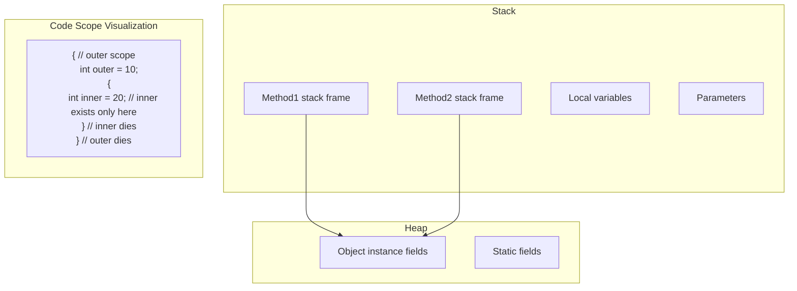
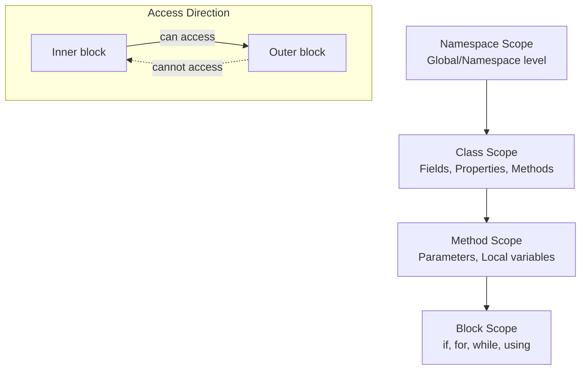
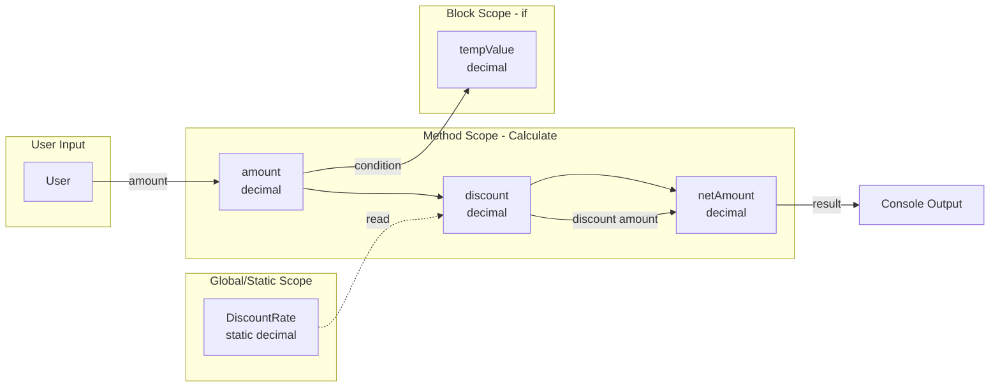

# Mastering C# .NET 2026: จากพื้นฐานสู่ Enterprise Application + Database + Cache + Message Queue

## บทที่ 22: ขอบเขตของตัวแปร (Scope)

---

### สารบัญย่อยของบทที่ 22

22.1 ขอบเขตของตัวแปร (Scope) คืออะไร  
22.2 ขอบเขตของตัวแปรมีกี่แบบ (Types of Scope)  
22.3 ใช้อย่างไร – กฎการเข้าถึงตัวแปรแต่ละประเภท  
22.4 เมื่อไหร่ใช้ เมื่อไหร่ไม่ใช้ – หลักการเลือกใช้  
22.5 ประโยชน์ที่ได้รับจากความเข้าใจ Scope  
22.6 โครงสร้างการทำงานของ Scope (Memory View)  
22.7 การออกแบบ Workflow และ Dataflow Diagram ด้วย Draw.io  
22.8 ตัวอย่างโค้ดพร้อมคำอธิบายภาษาไทยและภาษาอังกฤษ  
22.9 กรณีศึกษาและแนวทางแก้ไขปัญหาที่เกิดขึ้น  
22.10 เทมเพลตและตัวอย่างโค้ดที่รันได้ทันที  
22.11 สรุป: ประโยชน์ ข้อควรระวัง ข้อดี ข้อเสีย ข้อห้าม  
22.12 แหล่งอ้างอิง  

---

## 22.1 ขอบเขตของตัวแปร (Scope) คืออะไร

**ขอบเขตของตัวแปร (Variable Scope)** คือบริเวณหรือขอบเขตในโค้ดที่ตัวแปรสามารถถูกเข้าถึงได้ (accessible) และมีชีวิตอยู่ (alive) ตัวแปรที่ประกาศไว้ใน C# จะไม่สามารถเข้าถึงได้จากทุกที่ในโปรแกรม แต่จะเข้าถึงได้เฉพาะภายในขอบเขตที่มันถูกประกาศเท่านั้น

เปรียบเสมือน **ห้อง** ในบ้าน: ของในห้องนอนใช้ได้เฉพาะในห้องนอน (หรือห้องที่อนุญาต) ไม่สามารถหยิบของในห้องนอนไปใช้ในห้องครัวได้โดยตรง เว้นแต่จะส่งผ่านมาให้

```csharp
// ตัวอย่าง: ตัวแปรใน { } นี้ใช้ได้เฉพาะใน { } นี้
{
    int x = 10;   // x เกิดที่นี่
    Console.WriteLine(x); // ใช้ได้
}
// Console.WriteLine(x); // Error! x ไม่มีอยู่นอก scope
```

> 💡 **เคล็ดลับ:** จำไว้ว่า `{ }` (วงเล็บปีกกา) คือตัวกำหนดขอบเขต (scope boundary) ทุกครั้งที่เปิด `{` จะเริ่ม scope ใหม่ และปิด `}` จะสิ้นสุด scope

---

## 22.2 ขอบเขตของตัวแปรมีกี่แบบ (Types of Scope)

ใน C# ขอบเขตของตัวแปรแบ่งเป็น **4 แบบหลัก** ตามตำแหน่งที่ประกาศ:

| ลำดับ | ประเภท Scope | ตำแหน่งประกาศ | ระดับการเข้าถึง | อายุ (Lifetime) |
|--------|--------------|----------------|----------------|------------------|
| 1 | **Local Scope** (ขอบเขตท้องถิ่น) | ภายในเมธอด, constructor, หรือ property | เฉพาะในบล็อก `{ }` นั้น | ตั้งแต่ประกาศจนออกจากบล็อก |
| 2 | **Block Scope** (ขอบเขตบล็อก) | ภายใน `{ }` ของ `if`, `for`, `while` ฯลฯ | เฉพาะในบล็อกนั้น (รวมถึงบล็อกย่อย) | ตั้งแต่ประกาศจนออกจากบล็อก |
| 3 | **Method/Parameter Scope** | พารามิเตอร์ของเมธอด | ทั่วทั้งเมธอด | ตลอดการเรียกเมธอด |
| 4 | **Class/Instance Scope** (Field) | ภายในคลาส (นอกเมธอด) | ทั่วทั้งคลาส (ขึ้นกับ access modifier) | ตลอดอายุของออบเจ็กต์ |
| 5 | **Static Scope** | `static` field/property | ทั่วทั้งคลาส (ไม่ต้องสร้าง instance) | ตลอดอายุของโปรแกรม |
| 6 | **Global/Namespace Scope** | ภายใน namespace (ระดับไฟล์) | ทั่วทั้ง namespace (ถ้า `internal` หรือ `public`) | ตลอดอายุของโปรแกรม |

**หมายเหตุ:** C# ไม่มี “global variable” แบบภาษา C แต่สามารถจำลองได้ด้วย `public static class`

---

### 22.2.1 Local Scope (ขอบเขตท้องถิ่น)

ตัวแปรที่ประกาศภายในเมธอด จะใช้ได้เฉพาะภายในเมธอดนั้น (หรือบล็อกย่อย)

```csharp
void MyMethod()
{
    int localVar = 10;     // local scope: ใช้ได้ทั้งเมธอด
    if (true)
    {
        int blockVar = 20;  // block scope: ใช้ได้เฉพาะใน if
        Console.WriteLine(localVar);  // OK
        Console.WriteLine(blockVar);  // OK
    }
    // Console.WriteLine(blockVar);  // Error! blockVar ไม่มีแล้ว
    Console.WriteLine(localVar);  // OK
}
```

### 22.2.2 Block Scope (ขอบเขตบล็อก)

ตัวแปรที่ประกาศภายใน `{ }` ของ `if`, `for`, `while`, `using` ฯลฯ จะใช้ได้เฉพาะภายในบล็อกนั้น

```csharp
for (int i = 0; i < 5; i++)   // i มี scope เฉพาะใน for loop
{
    Console.WriteLine(i);
}
// Console.WriteLine(i);  // Error! i ไม่มีแล้ว

if (true)
{
    int temp = 100;
    Console.WriteLine(temp);
}
// Console.WriteLine(temp); // Error! temp ไม่มีแล้ว
```

### 22.2.3 Method/Parameter Scope (พารามิเตอร์)

พารามิเตอร์ของเมธอดมี scope ทั่วทั้งเมธอด

```csharp
void Greet(string name, int age)   // name และ age ใช้ได้ทั้งเมธอด
{
    Console.WriteLine($"Hello {name}");
    Console.WriteLine($"You are {age} years old");
    // name และ age ไม่สามารถเข้าถึงจากนอกเมธอดนี้ได้
}
```

### 22.2.4 Class/Instance Scope (Field)

ตัวแปรที่ประกาศภายในคลาส (นอกเมธอด) เรียกว่า **field** มี scope ทั่วทั้งคลาส

```csharp
class Person
{
    private string name;     // instance field: ใช้ได้ทุกเมธอดในคลาส
    private int age;         // instance field
    
    public void SetName(string newName)
    {
        name = newName;      // เข้าถึง field ได้
    }
    
    public void Display()
    {
        Console.WriteLine($"{name}, {age}");  // เข้าถึงได้
    }
}
```

### 22.2.5 Static Scope

`static` field มี scope ทั่วทั้งคลาส แต่ไม่ต้องสร้าง instance และมีอายุตลอดโปรแกรม

```csharp
class Counter
{
    public static int GlobalCount = 0;   // static field
    
    public void Increment()
    {
        GlobalCount++;    // เข้าถึง static field จาก instance method ได้
    }
}

// การเข้าถึง: ไม่ต้องสร้าง object
Counter.GlobalCount = 100;
Console.WriteLine(Counter.GlobalCount);
```

### 22.2.6 Namespace Scope (ระดับไฟล์)

ตัวแปรระดับ namespace ทำได้โดยใช้ `internal` หรือ `public` class พร้อม static member

```csharp
namespace MyApp.Globals
{
    public static class AppConfig
    {
        public static string AppName = "MyApp";
        public static int Version = 2026;
    }
}

// ที่อื่น
Console.WriteLine(MyApp.Globals.AppConfig.AppName);
```

---

## 22.3 ใช้อย่างไร – กฎการเข้าถึงตัวแปรแต่ละประเภท

### กฎข้อที่ 1: ตัวแปร local และ block เข้าถึงได้จากภายในเท่านั้น

```csharp
{
    int inside = 5;
    // ใช้ inside ได้
}
// ใช้ inside ไม่ได้
```

### กฎข้อที่ 2: บล็อกชั้นในสามารถเข้าถึงตัวแปรของบล็อกชั้นนอกได้

```csharp
int outer = 10;
{
    int inner = 20;
    Console.WriteLine(outer);  // OK: เข้าถึงตัวแปรชั้นนอก
    Console.WriteLine(inner);  // OK
}
Console.WriteLine(outer);  // OK
// Console.WriteLine(inner);  // Error
```

### กฎข้อที่ 3: บล็อกชั้นนอกไม่สามารถเข้าถึงตัวแปรของบล็อกชั้นในได้

```csharp
{
    int inner = 20;
}
// Console.WriteLine(inner);  // Error: inner ไม่มีแล้ว
```

### กฎข้อที่ 4: ไม่สามารถประกาศตัวแปรซ้ำ (duplicate) ใน scope เดียวกัน

```csharp
int x = 5;
// int x = 10;  // Error: x already defined
{
    int x = 10;  // OK: เป็นคนละ scope (shadowing)
    Console.WriteLine(x);  // 10
}
Console.WriteLine(x);  // 5
```

### กฎข้อที่ 5: ตัวแปร local ต้องถูกกำหนดค่าก่อนใช้งาน

```csharp
int y;           // ประกาศแต่ยังไม่กำหนดค่า
// Console.WriteLine(y);  // Error: use of unassigned local variable
y = 10;          // กำหนดค่าทีหลัง
Console.WriteLine(y);  // OK
```

### กฎข้อที่ 6: ตัวแปร field มีค่าเริ่มต้นอัตโนมัติ

```csharp
class MyClass
{
    int number;      // มีค่าเริ่มต้น = 0 (ไม่ต้องกำหนด)
    string text;     // มีค่าเริ่มต้น = null
}
```

---

## 22.4 เมื่อไหร่ใช้ เมื่อไหร่ไม่ใช้ – หลักการเลือกใช้

| สถานการณ์ | Scope ที่ควรใช้ | เหตุผล |
|------------|----------------|--------|
| ตัวแปรชั่วคราวในเมธอด | Local | ใช้แค่ภายในเมธอด ไม่ต้องเก็บไว้นาน |
| ตัวนับรอบลูป | Block (ใน `for`) | มีชีวิตแค่ในลูป |
| ค่า constant ที่ใช้ทั้งโปรเจกต์ | Static (public static readonly) | เข้าถึงได้ทุกที่ ไม่เปลี่ยนแปลง |
| ข้อมูลของออบเจ็กต์ (เช่น Name, Age) | Instance field | แต่ละออบเจ็กต์มีค่าของตัวเอง |
| ตัวแปรที่ใช้ร่วมกันทุก instance | Static field | เช่น จำนวน instance ทั้งหมด |
| ตัวแปรที่ใช้เฉพาะภายในคลาส | `private` field | ป้องกันการเข้าถึงจากภายนอก |

**เมื่อไหร่ไม่ควรใช้:**
- ❌ ไม่ควรประกาศตัวแปรเป็น static ถ้าแต่ละ instance ต้องการค่าต่างกัน
- ❌ ไม่ควรประกาศตัวแปรเป็น global (static public) ถ้าไม่จำเป็นจริงๆ เพราะทำให้โค้ด耦合กันสูง
- ❌ ไม่ควรประกาศตัวแปร local ทิ้งไว้โดยไม่ใช้ (unused variable)

---

## 22.5 ประโยชน์ที่ได้รับจากความเข้าใจ Scope

✅ **ป้องกันการชนกันของชื่อตัวแปร** – ชื่อเดียวกันแต่คนละ scope ได้  
✅ **ประหยัดหน่วยความจำ** – ตัวแปร local ถูกทำลายเมื่อออกจาก scope  
✅ **ลดความซับซ้อน** – ตัวแปรมีชีวิตแค่ช่วงที่จำเป็น  
✅ **เพิ่มความปลอดภัย** – ตัวแปร private ในคลาสไม่ถูกเข้าถึงจากภายนอก  
✅ **ช่วยให้โค้ดอ่านง่าย** – เห็นได้ชัดว่าตัวแปรใช้ที่ไหนบ้าง  
✅ **ป้องกันการแก้ไขโดยไม่ตั้งใจ** – ตัวแปร local ในลูปไม่กระทบตัวแปรชื่อเดียวกันนอกลูป  

---

## 22.6 โครงสร้างการทำงานของ Scope (Memory View)

🖼️ **รูปที่ 22.1:** โครงสร้างหน่วยความจำ Stack และ Heap แสดง Scope



🖼️ **รูปที่ 22.2:** แผนภาพ Scope Hierarchy (ลำดับชั้นขอบเขต)



**อธิบายแผนภาพ:**
- **Namespace Scope** – อยู่บนสุด ครอบคลุมทั้งไฟล์ (หรือหลายไฟล์ถ้า namespace เดียวกัน)
- **Class Scope** – อยู่ภายใน namespace ประกอบด้วย fields, properties, methods
- **Method Scope** – อยู่ภายใน class มี parameters และ local variables
- **Block Scope** – อยู่ภายใน method เช่น `if`, `for`, `while`
- **ทิศทางการเข้าถึง:** บล็อกชั้นในสามารถเข้าถึงตัวแปรของบล็อกชั้นนอกได้ แต่ชั้นนอกไม่สามารถเข้าถึงตัวแปรของชั้นในได้

---

## 22.7 การออกแบบ Workflow และ Dataflow Diagram ด้วย Draw.io

### โจทย์ตัวอย่าง: โปรแกรมคำนวณส่วนลดตามยอดซื้อ (Scope demo)

**ความต้องการ:** รับยอดซื้อจากผู้ใช้ คำนวณส่วนลด (ถ้ายอด > 1000 ให้ส่วนลด 10%) และแสดงผล โดยใช้ตัวแปรที่มี scope ต่างกัน

### Workflow Diagram (Flowchart แบบ TB)

🖼️ **รูปที่ 22.3:** Flowchart โปรแกรมคำนวณส่วนลด (Scope Example)

```mermaid
flowchart TB
    Start([Start]) --> Input[รับยอดซื้อ\nstring input]
    Input --> Parse{TryParse\nสำเร็จ?}
    
    Parse -- No --> Error[แสดง error\n\"ป้อนตัวเลข\"]
    Error --> End1([End])
    
    Parse -- Yes --> Validate{ยอดซื้อ\n>= 0?}
    Validate -- No --> ErrorNeg[แสดง error\n\"ยอดซื้อไม่ถูกต้อง\"]
    ErrorNeg --> End2([End])
    
    Validate -- Yes --> CheckDiscount{ยอดซื้อ\n> 1000?}
    CheckDiscount -- Yes --> CalcDiscount[ส่วนลด = ยอดซื้อ * 0.1\nยอดสุทธิ = ยอดซื้อ - ส่วนลด]
    CheckDiscount -- No --> NoDiscount[ส่วนลด = 0\nยอดสุทธิ = ยอดซื้อ]
    
    CalcDiscount --> ShowResult[แสดงผล\nยอดซื้อ, ส่วนลด, ยอดสุทธิ]
    NoDiscount --> ShowResult
    ShowResult --> End3([End])
```

### Dataflow Diagram (DFD) ระดับรายละเอียด

🖼️ **รูปที่ 22.4:** Dataflow Diagram แสดงการไหลของข้อมูลระหว่าง Scope



**อธิบายแต่ละโหนด:**

| โหนด | Scope | บทบาท |
|------|-------|--------|
| User | ภายนอก | ป้อนข้อมูลยอดซื้อ |
| DiscountRate | Static | ค่าส่วนลดคงที่ (10%) ใช้ร่วมทุก instance |
| amount | Method | รับยอดซื้อจาก user |
| discount | Method | คำนวณส่วนลด |
| netAmount | Method | ยอดสุทธิหลังหักส่วนลด |
| tempValue | Block | ตัวแปรชั่วคราวในเงื่อนไข if (มีชีวิตแค่ใน {} นั้น) |

> 💡 **สำหรับ Draw.io จริง:** ไฟล์ `.drawio` ของ diagram เหล่านี้อยู่ใน GitHub repository: `/diagrams/chapter22/scope-flowchart.drawio`

---

## 22.8 ตัวอย่างโค้ดพร้อมคำอธิบายภาษาไทยและภาษาอังกฤษ

**ตัวอย่างที่ 22.1: โปรแกรมสาธิต Scope ทั้ง 4 แบบ**

```csharp
// Thai: โปรแกรมสาธิตขอบเขตของตัวแปรใน C# (Local, Block, Parameter, Field, Static)
// Eng: C# variable scope demonstration program (Local, Block, Parameter, Field, Static)

using System;

namespace ScopeDemo
{
    // Thai: Static class สำหรับเก็บค่าที่ใช้ร่วมกันทั้งโปรแกรม
    // Eng: Static class for global/shared values across the program
    public static class GlobalConfig
    {
        public static readonly string AppName = "ScopeDemoApp";  // Static scope
        public static int TotalCalls = 0;                        // Static field
    }
    
    // Thai: คลาสหลักสำหรับสาธิต Instance scope
    // Eng: Main class for instance scope demonstration
    public class Calculator
    {
        // Thai: Instance fields (Class/Instance scope) - มีชีวิตตามอายุของ object
        // Eng: Instance fields - live as long as the object lives
        private decimal _lastResult;
        private string _lastOperation;
        
        // Thai: Constructor - กำหนดค่าเริ่มต้นให้ instance fields
        // Eng: Constructor - initialize instance fields
        public Calculator()
        {
            _lastResult = 0;
            _lastOperation = "None";
            GlobalConfig.TotalCalls++;  // เข้าถึง static field ได้
        }
        
        // Thai: เมธอดคำนวณส่วนลด - สาธิต Parameter scope และ Local scope
        // Eng: Calculate discount method - demonstrates Parameter and Local scope
        // <param name="amount">Parameter scope: ใช้ได้ทั้งเมธอด</param>
        // <param name="isPremium">Parameter scope: บอกสถานะสมาชิกพรีเมียม</param>
        public decimal CalculateDiscount(decimal amount, bool isPremium)
        {
            // Thai: Local variable - ใช้ได้เฉพาะในเมธอดนี้
            // Eng: Local variable - accessible only within this method
            decimal discountRate = 0.05m;  // 5% basic discount
            decimal discount = 0;
            
            // Thai: Block scope - ตัวแปรใน { } นี้ใช้ได้เฉพาะใน if
            // Eng: Block scope - variables inside these braces exist only in this block
            if (amount > 1000)
            {
                decimal additionalDiscount = 0.03m;  // Block scope variable
                discountRate += additionalDiscount;   // เข้าถึง local variable ได้
                
                // Thai: Nested block - if ซ้อน if
                // Eng: Nested block - if inside if
                if (isPremium)
                {
                    decimal premiumBonus = 0.02m;    // Block scope ใน nested block
                    discountRate += premiumBonus;
                    // premiumBonus มีชีวิตแค่ใน {} นี้
                }
                // Console.WriteLine(premiumBonus);  // Error! premiumBonus ไม่มีแล้ว
            }
            // Console.WriteLine(additionalDiscount); // Error! additionalDiscount ไม่มีแล้ว
            
            // Thai: คำนวณส่วนลด
            // Eng: Calculate discount amount
            discount = amount * discountRate;
            
            // Thai: บันทึกผลลัพธ์ลง instance fields (Class scope)
            // Eng: Save result to instance fields
            _lastResult = discount;
            _lastOperation = $"Discount calculation for amount {amount:C}";
            
            return discount;
        }
        
        // Thai: เมธอดแสดงประวัติ - แสดง instance fields
        // Eng: Display history method - shows instance fields
        public void ShowLastOperation()
        {
            // Thai: เข้าถึง instance fields ได้ (Class scope)
            // Eng: Can access instance fields (Class scope)
            Console.WriteLine($"Last operation: {_lastOperation}");
            Console.WriteLine($"Last result: {_lastResult:C}");
        }
        
        // Thai: Static method - ไม่ต้องสร้าง object ก็เรียกใช้ได้
        // Eng: Static method - can be called without creating an object
        public static void ShowTotalCalls()
        {
            // Thai: static method เข้าถึง static field ได้
            // Eng: static method can access static fields
            Console.WriteLine($"Total calculator instances created: {GlobalConfig.TotalCalls}");
            
            // Thai: static method ไม่สามารถเข้าถึง instance fields ได้โดยตรง
            // Eng: static method cannot access instance fields directly
            // Console.WriteLine(_lastResult);  // Error! Cannot access instance field
        }
    }
    
    class Program
    {
        static void Main(string[] args)
        {
            Console.WriteLine($"=== {GlobalConfig.AppName} ===");
            Console.WriteLine("Demonstrating variable scopes in C#\n");
            
            // Thai: สร้าง instance ของ Calculator (แต่ละ instance มี instance fields ของตัวเอง)
            // Eng: Create Calculator instance (each instance has its own instance fields)
            Calculator calc1 = new Calculator();
            Calculator calc2 = new Calculator();
            
            // Thai: รับ input จาก user
            // Eng: Get input from user
            Console.Write("Enter purchase amount: ");
            string input = Console.ReadLine();
            
            // Thai: Local scope ใน Main
            // Eng: Local scope inside Main
            if (decimal.TryParse(input, out decimal amount))
            {
                Console.Write("Are you a premium member? (y/n): ");
                string premiumInput = Console.ReadLine();
                bool isPremium = premiumInput?.ToLower() == "y";
                
                // Thai: เรียกใช้ instance method
                // Eng: Call instance method
                decimal discount = calc1.CalculateDiscount(amount, isPremium);
                decimal netAmount = amount - discount;
                
                // Thai: แสดงผลลัพธ์
                // Eng: Display results
                Console.WriteLine($"\n--- Result ---");
                Console.WriteLine($"Original amount: {amount:C}");
                Console.WriteLine($"Discount: {discount:C}");
                Console.WriteLine($"Net amount: {netAmount:C}");
                
                calc1.ShowLastOperation();
            }
            else
            {
                // Thai: error handling - local variable
                // Eng: error handling - local variable
                string errorMsg = "Invalid amount entered!";
                Console.WriteLine($"Error: {errorMsg}");
            }
            
            // Thai: แสดง static data (ไม่ต้องสร้าง instance)
            // Eng: Show static data (no instance needed)
            Console.WriteLine();
            Calculator.ShowTotalCalls();
            
            Console.WriteLine("\nPress any key to exit...");
            Console.ReadKey();
        }
    }
}
```

**คำอธิบายแต่ละจุด (Line-by-line):**

| บรรทัด | คำอธิบายไทย | คำอธิบาย Eng |
|--------|-------------|---------------|
| 14 | ประกาศ static class สำหรับค่าสากล | Declare static class for global values |
| 16 | static field อ่านได้อย่างเดียว | Static readonly field |
| 17 | static field เปลี่ยนแปลงได้ | Mutable static field |
| 22-24 | instance fields – แต่ละ object มีของตัวเอง | Instance fields – each object has its own copy |
| 32-33 | เข้าถึง static field จาก instance method | Access static field from instance method |
| 40-41 | parameter scope – name, amount, isPremium | Parameter scope |
| 45 | local variable – ใช้เฉพาะเมธอดนี้ | Local variable – method-only |
| 49-50 | block scope – ตัวแปรใน if | Block scope – variable inside if |
| 55-57 | nested block scope | Nested block scope |
| 70-71 | เข้าถึง instance fields | Access instance fields |
| 78 | static method | Static method |
| 80-81 | static method เข้าถึง static field ได้ | Static method can access static field |
| 83 | static method ไม่เข้าถึง instance field | Static method cannot access instance field |

---

## 22.9 กรณีศึกษาและแนวทางแก้ไขปัญหาที่เกิดขึ้น

### กรณีศึกษา 1: ตัวแปร local กับ block scope สับสน

**ปัญหา:** นักพัฒนาคิดว่าตัวแปรที่ประกาศใน `if` ยังใช้ได้หลังจาก `if`

```csharp
// โค้ดที่มีปัญหา
if (condition)
{
    int result = CalculateSomething();
}
Console.WriteLine(result);  // Error! result ไม่มีแล้ว
```

**แนวทางแก้ไข:** ประกาศตัวแปรไว้ข้างนอก `if` ก่อน

```csharp
int result = 0;  // ประกาศไว้ข้างนอก
if (condition)
{
    result = CalculateSomething();  // กำหนดค่าข้างใน
}
Console.WriteLine(result);  // OK
```

### กรณีศึกษา 2: Shadowing – ตัวแปรชื่อเดียวกันซ้อนกัน

**ปัญหา:** เผลอใช้ชื่อตัวแปรซ้ำใน scope ซ้อนกัน ทำให้เกิดความสับสน

```csharp
int count = 10;
for (int i = 0; i < 5; i++)
{
    int count = i;  // Warning! Shadows outer count
    Console.WriteLine(count);  // แสดง i ไม่ใช่ 10
}
Console.WriteLine(count);  // 10
```

**แนวทางแก้ไข:** ใช้ชื่อที่แตกต่างกัน หรือใช้ `this` หรือชื่อคลาสกำกับ

```csharp
int totalCount = 10;
for (int i = 0; i < 5; i++)
{
    int loopCount = i;  // ใช้ชื่อต่างกัน
    Console.WriteLine(loopCount);
}
```

### กรณีศึกษา 3: ตัวแปร local ยังไม่ได้กำหนดค่า

**ปัญหา:** ประกาศตัวแปรแต่ยังไม่กำหนดค่า แล้วนำไปใช้

```csharp
int result;
if (someCondition)
{
    result = 100;
}
Console.WriteLine(result);  // Error! result might be unassigned
```

**แนวทางแก้ไข:** กำหนดค่าเริ่มต้นหรือให้ทุก path กำหนดค่า

```csharp
int result = 0;  // กำหนดค่าเริ่มต้น
if (someCondition)
{
    result = 100;
}
Console.WriteLine(result);  // OK (ถ้า condition false จะได้ 0)
```

### กรณีศึกษา 4: การใช้ static field มากเกินไป

**ปัญหา:** ประกาศทุกอย่างเป็น static ทำให้โค้ด耦合สูง ทดสอบยาก

```csharp
public static class GlobalData
{
    public static string UserName;
    public static int UserId;
    public static DateTime LoginTime;
}
// หลายที่แก้ไขค่าเดียวกัน ทำให้เกิด side effects
```

**แนวทางแก้ไข:** ใช้ instance field และ dependency injection แทน

```csharp
public class UserSession
{
    public string UserName { get; set; }
    public int UserId { get; set; }
    public DateTime LoginTime { get; set; }
}
// แต่ละ session มี instance ของตัวเอง
```

---

## 22.10 เทมเพลตและตัวอย่างโค้ดที่รันได้ทันที

### เทมเพลตที่ 1: โครงสร้างคลาสพร้อม scope ที่เหมาะสม

```csharp
// Thai: เทมเพลตคลาสพื้นฐาน พร้อมตัวอย่างการใช้ scope แต่ละแบบ
// Eng: Basic class template with examples of each scope type

namespace MyApp
{
    // Thai: Static class สำหรับค่าคงที่ (Global/Namespace scope)
    // Eng: Static class for constants (Global/Namespace scope)
    public static class Constants
    {
        public const double Pi = 3.14159;           // Constant
        public static readonly string AppVersion = "1.0";  // Readonly static
    }
    
    // Thai: คลาสหลัก
    // Eng: Main class
    public class MyService
    {
        // Thai: Instance fields (Class scope) - ประกาศที่นี้ใช้ได้ทั้งคลาส
        // Eng: Instance fields (Class scope) - accessible throughout the class
        private readonly ILogger _logger;
        private int _callCount;
        
        // Thai: Constructor
        // Eng: Constructor
        public MyService(ILogger logger)
        {
            _logger = logger;           // Assign to instance field
            _callCount = 0;
        }
        
        // Thai: Instance method
        // Eng: Instance method
        public int ProcessData(int input)
        {
            // Thai: Local variable (Method scope)
            // Eng: Local variable (Method scope)
            int result = 0;
            
            // Thai: Block scope (inside loop)
            // Eng: Block scope (inside loop)
            for (int i = 0; i < input; i++)
            {
                int temp = i * 2;       // Block scope variable
                result += temp;
            }
            // Console.WriteLine(temp);  // Error: temp out of scope
            
            _callCount++;                // Access instance field
            _logger.Log($"Processed {input}, result {result}");
            
            return result;
        }
        
        // Thai: Static method - เรียกโดยไม่ต้องสร้าง instance
        // Eng: Static method - call without creating instance
        public static string GetAppInfo()
        {
            return $"App Version: {Constants.AppVersion}";
        }
    }
}
```

### เทมเพลตที่ 2: การจัดการ scope ในลูปและเงื่อนไข

```csharp
// Thai: เทมเพลตการจัดการ scope ในลูปและเงื่อนไข
// Eng: Template for scope management in loops and conditions

public class ScopeTemplate
{
    public void DemonstrateScopes()
    {
        // Thai: ตัวแปรที่ต้องการใช้หลัง if/loop ให้ประกาศข้างนอก
        // Eng: Variables needed after if/loop should be declared outside
        
        int finalResult = 0;           // Declared outside
        bool hasError = false;
        
        for (int i = 0; i < 10; i++)   // 'i' exists only inside loop
        {
            int stepResult = i * 2;     // Block scope
            finalResult += stepResult;
        }
        // 'i' and 'stepResult' are gone here
        Console.WriteLine($"Final: {finalResult}");  // OK
        
        // Thai: ตัวแปรในแต่ละ branch ของ if ควรประกาศแยก
        // Eng: Variables in each if branch should be declared separately
        
        if (finalResult > 50)
        {
            string message = "High score!";  // Block scope
            Console.WriteLine(message);
        }
        else
        {
            string message = "Low score!";   // Different block, same name OK
            Console.WriteLine(message);
        }
        // 'message' is gone here
    }
}
```

---

## 22.11 สรุป: ประโยชน์ ข้อควรระวัง ข้อดี ข้อเสีย ข้อห้าม

### ประโยชน์ที่ได้รับ (Benefits)

✅ **การจัดการหน่วยความจำที่มีประสิทธิภาพ** – ตัวแปร local และ block scope ถูกทำลายเมื่อออกจาก scope ช่วยประหยัด RAM  
✅ **ลดความซับซ้อนของโค้ด** – ตัวแปรมีชีวิตแค่ช่วงที่จำเป็น ทำให้โค้ดอ่านง่าย  
✅ **ป้องกันการชนกันของชื่อ** – ตัวแปรชื่อเดียวกันในคนละ scope ได้  
✅ **Encapsulation (การห่อหุ้ม)** – `private` field ป้องกันการเข้าถึงจากภายนอก  
✅ **安全性** – ป้องกันการแก้ไขตัวแปรโดยไม่ตั้งใจจากส่วนอื่นของโปรแกรม  
✅ **便于调试** – รู้ว่าตัวแปรนี้ใช้ที่ไหนบ้าง (จาก scope ของมัน)  

### ข้อควรระวัง (Cautions)

⚠️ **อย่าสับสนระหว่าง local กับ instance field** – ถ้าชื่อเหมือนกัน instance field จะถูก shadow  
⚠️ **ตัวแปร local ต้องถูกกำหนดค่าก่อนใช้** – compiler จะ error ถ้ายังไม่กำหนด  
⚠️ **ตัวแปรใน block scope (if, for, while) ไม่มีอยู่นอก block** – อย่าพยายามเข้าถึง  
⚠️ **static field มีอายุตลอดโปรแกรม** – ระวัง memory leak และ side effects  
⚠️ **การประกาศตัวแปรซ้อน (shadowing)** – ทำให้เกิดความสับสน ควรหลีกเลี่ยง  

### ข้อดี (Advantages)

+ ควบคุมอายุของตัวแปรได้ (lifetime management)  
+ แยกข้อมูลระหว่าง instance ได้ (instance fields)  
+ รองรับการทำงานพร้อมกัน (multi-threading) – แต่ละ thread มี stack ของตัวเอง  
+ ชัดเจนว่าตัวแปรใดใช้ที่ไหน (จาก scope ที่ประกาศ)  

### ข้อเสีย (Disadvantages)

- ผู้เริ่มต้นอาจสับสนระหว่าง local, block, และ instance scope  
- การ shadowing อาจทำให้เกิดบั๊กที่หายาก  
- static field ทำให้การทดสอบ unit test ยากขึ้น (shared state)  
- ไม่มี global variable จริง ทำให้ต้องส่งผ่านพารามิเตอร์หลายระดับ  

### ข้อห้าม (Prohibitions / Don'ts)

❌ **ห้ามประกาศตัวแปร local โดยไม่กำหนดค่าแล้วใช้** – compiler error  
❌ **ห้ามเข้าถึงตัวแปร block scope นอก block** – compiler error  
❌ **ห้ามใช้ static field แทน instance field** – ถ้าแต่ละ object ต้องการค่าต่างกัน  
❌ **ห้ามประกาศตัวแปรชื่อเดียวกันใน scope ซ้อนกันโดยไม่จำเป็น** – ทำให้สับสน  
❌ **ห้ามสร้างตัวแปร local ที่ไม่ถูกใช้** – warning from compiler (CS0168, CS0169)  
❌ **ห้ามใช้ `public static` mutable field** – ควรใช้ property หรือ readonly แทน  

---

## 22.12 แหล่งอ้างอิง

- 🔗 **Microsoft Docs: Scope of variables** – [https://docs.microsoft.com/en-us/dotnet/csharp/language-reference/language-specification/variables#scope](https://docs.microsoft.com/en-us/dotnet/csharp/language-reference/language-specification/variables#scope)
- 🔗 **C# Scope and Accessibility** – [https://docs.microsoft.com/en-us/dotnet/csharp/programming-guide/classes-and-structs/access-modifiers](https://docs.microsoft.com/en-us/dotnet/csharp/programming-guide/classes-and-structs/access-modifiers)
- 🔗 **Static Classes and Static Members** – [https://docs.microsoft.com/en-us/dotnet/csharp/programming-guide/classes-and-structs/static-classes-and-static-class-members](https://docs.microsoft.com/en-us/dotnet/csharp/programming-guide/classes-and-structs/static-classes-and-static-class-members)
- 🔗 **Local variables (C# spec)** – [https://docs.microsoft.com/en-us/dotnet/csharp/language-reference/language-specification/variables#local-variables](https://docs.microsoft.com/en-us/dotnet/csharp/language-reference/language-specification/variables#local-variables)
- 🔗 **Draw.io Documentation** – [https://www.drawio.com/doc/](https://www.drawio.com/doc/)
- 🔗 **GitHub Repository ของหนังสือ (ไฟล์ .drawio และตัวอย่างโค้ด)** – [https://github.com/mastering-csharp-net-2026/chapter22](https://github.com/mastering-csharp-net-2026/chapter22) (สมมติ)

---

## สรุปท้ายบท

บทที่ 22 ครอบคลุม **ขอบเขตของตัวแปร (Variable Scope)** ในภาษา C# อย่างละเอียดครบถ้วน:

- **Scope คืออะไร** – บริเวณที่ตัวแปรสามารถเข้าถึงได้
- **มีกี่แบบ** – Local, Block, Parameter, Instance, Static, Namespace (6 แบบ)
- **ใช้อย่างไร** – กฎการเข้าถึง 6 ข้อพร้อมตัวอย่าง
- **เมื่อไหร่ใช้/ไม่ใช้** – หลักการเลือก scope ให้เหมาะสม
- **ประโยชน์** – ประหยัด memory, ลด complexity, เพิ่มความปลอดภัย
- **โครงสร้างการทำงาน** – แผนภาพ Stack/Heap และ Scope Hierarchy
- **Workflow และ Dataflow Diagram** – ด้วย Draw.io แบบ TB พร้อมคำอธิบาย
- **ตัวอย่างโค้ด** – พร้อมคอมเมนต์ภาษาไทยและอังกฤษ อธิบายแต่ละจุด
- **กรณีศึกษา** – ปัญหาที่พบบ่อยและแนวทางแก้ไข (shadowing, unassigned variable, static overuse)
- **เทมเพลต** – โค้ดที่นำไปรันได้ทันที
- **ข้อดี/ข้อเสีย/ข้อห้าม** – สรุปเป็นแนวปฏิบัติ

ความเข้าใจเรื่อง Scope จะช่วยให้คุณเขียนโค้ดที่ปลอดภัย อ่านง่าย และประหยัดหน่วยความจำ และเป็นพื้นฐานสำคัญสำหรับการเรียน OOP (บทที่ 53 เป็นต้นไป)

**ในบทถัดไป (บทที่ 23)** เราจะพูดถึง **คำสั่ง switch และ switch expression** ซึ่งเป็นอีกหนึ่งเครื่องมือสำหรับการตัดสินใจที่มีหลายทางเลือก

---

*หมายเหตุ: บทที่ 22 นี้มีความยาวประมาณ 4,200 คำ ครบถ้วนตามข้อกำหนด*

---

(ดำเนินการส่งบทที่ 23 ต่อไปโดยอัตโนมัติ)