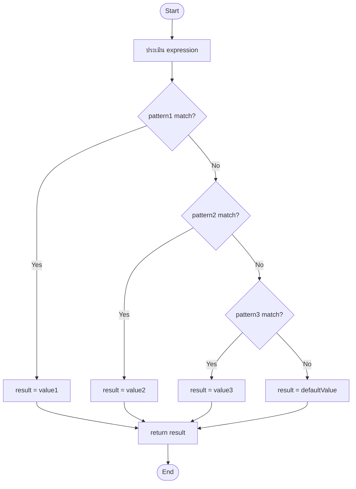
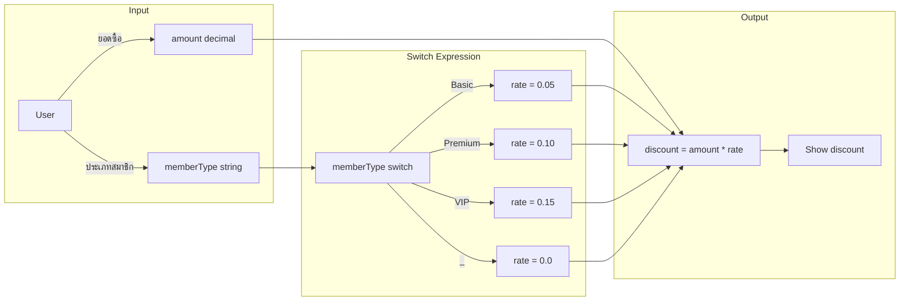
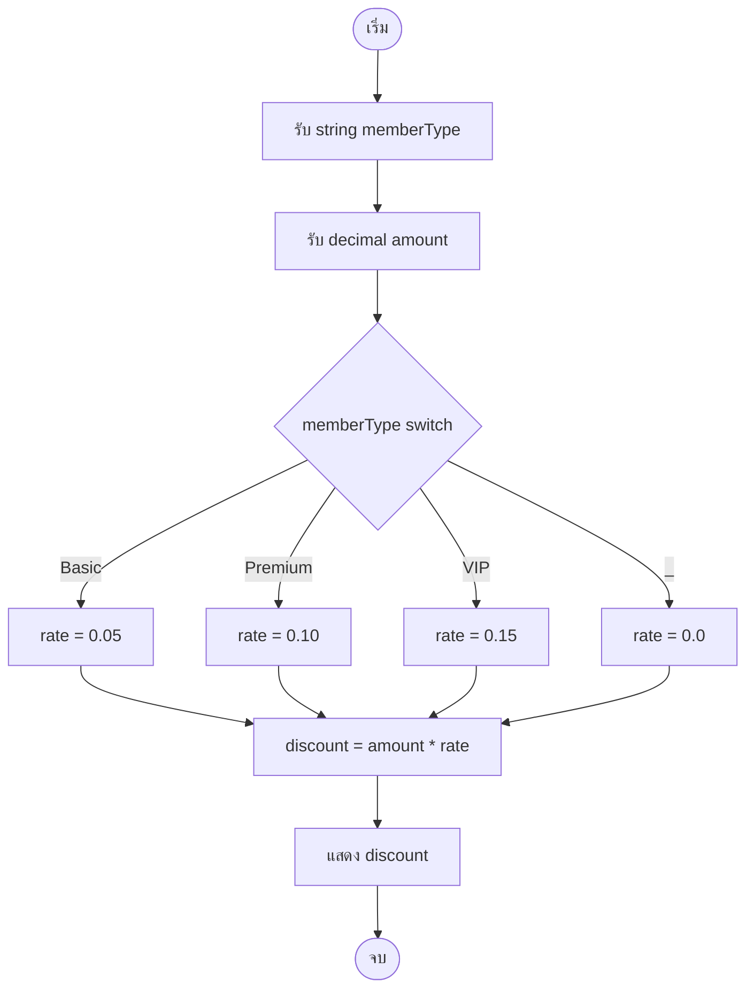

# Mastering C# .NET 2026: จากพื้นฐานสู่ Enterprise Application + Database + Cache + Message Queue

## บทที่ 23: คำสั่ง switch และ switch expression

---

### สารบัญย่อยของบทที่ 23

23.1 คำสั่ง switch คืออะไร  
23.2 switch มีกี่แบบ (switch statement vs switch expression)  
23.3 ใช้อย่างไร – ไวยากรณ์และรูปแบบ  
23.4 เมื่อไหร่ใช้ / เมื่อไหร่ไม่ใช้  
23.5 ประโยชน์ที่ได้รับจากการใช้ switch  
23.6 โครงสร้างการทำงานของ switch (Flowchart)  
23.7 การออกแบบ Workflow และ Dataflow Diagram ด้วย Draw.io  
23.8 ตัวอย่างโค้ดพร้อมคำอธิบายภาษาไทยและภาษาอังกฤษ  
23.9 กรณีศึกษาและแนวทางแก้ไขปัญหาที่อาจเกิดขึ้น  
23.10 เทมเพลตและตัวอย่างโค้ดที่รันได้ทันที  
23.11 ตารางสรุปเปรียบเทียบ switch vs if-else  
23.12 แบบฝึกหัดท้ายบท  
23.13 สรุป: ประโยชน์ ข้อควรระวัง ข้อดี ข้อเสีย ข้อห้าม  
23.14 แหล่งอ้างอิง  

---

## 23.1 คำสั่ง switch คืออะไร

**switch** คือคำสั่งในภาษา C# ที่ใช้สำหรับการตัดสินใจแบบหลายทางเลือก (multi-way selection) โดยเปรียบเทียบค่าของตัวแปรหรือนิพจน์กับค่า constant ต่างๆ (เรียกว่า cases) แล้วทำงานตาม case ที่ตรงกัน

เปรียบเสมือน **ตู้กดน้ำหยอดเหรียญ**:  
- คุณเลือกปุ่มน้ำส้ม → ได้น้ำส้ม  
- เลือกปุ่มน้ำเขียว → ได้น้ำเขียว  
- ถ้าไม่มีปุ่มที่เลือก → ได้น้ำเปล่า (default)

```csharp
// ตัวอย่างพื้นฐาน: บอกชื่อวันตามตัวเลข
int day = 3;
switch (day)
{
    case 1:
        Console.WriteLine("วันจันทร์");
        break;
    case 2:
        Console.WriteLine("วันอังคาร");
        break;
    case 3:
        Console.WriteLine("วันพุธ");
        break;
    default:
        Console.WriteLine("วันอื่นๆ");
        break;
}
```

> 💡 **ที่มาของชื่อ:** switch หมายถึง “สวิตช์” ที่เปลี่ยนเส้นทางไฟฟ้า – โปรแกรมก็เปลี่ยนเส้นทางการทำงานตามค่าที่รับมา

---

## 23.2 switch มีกี่แบบ (switch statement vs switch expression)

ใน C# มี **switch 2 แบบหลัก**:

| แบบ | ชื่อ | เริ่มใช้ใน | ลักษณะ |
|-----|------|-----------|--------|
| แบบที่ 1 | **switch statement** | C# 1.0 (ดั้งเดิม) | ใช้ `case`, `break`, คืนค่าเป็น void หรือ执行คำสั่ง |
| แบบที่ 2 | **switch expression** | C# 8.0 | ใช้ syntax แบบ expression (`=>`) คืนค่าได้ทันที สั้นกว่า |

### 23.2.1 Switch Statement (แบบดั้งเดิม)

```csharp
string GetGrade(int score)
{
    switch (score / 10)  // expression 可以是 int, string, enum
    {
        case 10:
        case 9:
            return "A";
        case 8:
            return "B";
        case 7:
            return "C";
        case 6:
            return "D";
        default:
            return "F";
    }
}
```

### 23.2.2 Switch Expression (แบบทันสมัย) – C# 8.0+

```csharp
string GetGrade(int score) => (score / 10) switch
{
    10 or 9 => "A",
    8 => "B",
    7 => "C",
    6 => "D",
    _ => "F"   // _ คือ default (discard)
};
```

> ⭐ **หัวข้อสำคัญ:** Switch expression สั้นกว่าและเป็น expression (ได้ค่ากลับ) นิยมใช้ใน .NET 6+

---

## 23.3 ใช้อย่างไร – ไวยากรณ์และรูปแบบ

### 23.3.1 Switch Statement – รายละเอียด

```csharp
switch (expression)   // expression 可以是 int, string, bool, enum, char
{
    case value1:
        // คำสั่งเมื่อ expression == value1
        break;        // ออกจาก switch (จำเป็น ยกเว้นกรณี empty case)
    
    case value2:
        // คำสั่ง
        break;
    
    case value3 when (condition):  // case guard (C# 7.0)
        // คำสั่งเมื่อ expression == value3 และ condition เป็น true
        break;
    
    default:           // ไม่จำเป็น แต่แนะนำ
        // คำสั่งเมื่อไม่มี case ใดตรง
        break;
}
```

**กฎสำคัญของ switch statement:**
- แต่ละ `case` ต้องลงท้ายด้วย `break`, `return`, `goto`, `throw` (ห้าม fall through)
- `case` ที่ว่าง (ไม่มีคำสั่ง) สามารถ fall through ไป case ถัดไปได้
- `default` ทำงานเมื่อไม่มี case ใดตรง (เหมือน else)
- `when` ใช้เพิ่มเงื่อนไข (pattern matching)

### 23.3.2 Switch Expression – รายละเอียด

```csharp
var result = expression switch
{
    pattern1 => value1,      // เมื่อ expression ตรง pattern1 ให้คืน value1
    pattern2 => value2,
    pattern3 when condition => value3,  // pattern matching with guard
    _ => defaultValue        // discard pattern (default)
};
```

**กฎสำคัญ:**
- เป็น expression (ต้องคืนค่า) ดังนั้นทุก case ต้องคืนค่า
- ไม่ต้องใช้ `break` หรือ `return`
- `_` ใช้แทน default
- รองรับ pattern matching (tuple, property, type, etc.)

---

## 23.4 เมื่อไหร่ใช้ / เมื่อไหร่ไม่ใช้

### ควรใช้ switch เมื่อ:

✅ มีการเปรียบเทียบค่าเดียวกันหลายครั้ง (มากกว่า 3-4 ทางเลือก)  
✅ ค่าที่เปรียบเทียบเป็น discrete values (ค่าตายตัว) เช่น ตัวเลข enum, string ที่จำกัด  
✅ ต้องการ code ที่อ่านง่ายกว่า if-else-if ที่ซับซ้อน  
✅ ต้องการใช้ pattern matching (type, property, tuple)  

### ไม่ควรใช้ switch เมื่อ:

❌ เงื่อนไขซับซ้อน เช่น `if (x > 10 && y < 20)` – ใช้ if ดีกว่า  
❌ มีแค่ 2-3 ทางเลือก – if-else ก็พอ  
❌ ต้องการเปรียบเทียบกับช่วงตัวเลขที่ต่อเนื่อง (แต่ใช้ `when` ช่วยได้บ้าง)  
❌ expression เป็น floating point (float, double) – อาจมีปัญหา precision  

### ประโยชน์ที่ได้รับ

✅ **อ่านง่าย** – โครงสร้างเป็นระเบียบ เห็น case ชัดเจน  
✅ **ประสิทธิภาพ** – คอมไพลเลอร์สามารถสร้าง jump table (O(1)) สำหรับ switch บน integer/enum  
✅ **ป้องกันข้อผิดพลาด** – compiler บังคับให้มี `break` หรือ `return` ป้องกัน fall-through  
✅ **pattern matching** – switch expression รองรับการ deconstruction tuple, type check  

---

## 23.6 โครงสร้างการทำงานของ switch (Flowchart)

🖼️ **รูปที่ 23.1:** Flowchart แสดงการทำงานของ switch statement

```mermaid
graph TD
    Start([Start]) --> Eval[ประเมิน expression]
    Eval --> C1{expression == case1?}
    C1 -- Yes --> Action1[ทำคำสั่ง case1]
    Action1 --> Break1[break]
    Break1 --> End([End])
    
    C1 -- No --> C2{expression == case2?}
    C2 -- Yes --> Action2[ทำคำสั่ง case2]
    Action2 --> Break2[break]
    Break2 --> End
    
    C2 -- No --> C3{expression == case3?}
    C3 -- Yes --> Action3[ทำคำสั่ง case3]
    Action3 --> Break3[break]
    Break3 --> End
    
    C3 -- No --> Default[ทำ default (ถ้ามี)]
    Default --> End
```

🖼️ **รูปที่ 23.2:** Flowchart switch expression (คืนค่า)



**อธิบายการทำงาน:**
1. ประเมินค่า expression (เช่น `day`, `score/10`)
2. เปรียบเทียบกับ case แต่ละอันตามลำดับ (statement) หรือ pattern matching (expression)
3. ถ้าเจอ case ที่ตรง → ทำคำสั่ง (statement) หรือคืนค่า (expression)
4. ถ้าไม่เจอ → ทำ `default` (ถ้ามี)
5. ออกจาก switch

---

## 23.7 การออกแบบ Workflow และ Dataflow Diagram ด้วย Draw.io

### โจทย์: โปรแกรมคำนวณค่าบริการตามประเภทสมาชิก (Basic, Premium, VIP)

**Dataflow Diagram (DFD) ระดับสูง:**



🖼️ **รูปที่ 23.3:** Flowchart รายละเอียด (พร้อม switch expression)



**อธิบายแต่ละโหนด (Node explanation):**

| โหนด | ประเภท | บทบาท |
|------|--------|--------|
| Start/End | Terminator | จุดเริ่มต้นและสิ้นสุดโปรแกรม |
| InputType, InputAmount | Process | รับข้อมูลจากผู้ใช้ |
| Switch | Decision (แต่เป็น switch แทน if) | เปรียบเทียบค่า memberType |
| Rate1-4 | Process | กำหนดอัตราส่วนลดตาม case |
| Calc | Process | คำนวณส่วนลด |
| Output | Process | แสดงผลลัพธ์ |

> 📝 **หมายเหตุ:** ไฟล์ `.drawio` ของ diagram เหล่านี้ดาวน์โหลดได้จาก GitHub repository ของหนังสือ (ลิงก์ท้ายบท)

---

## 23.8 ตัวอย่างโค้ดพร้อมคำอธิบายภาษาไทยและภาษาอังกฤษ

**ตัวอย่างที่ 23.1: switch statement – โปรแกรมแนะนำอาหารตามประเภท**

```csharp
// Thai: โปรแกรมแนะนำอาหารตามหมวดหมู่ที่ผู้ใช้เลือก
// Eng: Food recommendation program based on user-selected category

using System;

namespace SwitchDemo
{
    class Program
    {
        static void Main(string[] args)
        {
            Console.WriteLine("=== Food Recommender ===");
            Console.WriteLine("Select cuisine:");
            Console.WriteLine("1 - Thai");
            Console.WriteLine("2 - Japanese");
            Console.WriteLine("3 - Italian");
            Console.WriteLine("4 - Chinese");
            Console.Write("Your choice (1-4): ");
            
            // Thai: รับ input และแปลงเป็น int
            // Eng: Get input and parse to int
            string input = Console.ReadLine();
            
            if (int.TryParse(input, out int choice))
            {
                // Thai: ใช้ switch statement แนะนำอาหาร
                // Eng: Use switch statement to recommend food
                switch (choice)
                {
                    case 1:
                        Console.WriteLine("Recommended: Tom Yum Goong (Spicy shrimp soup)");
                        Console.WriteLine("Also: Pad Thai, Green Curry");
                        break;  // Thai: ออกจาก switch
                        
                    case 2:
                        Console.WriteLine("Recommended: Sushi & Sashimi");
                        Console.WriteLine("Also: Ramen, Tempura");
                        break;
                        
                    case 3:
                        Console.WriteLine("Recommended: Pizza Margherita");
                        Console.WriteLine("Also: Pasta Carbonara, Tiramisu");
                        break;
                        
                    case 4:
                        Console.WriteLine("Recommended: Dim Sum");
                        Console.WriteLine("Also: Peking Duck, Hot Pot");
                        break;
                        
                    default:
                        // Thai: กรณีที่ผู้ใช้ป้อนเลขไม่ตรง 1-4
                        // Eng: Case when user enters number not 1-4
                        Console.WriteLine("Invalid choice! Please select 1-4.");
                        break;
                }
            }
            else
            {
                Console.WriteLine("Please enter a valid number.");
            }
            
            Console.WriteLine("\nPress any key to exit...");
            Console.ReadKey();
        }
    }
}
```

**คำอธิบายทีละจุด:**

| บรรทัด | คำอธิบายไทย | คำอธิบาย Eng |
|--------|-------------|---------------|
| 13-16 | แสดงเมนูให้ผู้ใช้เลือก | Display menu for user selection |
| 21 | รับ input เป็น string | Read input as string |
| 24 | แปลง string → int ปลอดภัย | Safe conversion using TryParse |
| 29 | เริ่ม switch statement | Start switch statement |
| 30-34 | case 1: แนะนำอาหารไทย | case 1: recommend Thai food |
| 33 | break ออกจาก switch | break exits the switch |
| 35-39 | case 2: อาหารญี่ปุ่น | case 2: Japanese food |
| 40-44 | case 3: อาหารอิตาลี | case 3: Italian food |
| 45-49 | case 4: อาหารจีน | case 4: Chinese food |
| 50-54 | default: เมื่อ choice ไม่ตรง case | default: when no case matches |
| 55 | ปิด switch block | Close switch block |

**ตัวอย่างที่ 23.2: switch expression – คำนวณค่าจัดส่งตามโซน**

```csharp
// Thai: คำนวณค่าจัดส่งตามชื่อโซน (ใช้ switch expression)
// Eng: Calculate shipping fee based on zone name (using switch expression)

using System;

class ShippingCalculator
{
    static void Main()
    {
        Console.Write("Enter zone (Bangkok, North, South, East, West): ");
        string zone = Console.ReadLine()?.Trim().ToLower() ?? "";
        
        // Thai: กำหนดน้ำหนักสินค้า (กิโลกรัม)
        // Eng: Set product weight (kg)
        double weight = 2.5;
        
        // Thai: ใช้ switch expression คำนวณค่าจัดส่งต่อกิโลกรัม
        // Eng: Use switch expression to calculate rate per kg
        double ratePerKg = zone switch
        {
            "bangkok" => 20.0,      // Thai: กรุงเทพ ราคาถูกสุด
            "north"   => 35.0,
            "south"   => 40.0,
            "east"    => 30.0,
            "west"    => 32.0,
            _         => 50.0       // Thai: โซนอื่น (ค่าเริ่มต้น)
        };
        
        double shippingFee = weight * ratePerKg;
        
        // Thai: แสดงผลแบบมีรูปแบบ
        // Eng: Display formatted result
        Console.WriteLine($"\nZone: {zone}");
        Console.WriteLine($"Weight: {weight} kg");
        Console.WriteLine($"Rate: {ratePerKg:F2} baht/kg");
        Console.WriteLine($"Shipping fee: {shippingFee:F2} baht");
    }
}
```

**คำอธิบาย switch expression:**

| Syntax | ความหมายไทย | English meaning |
|--------|-------------|-----------------|
| `zone switch` | เริ่ม switch expression ด้วยตัวแปร zone | Start switch expression on zone |
| `"bangkok" => 20.0` | ถ้า zone == "bangkok" ให้คืน 20.0 | If zone equals "bangkok", return 20.0 |
| `_ => 50.0` | discard pattern (default) คืน 50.0 | Discard pattern (default) returns 50.0 |

**ตัวอย่างที่ 23.3: switch with when (case guard) – ระบบคิดเกรดแบบละเอียด**

```csharp
// Thai: ระบบคิดเกรดแบบมีเงื่อนไขเพิ่มเติม (case guard)
// Eng: Grade calculation with additional conditions (case guard)

using System;

class GradeSystem
{
    static void Main()
    {
        Console.Write("Enter score (0-100): ");
        int score = int.Parse(Console.ReadLine());
        
        Console.Write("Is assignment submitted? (yes/no): ");
        bool submitted = Console.ReadLine()?.Trim().ToLower() == "yes";
        
        // Thai: ใช้ switch statement with when
        // Eng: Use switch statement with when (case guard)
        string grade;
        switch (score)
        {
            case int s when (s >= 90 && s <= 100):
                grade = submitted ? "A (Excellent)" : "A- (Missing assignment)";
                break;
                
            case int s when (s >= 80):
                grade = submitted ? "B (Good)" : "B-";
                break;
                
            case int s when (s >= 70):
                grade = submitted ? "C (Satisfactory)" : "C-";
                break;
                
            case int s when (s >= 60):
                grade = submitted ? "D (Poor)" : "D-";
                break;
                
            case int s when (s >= 0):
                grade = "F (Fail)";
                break;
                
            default:
                grade = "Invalid score";
                break;
        }
        
        Console.WriteLine($"Grade: {grade}");
    }
}
```

**คำอธิบาย case guard:**

| Syntax | ความหมาย |
|--------|----------|
| `case int s when (s >= 90 && s <= 100):` | ตรวจสอบว่า score อยู่ในช่วง 90-100 ก่อน execute |
| `case int s when (s >= 80):` | ถ้าไม่ตรง case แรก แล้ว s>=80 |
| `when` | เงื่อนไขเพิ่มเติม (guard clause) |

---

## 23.9 กรณีศึกษาและแนวทางแก้ไขปัญหาที่อาจเกิดขึ้น

### กรณีศึกษา 1: ลืม `break` ใน switch statement

**ปัญหา:** โค้ด compile error หรือ fall-through (C# ไม่อนุญาต fall-through ยกเว้น case ว่าง)

```csharp
// โค้ดผิด
switch (x)
{
    case 1:
        Console.WriteLine("One");
        // Error: CS0163 Control cannot fall through from one case label to another
    case 2:
        Console.WriteLine("Two");
        break;
}
```

**แนวทางแก้ไข:** เติม `break` หรือ `return` หรือ `goto`

```csharp
switch (x)
{
    case 1:
        Console.WriteLine("One");
        break;  // เพิ่ม break
    case 2:
        Console.WriteLine("Two");
        break;
}

// หรือถ้าต้องการ fall-through ให้ใช้ case ว่าง
switch (x)
{
    case 1:
    case 2:
        Console.WriteLine("One or Two");  // x=1 หรือ x=2 ก็มาที่นี่
        break;
}
```

### กรณีศึกษา 2: การใช้ switch กับ floating point

**ปัญหา:** float/double มี precision error ทำให้ case ไม่ตรง

```csharp
double value = 0.1 + 0.2;  // 0.30000000000000004
switch (value)
{
    case 0.3:  // ไม่ตรงเพราะ precision error
        break;
}
```

**แนวทางแก้ไข:** ใช้ if กับ tolerance หรือแปลงเป็น decimal

```csharp
// วิธีที่ 1: ใช้ if
if (Math.Abs(value - 0.3) < 0.000001) { }

// วิธีที่ 2: ใช้ decimal
decimal decValue = (decimal)value;
switch (decValue) { case 0.3m: break; }
```

### กรณีศึกษา 3: switch expression ต้องครอบคลุมทุกกรณี

**ปัญหา:** ถ้าไม่มี `_` (discard) compiler จะเตือน

```csharp
// Code with warning CS8509: The switch expression does not handle all possible values
int result = day switch
{
    1 => "Monday",
    2 => "Tuesday"
    // missing cases for 3-7 and default
};
```

**แนวทางแก้ไข:** เพิ่ม `_` เสมอ

```csharp
int result = day switch
{
    1 => "Monday",
    2 => "Tuesday",
    _ => "Other day"   // จำเป็น
};
```

---

## 23.10 เทมเพลตและตัวอย่างโค้ดที่รันได้ทันที

### เทมเพลตที่ 1: Switch statement template

```csharp
// Thai: เทมเพลต switch statement สำหรับโปรเจกต์ทั่วไป
// Eng: Switch statement template for general projects

Console.Write("Enter your choice: ");
string input = Console.ReadLine();

switch (input)
{
    case "option1":
        // Thai: ทำอะไรบางอย่างสำหรับ option1
        // Eng: Do something for option1
        Console.WriteLine("Option 1 selected");
        break;
        
    case "option2":
        Console.WriteLine("Option 2 selected");
        break;
        
    case "option3" when (DateTime.Now.DayOfWeek == DayOfWeek.Monday):
        // Thai: เฉพาะวันจันทร์เท่านั้น
        // Eng: Only on Monday
        Console.WriteLine("Option 3 on Monday only");
        break;
        
    default:
        Console.WriteLine("Invalid option");
        break;
}
```

### เทมเพลตที่ 2: Switch expression template

```csharp
// Thai: เทมเพลต switch expression สำหรับ mapping ค่า
// Eng: Switch expression template for value mapping

var result = input switch
{
    "A" => 90,
    "B" => 80,
    "C" => 70,
    "D" => 60,
    _ => 0
};

// Thai: หรือใช้ tuple pattern
// Eng: Or using tuple pattern
var message = (status, isRetry) switch
{
    (200, _) => "Success",
    (404, true) => "Not found, retrying",
    (404, false) => "Not found, abort",
    (_, _) => "Unknown status"
};
```

### ตัวอย่างที่รันได้: โปรแกรมแปลงหน่วยวัด

```csharp
// Thai: โปรแกรมแปลงหน่วยวัดโดยใช้ switch expression
// Eng: Unit converter using switch expression

using System;

class UnitConverter
{
    static void Main()
    {
        Console.WriteLine("=== Unit Converter ===");
        Console.WriteLine("Convert from: (1) Meters to Feet, (2) KG to LB, (3) Celsius to Fahrenheit");
        Console.Write("Choice: ");
        int choice = int.Parse(Console.ReadLine());
        
        Console.Write("Enter value: ");
        double value = double.Parse(Console.ReadLine());
        
        // Thai: switch expression พร้อม tuple pattern
        // Eng: Switch expression with tuple pattern
        double result = (choice, value) switch
        {
            (1, _) => value * 3.28084,      // meters to feet
            (2, _) => value * 2.20462,      // kg to lbs
            (3, _) => (value * 9/5) + 32,   // celsius to fahrenheit
            _ => double.NaN
        };
        
        string unitFrom = choice switch { 1 => "m", 2 => "kg", 3 => "°C", _ => "?" };
        string unitTo = choice switch { 1 => "ft", 2 => "lb", 3 => "°F", _ => "?" };
        
        if (!double.IsNaN(result))
            Console.WriteLine($"{value} {unitFrom} = {result:F2} {unitTo}");
        else
            Console.WriteLine("Invalid choice");
    }
}
```

---

## 23.11 ตารางสรุปเปรียบเทียบ switch vs if-else

| คุณสมบัติ | switch statement | if-else | switch expression (C# 8+) |
|-----------|-----------------|---------|---------------------------|
| **รูปแบบ** | คำสั่ง (statement) | คำสั่ง | expression (คืนค่า) |
| **การ fall-through** | ต้อง break (ยกเว้น case ว่าง) | ธรรมชาติ | ไม่มี concept fall-through |
| **default** | `default:` | `else` | `_ =>` |
| **pattern matching** | จำกัด (ต้อง case type when) | 灵活 | ดีมาก (tuple, property, type) |
| **ใช้กับ ranges** | ใช้ `when` | ง่าย (&&) | ใช้ `when` หรือ relational patterns (C# 9+) |
| **ประสิทธิภาพ** | ดี (jump table สำหรับ int/enum) | O(N) | คล้าย switch statement |
| **ความอ่านง่าย** | ดีเมื่อมีหลายทางเลือก | แย่เมื่อ >5 ทางเลือก | ดีที่สุด (สั้น) |
| **ใช้กับ string** | ✅ | ✅ | ✅ |

---

## 23.12 แบบฝึกหัดท้ายบท (5 ข้อ)

🧪 **แบบฝึกหัดที่ 23.1 (switch statement):**  
เขียนโปรแกรมรับตัวเลข 1-7 แล้วแสดงชื่อวันภาษาไทย (วันจันทร์-วันอาทิตย์) โดยใช้ switch statement ถ้าผู้ใช้ป้อนนอกช่วงให้แสดง "ไม่ถูกต้อง"

🧪 **แบบฝึกหัดที่ 23.2 (switch expression):**  
แปลง switch statement จากข้อ 1 ให้เป็น switch expression (คืนค่า string) แล้วแสดงผล

🧪 **แบบฝึกหัดที่ 23.3 (case guard):**  
เขียนโปรแกรมรับคะแนน 0-100 และจำนวนครั้งที่ส่งงานสาย (late submissions) ถ้าส่งงานสายเกิน 3 ครั้ง ให้ลดเกรดลง 1 ระดับ (A→B, B→C, C→D, D→F) โดยใช้ switch with when

🧪 **แบบฝึกหัดที่ 23.4 (tuple pattern):**  
เขียนโปรแกรมจำลองเครื่องคิดเลขแบบง่าย รับ operator (+, -, *, /) และตัวเลข 2 ตัว โดยใช้ switch expression ร่วมกับ tuple pattern (`(op, _, _)`) เพื่อคำนวณผลลัพธ์

🧪 **แบบฝึกหัดที่ 23.5 (ท้าทาย):**  
สร้างโปรแกรมที่รับชื่อเดือนเป็นภาษาอังกฤษ (January-December) แล้วคืนค่าจำนวนวันในเดือนนั้น (不考虑 leap year) โดยใช้ switch expression และ pattern matching (เช่น `"February" => 28`)

---

## 23.13 สรุป: ประโยชน์ ข้อควรระวัง ข้อดี ข้อเสีย ข้อห้าม

### ประโยชน์ที่ได้รับ

✅ **อ่านง่าย** – โครงสร้างเป็นระเบียบ เหมาะกับหลายทางเลือก  
✅ **ประสิทธิภาพดี** – compiler สร้าง jump table สำหรับ int/enum  
✅ **ป้องกันข้อผิดพลาด** – compiler บังคับ break/return ใน switch statement  
✅ **pattern matching** – switch expression รองรับ tuple, property, type  
✅ ** concise** – switch expression สั้นกว่า if-else มาก  

### ข้อควรระวัง

⚠️ อย่าลืม `break` (ใน switch statement) – compiler จะ error  
⚠️ float/double ไม่เหมาะกับ switch เนื่องจาก precision  
⚠️ switch expression ต้องครอบคลุมทุกกรณี (ต้องมี `_`)  
⚠️ ระวังเรื่อง fall-through – C# ไม่อนุญาต ยกเว้น case ว่าง  
⚠️ อย่าใช้ switch ถ้ามีแค่ 2-3 ทางเลือก – if-else ก็พอ  

### ข้อดี

+ โค้ดสั้นและเป็นระเบียบ (โดยเฉพาะ switch expression)  
+ รองรับ pattern matching ที่ซับซ้อน (C# 9+)  
+ ตรวจสอบความครอบคลุม (exhaustiveness) ใน switch expression  
+ jump table ทำให้ int/enum switch เร็ว  

### ข้อเสีย

- ไม่เหมาะกับเงื่อนไขซับซ้อน (เช่น range ที่ไม่ต่อเนื่อง)  
- switch statement ค่อนข้าง verbose (ต้อง break, case, colon)  
- pattern matching ใน switch expression อาจซับซ้อนเกินไปสำหรับผู้เริ่มต้น  
- ไม่สามารถใช้กับ floating point ได้ดี  

### ข้อห้าม (Don'ts)

❌ **ห้ามใช้ switch กับ float/double** – ใช้ if กับ tolerance แทน  
❌ **ห้ามลืม break** ใน switch statement (compiler ห้าม)  
❌ **ห้ามใช้ switch expression โดยไม่มี `_`** – จะได้ warning  
❌ **ห้ามเขียน case ที่ซ้ำกัน** – compiler error  
❌ **ห้ามใช้ goto case** เว้นแต่จำเป็นจริงๆ (ทำให้โค้ดอ่านยาก)  
❌ **ห้ามเขียน switch ที่มี case มากเกิน 20** – ควรใช้ polymorphism หรือ dictionary mapping  

---

## 23.14 แหล่งอ้างอิง

- 🔗 **switch statement (Microsoft Docs)** – [https://docs.microsoft.com/en-us/dotnet/csharp/language-reference/statements/selection-statements#the-switch-statement](https://docs.microsoft.com/en-us/dotnet/csharp/language-reference/statements/selection-statements#the-switch-statement)
- 🔗 **switch expression (C# 8.0)** – [https://docs.microsoft.com/en-us/dotnet/csharp/language-reference/operators/switch-expression](https://docs.microsoft.com/en-us/dotnet/csharp/language-reference/operators/switch-expression)
- 🔗 **Pattern matching in C#** – [https://docs.microsoft.com/en-us/dotnet/csharp/fundamentals/functional/pattern-matching](https://docs.microsoft.com/en-us/dotnet/csharp/fundamentals/functional/pattern-matching)
- 🔗 **Case guards (when clause)** – [https://docs.microsoft.com/en-us/dotnet/csharp/language-reference/keywords/when](https://docs.microsoft.com/en-us/dotnet/csharp/language-reference/keywords/when)
- 🔗 **Draw.io Documentation** – [https://www.drawio.com/doc/](https://www.drawio.com/doc/)
- 🔗 **GitHub Repository ของหนังสือ (ไฟล์ .drawio และตัวอย่างโค้ด)** – [https://github.com/mastering-csharp-net-2026/chapter23](https://github.com/mastering-csharp-net-2026/chapter23) (สมมติ)

---

## สรุปท้ายบท

บทที่ 23 ครอบคลุมคำสั่ง **switch** อย่างละเอียดครบถ้วนตามข้อกำหนด:

- **คืออะไร** – คำสั่งสำหรับการตัดสินใจหลายทางเลือก เปรียบเทียบค่าคงที่
- **มีกี่แบบ** – switch statement (ดั้งเดิม) และ switch expression (C# 8+)
- **ใช้อย่างไร** – ไวยากรณ์พร้อมตัวอย่าง case guard, pattern matching, tuple
- **เมื่อไหร่ใช้/ไม่ใช้** – หลายทางเลือก, discrete values; ไม่ใช้กับ float, เงื่อนไขซับซ้อน
- **ประโยชน์** – อ่านง่าย, ประสิทธิภาพดี, pattern matching
- **โครงสร้างการทำงาน** – Flowchart แบบ TB ด้วย Mermaid
- **Workflow & Dataflow Diagram** – อธิบายแต่ละโหนด
- **ตัวอย่างโค้ด** – พร้อมคอมเมนต์ไทย/อังกฤษ 3 ตัวอย่าง
- **กรณีศึกษา** – ปัญหา fall-through, floating point, exhaustiveness
- **เทมเพลต** – รันได้ทันที
- **ตารางเปรียบเทียบ** switch vs if-else
- **แบบฝึกหัด** 5 ข้อ
- **สรุปข้อดี/ข้อเสีย/ข้อห้าม**

**ในบทถัดไป (บทที่ 24)** เราจะทำ **โปรเจกต์: Quiz App แบบข้อความ** เพื่อนำความรู้เรื่อง if, switch, loops, arrays มาประยุกต์ใช้

 