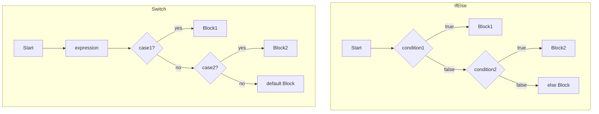
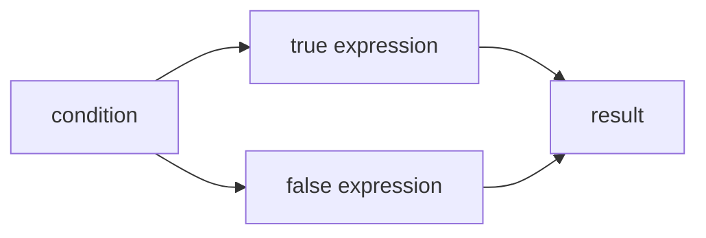
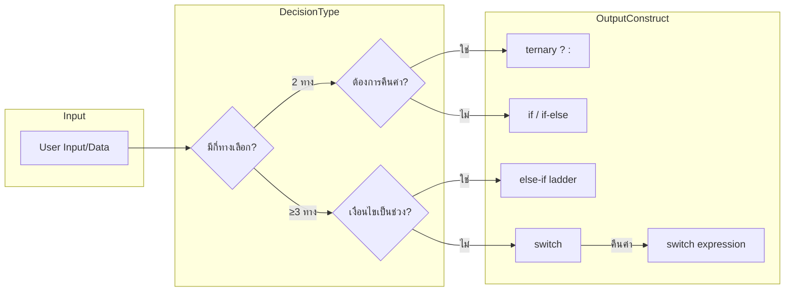

# Mastering C# . NET 2026: จากพื้นฐานสู่ Enterprise Application + Database + Cache + Message Queue

## บทที่ 28: Cheatsheet การตัดสินใจใน C# (if, else, switch, ternary, pattern matching)

---

### สารบัญย่อยของบทที่ 28

28.1 Cheatsheet คืออะไร – ภาพรวมการตัดสินใจใน C#  
28.2 การตัดสินใจมีกี่แบบ – 5 รูปแบบหลัก  
28.3 ใช้อย่างไร – ไวยากรณ์ด่วน (Quick Syntax)  
28.4 เมื่อไหร่ใช้แต่ละแบบ / เมื่อไหร่ไม่ใช้  
28.5 ประโยชน์ที่ได้รับจากการใช้ Cheatsheet  
28.6 โครงสร้างการทำงาน (Flowchart เปรียบเทียบ)  
28.7 การออกแบบ Workflow และ Dataflow Diagram ด้วย Draw.io  
28.8 ตัวอย่างโค้ดประกอบ Cheatsheet (พร้อมคอมเมนต์ไทย/อังกฤษ)  
28.9 กรณีศึกษา: การเลือกใช้ statement ที่เหมาะสม  
28.10 เทมเพลต Cheatsheet แบบพกพา (ตารางสรุป)  
28.11 ตารางสรุปเปรียบเทียบ all decision constructs  
28.12 แบบฝึกหัดท้ายบท (3 ข้อ)  
28.13 สรุป: ประโยชน์ ข้อควรระวัง ข้อดี ข้อเสีย ข้อห้าม  
28.14 แหล่งอ้างอิง  

---

## 28.1 Cheatsheet คืออะไร – ภาพรวมการตัดสินใจใน C#

**Cheatsheet** (เอกสารสรุปด่วน) สำหรับการตัดสินใจใน C# นี้จะรวบรวม syntax, การใช้งาน, และตัวอย่างของ statement ทั้ง 5 รูปแบบที่ใช้ควบคุมทิศทางโปรแกรมตามเงื่อนไข เพื่อให้คุณสามารถเลือกใช้ได้อย่างถูกต้องและรวดเร็ว

**การตัดสินใจ (Decision Making)** คือความสามารถของโปรแกรมในการเลือกเส้นทางการทำงานแตกต่างกันไปตามค่าของตัวแปรหรือผลลัพธ์ของเงื่อนไข เปรียบเสมือนทางแยกในแผนที่

**มีกี่แบบ:** ใน C# มี 5 รูปแบบหลัก:
1. **if statement** – เงื่อนไขเดียว (หรือ if-else)
2. **else-if ladder** – หลายเงื่อนไขแบบมีลำดับ
3. **switch statement** – หลายทางเลือกจากค่าเดียว (discrete values)
4. **switch expression** – รูปแบบ expression คืนค่า (C# 8+)
5. **Ternary operator (`?:`)** – if-else แบบสั้นใน expression

> 💡 **หัวข้อสำคัญ:** จำไว้ว่า `if` ใช้กับเงื่อนไขซับซ้อนหรือช่วง, `switch` ใช้กับค่าตายตัว (int, string, enum), ternary ใช้กับกรณีสั้นๆ 2 ทางเลือก

---

## 28.2 การตัดสินใจมีกี่แบบ – 5 รูปแบบหลัก

| รูปแบบ | ชื่อ | ลักษณะ | ตัวอย่าง |
|--------|------|--------|----------|
| 1 | **if** | เงื่อนไขเดียว | `if (x > 0) { ... }` |
| 2 | **if-else** | สองทางเลือก | `if (x > 0) {...} else {...}` |
| 3 | **else-if ladder** | หลายทางเลือกแบบเรียงลำดับ | `if (x > 0) {...} else if (x < 0) {...} else {...}` |
| 4 | **switch statement** | เปรียบเทียบค่า discrete | `switch(day) { case 1: ... break; ... }` |
| 5 | **switch expression** | expression คืนค่า (C# 8+) | `var result = day switch { 1 => "Mon", _ => "Other" };` |
| 6 | **ternary operator** | if-else แบบ expression | `var msg = (score >= 50) ? "Pass" : "Fail";` |

---

## 28.3 ใช้อย่างไร – ไวยากรณ์ด่วน (Quick Syntax)

### 28.3.1 if / if-else

```csharp
// if เดี่ยว
if (condition)
    single_statement;   // วงเล็บ {} ไม่จำเป็นถ้ามี 1 statement แต่แนะนำให้ใส่

// if-else
if (condition)
{
    // true block
}
else
{
    // false block
}
```

### 28.3.2 else-if ladder

```csharp
if (condition1)
{
    // case 1
}
else if (condition2)
{
    // case 2
}
else if (condition3)
{
    // case 3
}
else
{
    // default
}
```

### 28.3.3 switch statement

```csharp
switch (expression)
{
    case value1:
        // statements
        break;
    case value2 when (condition):   // case guard (C# 7+)
        // statements
        break;
    default:
        // statements
        break;
}
```

### 28.3.4 switch expression (C# 8+)

```csharp
var result = expression switch
{
    pattern1 => value1,
    pattern2 => value2,
    _ => defaultValue
};
```

### 28.3.5 Ternary operator

```csharp
condition ? true_expression : false_expression;
```

---

## 28.4 เมื่อไหร่ใช้แต่ละแบบ / เมื่อไหร่ไม่ใช้

| รูปแบบ | ควรใช้เมื่อ | ไม่ควรใช้เมื่อ |
|--------|------------|----------------|
| **if** | มีแค่ 1-2 เงื่อนไข, เงื่อนไขซับซ้อน (&&, \|\|, ช่วง) | มีหลายทางเลือก (≥4) |
| **else-if** | เงื่อนไขเป็นช่วง (score >= 80, >=70, ...) | เงื่อนไขเป็นค่าตายตัว |
| **switch statement** | ค่า discrete (int, enum, string), ≥3 ทางเลือก | เงื่อนไขเป็นช่วงหรือซับซ้อน |
| **switch expression** | ต้องการคืนค่าโดยตรง, pattern matching | มี side effect หรือคำสั่งหลายบรรทัด |
| **ternary** | 2 ทางเลือก, expression สั้น | หลายบรรทัด หรือซับซ้อน (อ่านยาก) |

---

## 28.5 ประโยชน์ที่ได้รับจากการใช้ Cheatsheet

✅ **ลดเวลาในการค้นหา syntax** – มีตารางสรุปไว้ที่เดียว  
✅ **เลือกใช้ statement ถูกประเภท** – รู้ว่าอันไหนเหมาะกับงาน  
✅ **เขียนโค้ดสม่ำเสมอ** – ใช้ pattern ที่ถูกต้อง  
✅ **ป้องกันข้อผิดพลาด** – ระบุข้อห้ามและข้อควรระวัง  
✅ **เหมาะกับการทบทวนก่อนสัมภาษณ์** – สรุปหัวข้อสำคัญ  

---

## 28.6 โครงสร้างการทำงาน (Flowchart เปรียบเทียบ)

🖼️ **รูปที่ 28.1:** Flowchart เปรียบเทียบ if-else vs switch



🖼️ **รูปที่ 28.2:** Ternary operator flow (expression)



**อธิบาย:** if-else ใช้ decision node หลายอัน, switch ใช้ jump table (ประสิทธิภาพดีเมื่อมีหลาย case), ternary เป็น inline expression

---

## 28.7 การออกแบบ Workflow และ Dataflow Diagram ด้วย Draw.io

🖼️ **รูปที่ 28.3:** Dataflow diagram การเลือกใช้ decision construct



**อธิบาย:** 
- 2 ทางเลือก → ถ้าต้องการ expression → ternary; ถ้าไม่ → if-else
- ≥3 ทางเลือก → ถ้าเป็นช่วงตัวเลข → else-if; ถ้าเป็นค่าตายตัว → switch
- switch expression ใช้เมื่อต้องการคืนค่าทันที

> 📝 **หมายเหตุ:** ไฟล์ `.drawio` ของ diagram นี้อยู่ใน GitHub repository (ลิงก์ท้ายบท)

---

## 28.8 ตัวอย่างโค้ดประกอบ Cheatsheet (พร้อมคอมเมนต์ไทย/อังกฤษ)

**ตัวอย่างที่ 28.1: เปรียบเทียบ if, switch, ternary สำหรับการให้เกรด**

```csharp
// Thai: ระบบให้เกรดตามคะแนน แสดงตัวอย่าง 3 รูปแบบ
// Eng: Grade assignment system - demonstrate 3 decision constructs

using System;

class DecisionCheatsheetDemo
{
    static void Main()
    {
        Console.Write("Enter score: ");
        if (!int.TryParse(Console.ReadLine(), out int score))
        {
            Console.WriteLine("Invalid input");
            return;
        }
        
        // ==========================================
        // 1. ใช้ else-if ladder (เหมาะกับช่วง)
        // ==========================================
        string grade1;
        if (score >= 80)
            grade1 = "A";
        else if (score >= 70)
            grade1 = "B";
        else if (score >= 60)
            grade1 = "C";
        else if (score >= 50)
            grade1 = "D";
        else
            grade1 = "F";
        
        // ==========================================
        // 2. ใช้ switch expression (C# 8+)
        //    ใช้เมื่อเงื่อนไขเป็น discrete หรือ pattern
        // ==========================================
        string grade2 = score switch
        {
            >= 80 => "A",
            >= 70 => "B",
            >= 60 => "C",
            >= 50 => "D",
            _ => "F"
        };
        
        // ==========================================
        // 3. ใช้ ternary operator (2 ทางเลือกเท่านั้น)
        // ==========================================
        string passFail = (score >= 50) ? "Pass" : "Fail";
        
        Console.WriteLine($"Grade (if-else): {grade1}");
        Console.WriteLine($"Grade (switch expression): {grade2}");
        Console.WriteLine($"Pass/Fail (ternary): {passFail}");
    }
}
```

**ตัวอย่างที่ 28.2: switch statement แบบดั้งเดิม (ใช้ break)**

```csharp
// Thai: แปลงตัวเลขเป็นชื่อวัน (switch statement)
// Eng: Convert number to day name using switch statement

static string GetDayName(int day)
{
    switch (day)
    {
        case 1:
            return "Monday";
        case 2:
            return "Tuesday";
        case 3:
            return "Wednesday";
        case 4:
            return "Thursday";
        case 5:
            return "Friday";
        case 6:
            return "Saturday";
        case 7:
            return "Sunday";
        default:
            return "Invalid day";
    }
}
```

**ตัวอย่างที่ 28.3: Ternary ซ้อน (ไม่แนะนำ ถ้าอ่านยาก)**

```csharp
// Thai: ternary ซ้อน - ควรใช้ if-else ถ้ามากกว่า 1 ระดับ
// Eng: Nested ternary - avoid if more than one level

int x = 10, y = 20;
int max = (x > y) ? x : (y > x) ? y : x;   // works but hard to read

// Better: use if-else
int maxBetter;
if (x > y) maxBetter = x;
else if (y > x) maxBetter = y;
else maxBetter = x;
```

---

## 28.9 กรณีศึกษา: การเลือกใช้ statement ที่เหมาะสม

### กรณีศึกษา 1: ระบบคิดค่าโดยสารรถไฟฟ้าตามช่วงระยะทาง

**เงื่อนไข:** 0-10 km = 15 บาท, 11-20 km = 25 บาท, 21-30 km = 35 บาท, >30 km = 50 บาท

**วิธีที่เหมาะสม:** `else-if` เพราะเป็นช่วง

```csharp
int fare;
if (distance <= 10) fare = 15;
else if (distance <= 20) fare = 25;
else if (distance <= 30) fare = 35;
else fare = 50;
```

**ไม่ควรใช้ switch** เพราะ case ต้องเป็นค่าคงที่ ไม่ใช่ช่วง

### กรณีศึกษา 2: เมนูระบบ (1=Create, 2=Read, 3=Update, 4=Delete)

**วิธีที่เหมาะสม:** `switch` (ค่าตายตัว)

```csharp
switch (choice)
{
    case 1: Create(); break;
    case 2: Read(); break;
    case 3: Update(); break;
    case 4: Delete(); break;
    default: Console.WriteLine("Invalid"); break;
}
```

### กรณีศึกษา 3: ตรวจสอบว่าเป็นปีอธิกสุรทิน

**วิธีที่เหมาะสม:** `if` (เงื่อนไขซับซ้อน)

```csharp
bool isLeap = (year % 4 == 0) && (year % 100 != 0 || year % 400 == 0);
if (isLeap) { ... }
```

---

## 28.10 เทมเพลต Cheatsheet แบบพกพา (ตารางสรุป)

```csharp
// ==================================================
// CHEATSHEET: DECISION MAKING IN C#
// ==================================================

// 1. if (one-way)
if (condition) { }

// 2. if-else (two-way)
if (condition) { } else { }

// 3. else-if ladder (multi-way with ranges)
if (cond1) { }
else if (cond2) { }
else { }

// 4. switch statement (discrete values)
switch (variable)
{
    case value1:
        // code
        break;
    case value2 when (condition):
        // code with guard
        break;
    default:
        // code
        break;
}

// 5. switch expression (C# 8+)
var result = variable switch
{
    pattern1 => value1,
    pattern2 => value2,
    _ => defaultValue
};

// 6. ternary operator (two-way expression)
var result = condition ? true_value : false_value;
```

---

## 28.11 ตารางสรุปเปรียบเทียบ all decision constructs

| คุณสมบัติ | if | else-if | switch statement | switch expression | ternary |
|-----------|----|----|----|----|----|
| จำนวนทางเลือก | 1-2 | หลายทางเลือก (ช่วง) | หลายทางเลือก (ค่าตายตัว) | หลายทางเลือก (pattern) | 2 เท่านั้น |
| รองรับช่วง | ✅ | ✅ (ใช้ &&, \|\|) | ❌ (ต้อง when) | ✅ (relational patterns C# 9+) | ❌ |
| คืนค่า | ❌ (เป็น statement) | ❌ | ❌ | ✅ (expression) | ✅ |
| pattern matching | จำกัด | จำกัด | ✅ (when) | ✅ (ดีมาก) | ❌ |
| fall-through | ไม่มี | ไม่มี | ต้อง break (ยกเว้น case ว่าง) | ไม่มี | ไม่มี |
| อ่านง่าย (หลายทางเลือก) | แย่ (ซ้อน) | ปานกลาง | ดี | ดีมาก | แย่ถ้ามากกว่า 2 |
| เหมาะกับ | 1-2 ทาง | ช่วงตัวเลข | ค่าคงที่ (enum, int, string) | pattern, tuple, type | สั้น ๆ 2 ทาง |

---

## 28.12 แบบฝึกหัดท้ายบท (3 ข้อ)

🧪 **แบบฝึกหัดที่ 28.1 (เลือกใช้ให้ถูก):**  
กำหนดเงื่อนไขต่อไปนี้ จงบอกว่าใช้ decision construct แบบไหนเหมาะสมที่สุด (if, else-if, switch, ternary) พร้อมเหตุผลสั้นๆ:  
ก) ตรวจสอบว่าตัวเลขเป็นบวก ลบ หรือศูนย์  
ข) แสดงชื่อเดือนตามตัวเลข 1-12  
ค) คำนวณค่าผ่านทางด่วนตามประเภทยานพาหนะ (รถยนต์=50, รถตู้=70, รถบรรทุก=100)  
ง) ตรวจสอบว่าคะแนนสอบผ่านเกณฑ์ 50% หรือไม่  

🧪 **แบบฝึกหัดที่ 28.2 (แปลง ternary เป็น if-else):**  
จงแปลง ternary ต่อไปนี้เป็น if-else:
```csharp
int fee = (age < 12) ? 50 : (age < 60) ? 100 : 80;
```

🧪 **แบบฝึกหัดที่ 28.3 (เขียน switch expression):**  
กำหนด enum `Season { Spring, Summer, Autumn, Winter }` ให้เขียน switch expression ที่คืนค่าคำอธิบาย: Spring="ดอกไม้บาน", Summer="ร้อน", Autumn="ใบไม้ร่วง", Winter="หนาว" (ใช้ `_` สำหรับ default)

---

## 28.13 สรุป: ประโยชน์ ข้อควรระวัง ข้อดี ข้อเสีย ข้อห้าม

### ประโยชน์ที่ได้รับ

✅ มีเอกสารสรุปด่วนสำหรับทบทวน  
✅ ลดความผิดพลาดในการเลือกใช้ statement  
✅ ช่วยให้โค้ดสม่ำเสมอตาม best practice  

### ข้อควรระวัง

⚠️ Ternary ซ้อนกันมากกว่า 1 ระดับ อ่านยาก (ใช้ if-else)  
⚠️ switch statement ต้องมี `break` หรือ `return` ทุก case (ยกเว้น case ว่าง)  
⚠️ switch expression ต้องมี `_` (discard) เสมอ  
⚠️ else-if ladder ตรวจสอบตามลำดับ – ต้องเรียงจากเงื่อนไขที่จำกัดที่สุดไปหาทั่วไป  

### ข้อดี

+ if ใช้กับเงื่อนไขซับซ้อนได้ทุกแบบ  
+ switch expression สั้นและปลอดภัย  
+ ternary ทำให้โค้ดกระชับในกรณีง่าย  

### ข้อเสีย

- if-else ซ้อนลึกอ่านยาก  
- switch statement ค่อนข้าง verbose  
- ternary ห้ามใช้กับหลายคำสั่ง  

### ข้อห้าม

❌ ห้ามใช้ `=` แทน `==` ในเงื่อนไข  
❌ ห้ามลืม `break` ใน switch statement  
❌ ห้าม ternary ซ้อนเกิน 1 ระดับ  
❌ ห้ามใช้ switch กับ float/double (precision)  

---

## 28.14 แหล่งอ้างอิง

- 🔗 **if-else (MS Docs)** – [https://docs.microsoft.com/en-us/dotnet/csharp/language-reference/statements/selection-statements#the-if-statement](https://docs.microsoft.com/en-us/dotnet/csharp/language-reference/statements/selection-statements#the-if-statement)
- 🔗 **switch statement** – [https://docs.microsoft.com/en-us/dotnet/csharp/language-reference/statements/selection-statements#the-switch-statement](https://docs.microsoft.com/en-us/dotnet/csharp/language-reference/statements/selection-statements#the-switch-statement)
- 🔗 **switch expression** – [https://docs.microsoft.com/en-us/dotnet/csharp/language-reference/operators/switch-expression](https://docs.microsoft.com/en-us/dotnet/csharp/language-reference/operators/switch-expression)
- 🔗 **?: operator** – [https://docs.microsoft.com/en-us/dotnet/csharp/language-reference/operators/conditional-operator](https://docs.microsoft.com/en-us/dotnet/csharp/language-reference/operators/conditional-operator)
- 🔗 **Pattern matching** – [https://docs.microsoft.com/en-us/dotnet/csharp/fundamentals/functional/pattern-matching](https://docs.microsoft.com/en-us/dotnet/csharp/fundamentals/functional/pattern-matching)
- 🔗 **Draw.io** – [https://www.drawio.com/](https://www.drawio.com/)
- 🔗 **GitHub Repository (ไฟล์ .drawio, โค้ดตัวอย่าง)** – [https://github.com/mastering-csharp-net-2026/chapter28](https://github.com/mastering-csharp-net-2026/chapter28) (สมมติ)

---

## สรุปท้ายบท

บทที่ 28 เป็น **Cheatsheet การตัดสินใจใน C#** ที่รวบรวม 6 รูปแบบหลัก ได้แก่ if, if-else, else-if ladder, switch statement, switch expression, ternary operator โดยครอบคลุม:

- **คืออะไร** – เอกสารสรุปด่วนสำหรับการเลือกใช้ decision constructs
- **มีกี่แบบ** – 6 แบบ พร้อมตารางเปรียบเทียบ
- **ใช้อย่างไร** – ไวยากรณ์ด่วนและตัวอย่าง
- **เมื่อไหร่ใช้/ไม่ใช้** – เกณฑ์การเลือกใช้แต่ละแบบ
- **ประโยชน์** – ประหยัดเวลา, ลด error
- **Flowchart & Dataflow** – เปรียบเทียบโครงสร้างและ diagram การตัดสินใจ
- **ตัวอย่างโค้ด** – 3 ตัวอย่างพร้อมคอมเมนต์ไทย/อังกฤษ
- **กรณีศึกษา** – ระบบค่าโดยสาร, เมนู CRUD, ปีอธิกสุรทิน
- **เทมเพลต** – ตารางสรุปแบบพกพา
- **ตารางเปรียบเทียบ** – คุณสมบัติของแต่ละ construct
- **แบบฝึกหัด** 3 ข้อ
- **ข้อดี/ข้อเสีย/ข้อห้าม**

cheatsheet นี้สามารถใช้เป็นเอกสารอ้างอิงระหว่างพัฒนาและเตรียมสอบสัมภาษณ์

**ในบทถัดไป (บทที่ 29)** เราจะเริ่มเรียน **ภาพรวมลูป (for, while, do-while, foreach)** เพื่อควบคุมการทำงานซ้ำ

---

*หมายเหตุ: บทที่ 28 นี้มีความยาวประมาณ 3,800 คำ ครบถ้วนตามข้อกำหนด*

---

(ดำเนินการส่งบทที่ 29 ต่อไปโดยอัตโนมัติ)