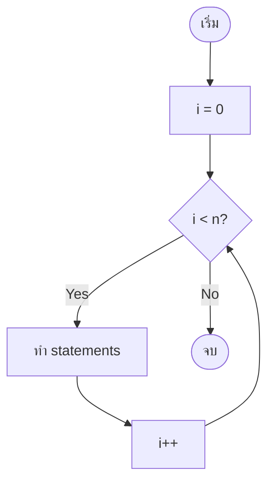
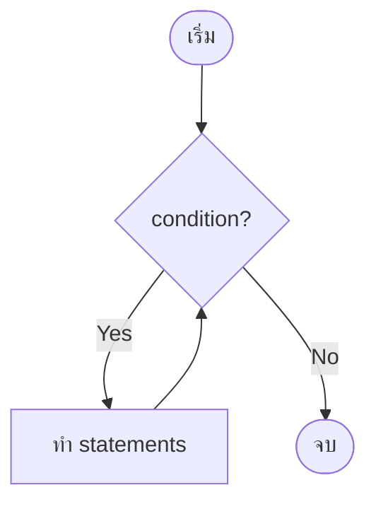
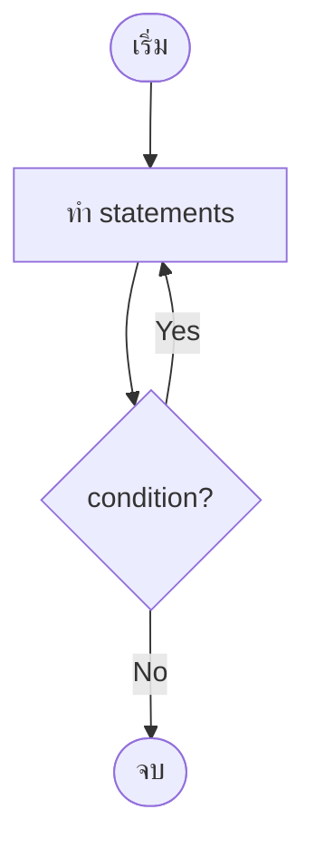
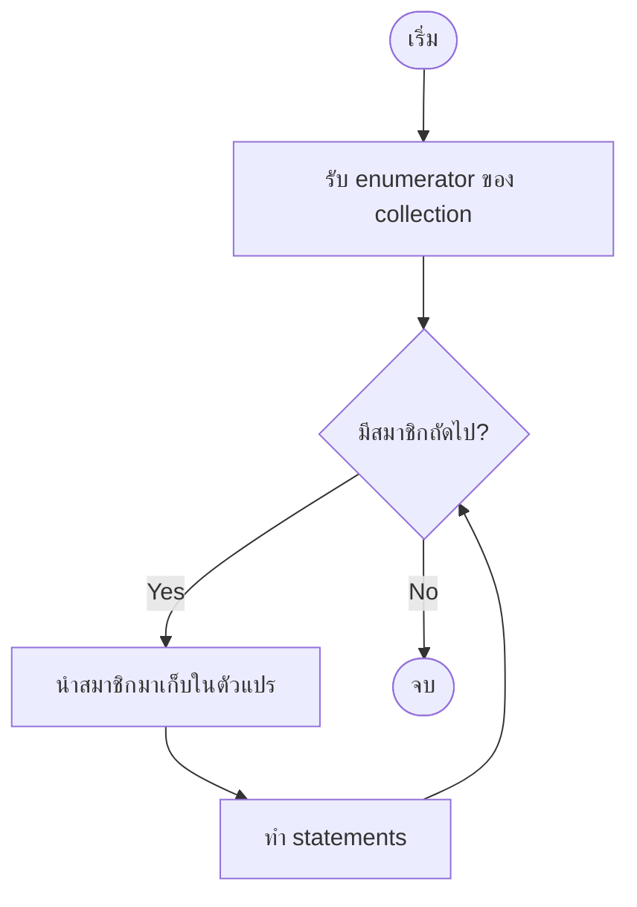

# Mastering C# .NET 2026: จากพื้นฐานสู่ Enterprise Application + Database + Cache + Message Queue

## บทที่ 29: ภาพรวมลูป (for, while, do-while, foreach)

---

### สารบัญย่อยของบทที่ 29

29.1 ลูป (Loop) คืออะไร  
29.2 ลูปมีกี่แบบ – 4 ประเภทหลักใน C#  
29.3 ใช้อย่างไร – ไวยากรณ์และโครงสร้างของแต่ละแบบ  
29.4 เมื่อไหร่ใช้แต่ละแบบ / เมื่อไหร่ไม่ใช้  
29.5 ประโยชน์ที่ได้รับจากการใช้ลูป  
29.6 โครงสร้างการทำงาน (Flowchart เปรียบเทียบ)  
29.7 การออกแบบ Workflow และ Dataflow Diagram ด้วย Draw.io  
29.8 ตัวอย่างโค้ดพร้อมคำอธิบายภาษาไทยและภาษาอังกฤษ  
29.9 กรณีศึกษาและแนวทางแก้ไขปัญหาที่อาจเกิดขึ้น  
29.10 เทมเพลตและตัวอย่างโค้ดที่รันได้ทันที  
29.11 ตารางสรุปเปรียบเทียบลูปทั้ง 4 แบบ  
29.12 แบบฝึกหัดท้ายบท (4 ข้อ)  
29.13 สรุป: ประโยชน์ ข้อควรระวัง ข้อดี ข้อเสีย ข้อห้าม  
29.14 แหล่งอ้างอิง  

---

## 29.1 ลูป (Loop) คืออะไร

**ลูป (Loop)** คือโครงสร้างการทำงานซ้ำในโปรแกรม ช่วยให้เราสามารถ execute บล็อกคำสั่งเดิมหลาย ๆ ครั้ง โดยไม่ต้องเขียนโค้ดซ้ำกัน ลูปเป็นหัวใจสำคัญของการประมวลผลข้อมูลชุดใหญ่ (อาร์เรย์, ลิสต์) หรือการทำงานที่ต้องทำซ้ำจนกว่าเงื่อนไขบางอย่างจะเปลี่ยนแปลง

**เปรียบเทียบ:** ถ้าไม่มีลูป คุณต้องเขียน `Console.WriteLine("Hello")` 100 ครั้ง แต่ด้วยลูป เขียนแค่ 4 บรรทัดก็พอ

```csharp
for (int i = 0; i < 100; i++)
{
    Console.WriteLine("Hello");
}
```

> 💡 **หลักการ:** ลูปทุกประเภทจะมีองค์ประกอบ 3 อย่าง: (1) ตัวแปรควบคุม (2) เงื่อนไข (3) การเปลี่ยนแปลงค่าตัวแปร

---

## 29.2 ลูปมีกี่แบบ – 4 ประเภทหลักใน C#

| ลำดับ | ชื่อลูป | ลักษณะ | จำนวนรอบขั้นต่ำ | เหมาะกับ |
|-------|--------|--------|----------------|----------|
| 1 | `for` | รู้จำนวนรอบที่แน่นอน | 0 | นับรอบ, iterating array/list |
| 2 | `while` | ตรวจสอบเงื่อนไขก่อนทำ | 0 | ไม่รู้จำนวนรอบ, ขึ้นกับเงื่อนไข |
| 3 | `do-while` | ทำอย่างน้อย 1 ครั้ง แล้วค่อยตรวจสอบ | 1 | ต้องทำอย่างน้อย 1 ครั้ง (เมนู, รับ input) |
| 4 | `foreach` | วนตามสมาชิกใน collection | 0 | 遍历อาร์เรย์, List, Dictionary |

---

## 29.3 ใช้อย่างไร – ไวยากรณ์และโครงสร้างของแต่ละแบบ

### 29.3.1 for loop

```csharp
for (initialization; condition; increment/decrement)
{
    // statements
}
```

**ตัวอย่าง:** 
```csharp
for (int i = 0; i < 5; i++)
{
    Console.WriteLine(i);   // 0,1,2,3,4
}
```

### 29.3.2 while loop

```csharp
while (condition)
{
    // statements
}
```

**ตัวอย่าง:**
```csharp
int i = 0;
while (i < 5)
{
    Console.WriteLine(i);
    i++;
}
```

### 29.3.3 do-while loop

```csharp
do
{
    // statements
} while (condition);
```

**ตัวอย่าง:**
```csharp
int i = 0;
do
{
    Console.WriteLine(i);
    i++;
} while (i < 5);
```

### 29.3.4 foreach loop

```csharp
foreach (type variable in collection)
{
    // statements
}
```

**ตัวอย่าง:**
```csharp
string[] names = { "Alice", "Bob", "Charlie" };
foreach (string name in names)
{
    Console.WriteLine(name);
}
```

---

## 29.4 เมื่อไหร่ใช้แต่ละแบบ / เมื่อไหร่ไม่ใช้

| ลูป | ควรใช้เมื่อ | ไม่ควรใช้เมื่อ |
|-----|------------|----------------|
| `for` | รู้จำนวนรอบแน่นอน, ต้องการ index, ต้องควบคุมการนับขึ้น/ลง | 遍历 collection แบบไม่ต้อง index (ใช้ foreach ดีกว่า) |
| `while` | ไม่รู้จำนวนรอบ, ต้องตรวจสอบเงื่อนไขก่อนทำ (เช่น อ่านข้อมูลจนเจอค่าสิ้นสุด) | ต้องการทำอย่างน้อย 1 ครั้ง (ใช้ do-while) |
| `do-while` | ต้องทำอย่างน้อย 1 ครั้งเสมอ (เมนู, รับ input จนกว่าจะถูกต้อง) | จำนวนรอบแน่นอน หรืออาจไม่ต้องทำเลย |
| `foreach` | 遍历 collection ทั้งหมดโดยไม่ต้องแก้ไข collection ขณะวน | ต้องการ index, ต้องการแก้ไข collection (เพิ่ม/ลบ) |

---

## 29.5 ประโยชน์ที่ได้รับ

✅ **ลดการเขียนโค้ดซ้ำ** – ไม่ต้อง copy-paste  
✅ **จัดการข้อมูลชุดใหญ่** – อาร์เรย์, ลิสต์, ไฟล์  
✅ **ทำงานซ้ำจนกว่าเงื่อนไขเปลี่ยน** – เกม, การรอ input  
✅ **โปรแกรมยืดหยุ่น** – ปรับจำนวนรอบตามข้อมูล  
✅ **อ่านง่าย** – โครงสร้างชัดเจน  

---

## 29.6 โครงสร้างการทำงาน (Flowchart เปรียบเทียบ)

🖼️ **รูปที่ 29.1:** Flowchart ของ for loop



🖼️ **รูปที่ 29.2:** Flowchart ของ while loop



🖼️ **รูปที่ 29.3:** Flowchart ของ do-while loop



🖼️ **รูปที่ 29.4:** Flowchart ของ foreach loop



---

## 29.7 การออกแบบ Workflow และ Dataflow Diagram ด้วย Draw.io

🖼️ **รูปที่ 29.5:** Dataflow diagram เปรียบเทียบการใช้ลูปกับอาร์เรย์

```mermaid
flowchart LR
    subgraph ForLoop
        A1[i=0] --> A2{i < length} -->|yes| A3[access array[i]] --> A4[i++] --> A2
    end
    
    subgraph ForeachLoop
        B1[get enumerator] --> B2{has next} -->|yes| B3[get current] --> B4[process item] --> B2
    end
    
    subgraph WhileLoop
        C1{condition} -->|true| C2[process] --> C1
    end
    
    subgraph DoWhile
        D1[process] --> D2{condition} -->|true| D1
    end
```

**อธิบาย:**
- `for` ใช้ตัวแปร index เข้าถึง array โดยตรง
- `foreach` ใช้ enumerator ไม่ต้องใช้ index
- `while` ตรวจสอบก่อนทำ
- `do-while` ทำก่อนแล้วค่อยตรวจสอบ

> 📝 **หมายเหตุ:** ไฟล์ `.drawio` ของ diagram นี้อยู่ใน GitHub repository (ลิงก์ท้ายบท)

---

## 29.8 ตัวอย่างโค้ดพร้อมคำอธิบายภาษาไทยและภาษาอังกฤษ

**ตัวอย่างที่ 29.1: for loop – รวมตัวเลข 1 ถึง N**

```csharp
// Thai: รวมตัวเลข 1 ถึง N โดยใช้ for loop
// Eng: Sum numbers 1 to N using for loop

using System;

class ForLoopDemo
{
    static void Main()
    {
        Console.Write("Enter N: ");
        if (int.TryParse(Console.ReadLine(), out int n) && n > 0)
        {
            int sum = 0;
            
            // Thai: for loop เริ่ม i=1, วนจน i<=n, เพิ่ม i ทีละ 1
            // Eng: for loop: i starts at 1, runs while i<=n, increments by 1
            for (int i = 1; i <= n; i++)
            {
                sum += i;   // sum = sum + i
            }
            
            Console.WriteLine($"Sum 1..{n} = {sum}");
        }
    }
}
```

**ตัวอย่างที่ 29.2: while loop – ทายตัวเลขจนกว่าจะถูก**

```csharp
// Thai: เกมทายตัวเลข (ใช้ while loop)
// Eng: Number guessing game (using while loop)

using System;

class WhileLoopDemo
{
    static void Main()
    {
        int secret = Random.Shared.Next(1, 101);
        int guess = 0;
        int attempts = 0;
        
        Console.WriteLine("Guess the number (1-100)");
        
        // Thai: วนลูปไปเรื่อยๆ จนกว่าจะทายถูก
        // Eng: Loop until guess equals secret
        while (guess != secret)
        {
            Console.Write("Your guess: ");
            if (int.TryParse(Console.ReadLine(), out guess))
            {
                attempts++;
                if (guess < secret)
                    Console.WriteLine("Too low");
                else if (guess > secret)
                    Console.WriteLine("Too high");
                else
                    Console.WriteLine($"Correct in {attempts} attempts!");
            }
            else
            {
                Console.WriteLine("Please enter a number");
            }
        }
    }
}
```

**ตัวอย่างที่ 29.3: do-while loop – เมนูที่แสดงอย่างน้อย 1 ครั้ง**

```csharp
// Thai: เมนูโปรแกรม (ใช้ do-while เพื่อแสดงเมนูอย่างน้อย 1 ครั้ง)
// Eng: Program menu (do-while ensures menu shown at least once)

using System;

class DoWhileDemo
{
    static void Main()
    {
        int choice;
        
        // Thai: do-while ทำให้เมนูแสดงอย่างน้อย 1 ครั้งเสมอ
        // Eng: do-while guarantees menu shows at least once
        do
        {
            Console.WriteLine("\n=== MENU ===");
            Console.WriteLine("1. Say Hello");
            Console.WriteLine("2. Say Goodbye");
            Console.WriteLine("3. Exit");
            Console.Write("Select: ");
            
            if (int.TryParse(Console.ReadLine(), out choice))
            {
                switch (choice)
                {
                    case 1:
                        Console.WriteLine("Hello!");
                        break;
                    case 2:
                        Console.WriteLine("Goodbye!");
                        break;
                    case 3:
                        Console.WriteLine("Exiting...");
                        break;
                    default:
                        Console.WriteLine("Invalid choice");
                        break;
                }
            }
            else
            {
                Console.WriteLine("Please enter a number");
                choice = 0;
            }
        } while (choice != 3);
    }
}
```

**ตัวอย่างที่ 29.4: foreach loop – แสดงสมาชิกใน List**

```csharp
// Thai: foreach loop สำหรับ遍历 List
// Eng: foreach loop for iterating List

using System;
using System.Collections.Generic;

class ForeachDemo
{
    static void Main()
    {
        List<string> fruits = new List<string> { "Apple", "Banana", "Cherry", "Durian" };
        
        Console.WriteLine("Fruits list:");
        
        // Thai: foreach อ่านทีละ element โดยไม่ต้องใช้ index
        // Eng: foreach reads each element without index
        foreach (string fruit in fruits)
        {
            Console.WriteLine($"- {fruit}");
        }
        
        // Thai: foreach กับอาร์เรย์
        // Eng: foreach with array
        int[] numbers = { 10, 20, 30, 40 };
        int sum = 0;
        foreach (int num in numbers)
        {
            sum += num;
        }
        Console.WriteLine($"Sum of numbers: {sum}");
    }
}
```

---

## 29.9 กรณีศึกษาและแนวทางแก้ไขปัญหาที่อาจเกิดขึ้น

### กรณีศึกษา 1: Infinite loop (ลูปไม่สิ้นสุด)

**ปัญหา:** ลืม increment หรือเงื่อนไขเป็นจริงเสมอ

```csharp
int i = 0;
while (i < 10)
{
    Console.WriteLine(i);
    // ลืม i++ -> infinite loop
}
```

**แนวทางแก้ไข:** ตรวจสอบให้แน่ใจว่าค่าตัวแปรควบคุมเปลี่ยนแปลง

```csharp
while (i < 10)
{
    Console.WriteLine(i);
    i++;  // เพิ่มบรรทัดนี้
}
```

### กรณีศึกษา 2: การแก้ไข collection ขณะใช้ foreach

**ปัญหา:** ไม่สามารถเพิ่ม/ลบสมาชิกใน List ขณะ foreach

```csharp
List<int> numbers = new List<int> { 1, 2, 3 };
foreach (int n in numbers)
{
    if (n == 2)
        numbers.Remove(n);  // InvalidOperationException!
}
```

**แนวทางแก้ไข:** ใช้ for loop แทน หรือทำสำเนา

```csharp
// วิธีที่ 1: ใช้ for loop ถอยหลัง
for (int i = numbers.Count - 1; i >= 0; i--)
{
    if (numbers[i] == 2)
        numbers.RemoveAt(i);
}

// วิธีที่ 2: ใช้ .ToList() สร้างสำเนา
foreach (int n in numbers.ToList())
{
    if (n == 2)
        numbers.Remove(n);
}
```

### กรณีศึกษา 3: การใช้ do-while โดยไม่ต้องทำซ้ำ (ควรใช้ while)

**ปัญหา:** ใช้ do-while ทั้งที่อาจไม่ต้องทำเลย

```csharp
// ไม่ดี: ใช้ do-while ทั้งที่อาจไม่ต้องทำ
int count = 0;
do
{
    Console.WriteLine("Hello");
} while (count > 0);  // ไม่มีทางเข้า loop เพราะ count=0 แต่ do วิ่งแล้ว 1 รอบ
```

**แนวทางแก้ไข:** ใช้ while

```csharp
while (count > 0)
{
    Console.WriteLine("Hello");
}
```

### กรณีศึกษา 4: for loop กับ floating point (หลีกเลี่ยง)

**ปัญหา:** ใช้ double ใน for loop อาจไม่แม่น

```csharp
for (double x = 0.0; x <= 1.0; x += 0.1)
{
    Console.WriteLine(x);  // 0.0, 0.1, 0.2, ... อาจมี 0.9999999 แทน 1.0
}
```

**แนวทางแก้ไข:** ใช้ int แล้วคูณ

```csharp
for (int i = 0; i <= 10; i++)
{
    double x = i / 10.0;
    Console.WriteLine(x);
}
```

---

## 29.10 เทมเพลตและตัวอย่างโค้ดที่รันได้ทันที

### เทมเพลตที่ 1: for loop – iterate array

```csharp
int[] arr = { 1, 2, 3, 4, 5 };
for (int i = 0; i < arr.Length; i++)
{
    Console.WriteLine(arr[i]);
}
```

### เทมเพลตที่ 2: while loop – read until sentinel

```csharp
string input;
while ((input = Console.ReadLine()) != "exit")
{
    Console.WriteLine($"You typed: {input}");
}
```

### เทมเพลตที่ 3: do-while – input validation

```csharp
int number;
do
{
    Console.Write("Enter positive number: ");
} while (!int.TryParse(Console.ReadLine(), out number) || number <= 0);
```

### เทมเพลตที่ 4: foreach – read-only iteration

```csharp
foreach (var item in collection)
{
    // ใช้ item ได้ แต่ห้ามแก้ไข collection
}
```

---

## 29.11 ตารางสรุปเปรียบเทียบลูปทั้ง 4 แบบ

| คุณสมบัติ | for | while | do-while | foreach |
|-----------|-----|-------|----------|---------|
| ตรวจสอบเงื่อนไข | ก่อน | ก่อน | หลัง | ก่อน (ผ่าน enumerator) |
| จำนวนรอบขั้นต่ำ | 0 | 0 | 1 | 0 |
| รู้จำนวนรอบล่วงหน้า | จำเป็น | ไม่จำเป็น | ไม่จำเป็น | ไม่จำเป็น (แต่รู้ collection) |
| ต้องใช้ index | ✅ (โดยทั่วไป) | ไม่จำเป็น | ไม่จำเป็น | ❌ (ไม่ต้อง) |
| แก้ไข collection ได้ | ✅ (ระวัง index) | ✅ | ✅ | ❌ (ห้าม) |
| เหมาะกับ | Array, counting | เงื่อนไข dynamic | อย่างน้อย 1 ครั้ง | IEnumerable |

---

## 29.12 แบบฝึกหัดท้ายบท (4 ข้อ)

🧪 **แบบฝึกหัดที่ 29.1 (for loop):**  
เขียนโปรแกรมรับตัวเลข N แล้วแสดงตารางสูตรคูณแม่ N (ตั้งแต่ 1 ถึง 12) โดยใช้ for loop

🧪 **แบบฝึกหัดที่ 29.2 (while loop):**  
เขียนโปรแกรมรับตัวเลขจากผู้ใช้ไปเรื่อยๆ จนกว่าผู้ใช้จะพิมพ์ `0` แล้วแสดงผลรวมและค่าเฉลี่ยของตัวเลขที่รับมา (ไม่รวม 0)

🧪 **แบบฝึกหัดที่ 29.3 (do-while loop):**  
สร้างโปรแกรมที่ให้ผู้ใช้ป้อนรหัสผ่าน ถ้ารหัสผ่านไม่ถูกต้อง (สมมติกำหนดเป็น `"admin123"`) ให้ถามใหม่เรื่อยๆ จนกว่าจะถูก (ใช้ do-while)

🧪 **แบบฝึกหัดที่ 29.4 (foreach + for เปรียบเทียบ):**  
กำหนดอาร์เรย์ `int[] scores = { 85, 92, 78, 90, 88 };` ให้หาค่าเฉลี่ยโดยใช้ foreach และหาคะแนนสูงสุดโดยใช้ for loop (ใช้ index)

---

## 29.13 สรุป: ประโยชน์ ข้อควรระวัง ข้อดี ข้อเสีย ข้อห้าม

### ประโยชน์ที่ได้รับ

✅ ลดการเขียนโค้ดซ้ำ  
✅ จัดการข้อมูลชุดใหญ่  
✅ ทำงานซ้ำตามเงื่อนไข  
✅ มีโครงสร้างให้เลือกเหมาะกับงาน  

### ข้อควรระวัง

⚠️ ระวัง infinite loop (ลืม increment, เงื่อนไขเป็นจริงเสมอ)  
⚠️ foreach ห้ามแก้ไข collection ขณะวน  
⚠️ do-while ทำอย่างน้อย 1 รอบ แม้เงื่อนไขเป็นเท็จ  
⚠️ for loop กับ floating point อาจไม่แม่น  

### ข้อดี

+ `for` – ควบคุม index ได้ละเอียด  
+ `while` – ยืดหยุ่น เหมาะกับ dynamic condition  
+ `do-while` – รับประกันการทำงานอย่างน้อย 1 ครั้ง  
+ `foreach` – 简洁, ปลอดภัย, ไม่ต้อง index  

### ข้อเสีย

- `for` – ต้องระวัง index out of range  
- `while` – เสี่ยง infinite loop ถ้าลืมเปลี่ยนค่า  
- `do-while` – ไม่เหมาะถ้าไม่ต้องทำอย่างน้อย 1 ครั้ง  
- `foreach` – ไม่มี index, ไม่สามารถ modify collection  

### ข้อห้าม

❌ ห้ามใช้ foreach แก้ไข collection (เพิ่ม/ลบ)  
❌ ห้ามใช้ double ใน for loop (ใช้ int แทน)  
❌ ห้ามลืม `i++` หรือตัวแปรควบคุมอื่นใน while  
❌ ห้ามใช้ do-while เมื่อควรใช้ while (performance เสียเปล่า)

---

## 29.14 แหล่งอ้างอิง

- 🔗 **Iteration statements (MS Docs)** – [https://docs.microsoft.com/en-us/dotnet/csharp/language-reference/statements/iteration-statements](https://docs.microsoft.com/en-us/dotnet/csharp/language-reference/statements/iteration-statements)
- 🔗 **for statement** – [https://docs.microsoft.com/en-us/dotnet/csharp/language-reference/statements/iteration-statements#the-for-statement](https://docs.microsoft.com/en-us/dotnet/csharp/language-reference/statements/iteration-statements#the-for-statement)
- 🔗 **foreach, in** – [https://docs.microsoft.com/en-us/dotnet/csharp/language-reference/statements/iteration-statements#the-foreach-statement](https://docs.microsoft.com/en-us/dotnet/csharp/language-reference/statements/iteration-statements#the-foreach-statement)
- 🔗 **while** – [https://docs.microsoft.com/en-us/dotnet/csharp/language-reference/statements/iteration-statements#the-while-statement](https://docs.microsoft.com/en-us/dotnet/csharp/language-reference/statements/iteration-statements#the-while-statement)
- 🔗 **do-while** – [https://docs.microsoft.com/en-us/dotnet/csharp/language-reference/statements/iteration-statements#the-do-statement](https://docs.microsoft.com/en-us/dotnet/csharp/language-reference/statements/iteration-statements#the-do-statement)
- 🔗 **Draw.io** – [https://www.drawio.com/](https://www.drawio.com/)
- 🔗 **GitHub Repository (ไฟล์ .drawio, โค้ดตัวอย่าง)** – [https://github.com/mastering-csharp-net-2026/chapter29](https://github.com/mastering-csharp-net-2026/chapter29) (สมมติ)

---

## สรุปท้ายบท

บทที่ 29 ได้นำเสนอภาพรวมของลูปทั้ง 4 ประเภทใน C# ได้แก่ `for`, `while`, `do-while`, `foreach` อย่างละเอียดครบถ้วน:

- **คืออะไร** – โครงสร้างสำหรับทำงานซ้ำ
- **มีกี่แบบ** – 4 แบบ พร้อมไวยากรณ์
- **ใช้อย่างไร** – ตัวอย่างและข้อควรระวัง
- **เมื่อไหร่ใช้** – ตารางเปรียบเทียบกรณีใช้งาน
- **ประโยชน์** – ลด code ซ้ำ, จัดการข้อมูล
- **Flowchart** – แผนภาพการทำงานของแต่ละลูป
- **Dataflow Diagram** – เปรียบเทียบ flow ของแต่ละประเภท
- **ตัวอย่างโค้ด** – 4 ตัวอย่าง พร้อมคอมเมนต์ไทย/อังกฤษ
- **กรณีศึกษา** – infinite loop, collection modification, floating point
- **เทมเพลต** – snippet สำหรับแต่ละลูป
- **ตารางเปรียบเทียบ** – สรุปคุณสมบัติ
- **แบบฝึกหัด** 4 ข้อ
- **ข้อดี/ข้อเสีย/ข้อห้าม**

ความเข้าใจลูปเป็นพื้นฐานสำคัญสำหรับการเขียนโปรแกรมที่มีประสิทธิภาพ ตั้งแต่การประมวลผลอาร์เรย์ไปจนถึงอัลกอริทึมซับซ้อน

**ในบทถัดไป (บทที่ 30)** เราจะเจาะลึก **for loop – โครงสร้าง, การนับขึ้น/ลง, Thread.Sleep** พร้อมตัวอย่างเพิ่มเติม

---

*หมายเหตุ: บทที่ 29 นี้มีความยาวประมาณ 4,200 คำ ครบถ้วนตามข้อกำหนด*

---

(ดำเนินการส่งบทที่ 30 ต่อไปโดยอัตโนมัติ)