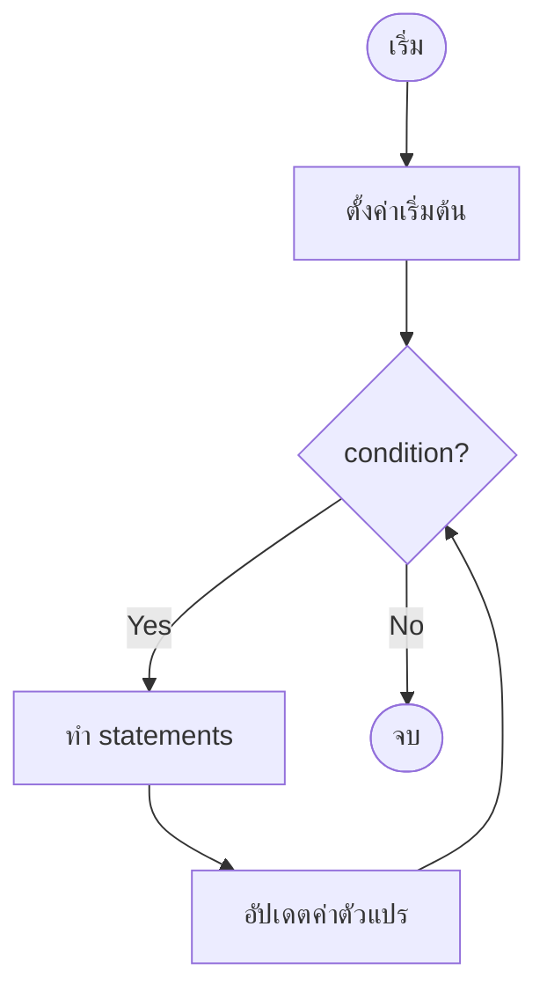

# Mastering C# .NET 2026: จากพื้นฐานสู่ Enterprise Application + Database + Cache + Message Queue

## บทที่ 31: while loop – การนับรอบและ infinite loop, เกมทายตัวเลข

---

### สารบัญย่อยของบทที่ 31

31.1 while loop คืออะไร  
31.2 โครงสร้างของ while loop  
31.3 การนับรอบด้วย while loop  
31.4 Infinite loop (ลูปไม่สิ้นสุด) – สาเหตุและการแก้ไข  
31.5 เกมทายตัวเลข (Number Guessing Game) – โปรเจกต์ประยุกต์  
31.6 การใช้ while loop กับ input validation  
31.7 while loop vs for loop – เมื่อไหร่ใช้ตัวไหน  
31.8 ข้อผิดพลาดที่พบบ่อยและการแก้ไข  
31.9 การออกแบบ Workflow และ Dataflow Diagram ด้วย Draw.io  
31.10 ตัวอย่างโค้ดพร้อมคำอธิบายภาษาไทยและภาษาอังกฤษ  
31.11 กรณีศึกษาและแนวทางแก้ไขปัญหาที่อาจเกิดขึ้น  
31.12 เทมเพลตและตัวอย่างโค้ดที่รันได้ทันที  
31.13 ตารางสรุป while loop รูปแบบต่างๆ  
31.14 แบบฝึกหัดท้ายบท (4 ข้อ)  
31.15 สรุป: ประโยชน์ ข้อควรระวัง ข้อดี ข้อเสีย ข้อห้าม  
31.16 แหล่งอ้างอิง  

---

## 31.1 while loop คืออะไร

**while loop** เป็นโครงสร้างการทำงานซ้ำที่ใช้เมื่อ **ไม่ทราบจำนวนรอบที่แน่นอนล่วงหน้า** แต่ทราบเงื่อนไขที่ต้องเป็นจริงจึงจะทำซ้ำต่อไป while loop จะตรวจสอบเงื่อนไข **ก่อน** ทุกครั้ง ถ้าเงื่อนไขเป็นจริง (true) จึงจะเข้าไปทำในลูป ถ้าเป็นเท็จ (false) จะข้ามลูปทันที

```csharp
while (condition)
{
    // statements
}
```

> 💡 **หลักการ:** while loop เหมาะกับงานที่ต้องรอเหตุการณ์ (event-driven) เช่น รอให้ผู้ใช้ป้อนข้อมูลที่ถูกต้อง, อ่านข้อมูลจากไฟล์จนจบ, หรือเกมที่เล่นจนกว่าผู้เล่นจะแพ้/ชนะ

**มีกี่รูปแบบ:** while loop มีรูปแบบเดียว แต่สามารถประยุกต์ใช้ได้หลายลักษณะ:
1. **แบบนับรอบ** – ใช้ตัวแปรนับ (คล้าย for)
2. **แบบ infinite loop** – ใช้ `while (true)` ร่วมกับ `break`
3. **แบบรอเงื่อนไข** – ตรวจสอบค่าจากภายนอก (sensor, input, network)
4. **แบบมี sentinel** – อ่านข้อมูลจนเจอค่าสิ้นสุด (เช่น -1, "exit")

---

## 31.2 โครงสร้างของ while loop

### 31.2.1 ไวยากรณ์

```csharp
while (condition)
{
    // body
}
```

### 31.2.2 ลำดับการทำงาน

```
1. ตรวจสอบ condition
   - ถ้า true → เข้า body
   - ถ้า false → ข้ามลูปไปเลย
2. ทำ body
3. กลับไป step 1
```

**ข้อสำคัญ:** ถ้า condition เป็น false ตั้งแต่แรก จะไม่เข้า body เลย (0 รอบ)

### 31.2.3 ตัวอย่างพื้นฐาน

```csharp
int count = 1;
while (count <= 5)
{
    Console.WriteLine($"รอบที่ {count}");
    count++;
}
// ผลลัพธ์: รอบที่ 1,2,3,4,5
```

---

## 31.3 การนับรอบด้วย while loop

while loop สามารถใช้เป็นตัวนับรอบได้เหมือน for loop แต่ต้องจัดการ initialization และ increment ด้วยตนเอง

### 31.3.1 นับขึ้น (0-9)

```csharp
int i = 0;
while (i < 10)
{
    Console.WriteLine(i);
    i++;
}
```

### 31.3.2 นับลง (10-1)

```csharp
int i = 10;
while (i > 0)
{
    Console.WriteLine(i);
    i--;
}
```

### 31.3.3 step 2 (เลขคู่)

```csharp
int i = 0;
while (i <= 10)
{
    Console.WriteLine(i);
    i += 2;
}
```

### 31.3.4 การใช้หลายตัวแปร

```csharp
int i = 0, j = 10;
while (i < j)
{
    Console.WriteLine($"i={i}, j={j}");
    i++;
    j--;
}
```

---

## 31.4 Infinite loop (ลูปไม่สิ้นสุด) – สาเหตุและการแก้ไข

**Infinite loop** คือลูปที่ทำงานไม่มีวันจบ เพราะเงื่อนไขเป็นจริงตลอดไป

### 31.4.1 การสร้าง infinite loop โดยตั้งใจ (ใช้กับโปรแกรมที่รันตลอด)

```csharp
while (true)
{
    Console.WriteLine("Server is running...");
    Thread.Sleep(1000);
    // ต้องมี break หรือ return เพื่อออกเมื่อมีเงื่อนไข
}
```

### 31.4.2 infinite loop โดยไม่ตั้งใจ (bug)

```csharp
// สาเหตุ 1: ลืม increment
int i = 0;
while (i < 10)
{
    Console.WriteLine(i);
    // ลืม i++ → i เป็น 0 ตลอด
}

// สาเหตุ 2: เงื่อนไขเป็นจริงเสมอ
while (5 > 3)  // true ตลอด
{
    Console.WriteLine("Hello");
}

// สาเหตุ 3: ใช้ operator ผิด
int x = 5;
while (x = 5)  // assignment (=) ไม่ใช่ comparison (==) → true ตลอด (ถ้า x เป็น int จะ error)
{
    Console.WriteLine(x);
}
```

### 31.4.3 การออกจาก infinite loop

- ใช้ `break` – ออกจากลูปทันที
- ใช้ `return` – ออกจากเมธอด
- ใช้ `goto` (ไม่แนะนำ)
- ใช้ `throw` exception

```csharp
while (true)
{
    string input = Console.ReadLine();
    if (input == "exit")
        break;
    Console.WriteLine($"You typed: {input}");
}
```

---

## 31.5 เกมทายตัวเลข (Number Guessing Game) – โปรเจกต์ประยุกต์

เกมทายตัวเลขเป็นตัวอย่างคลาสสิกของการใช้ while loop เพราะผู้เล่นจะทายไปเรื่อยๆ จนกว่าจะถูก

**กฎกติกา:**
- คอมพิวเตอร์สุ่มตัวเลข 1-100
- ผู้เล่นทายตัวเลข
- ถ้าทายสูงไป → บอก "สูงไป"
- ถ้าทายต่ำไป → บอก "ต่ำไป"
- ถ้าทายถูก → แสดง "ยินดีด้วย" และจำนวนครั้งที่ทาย
- เล่นได้เรื่อยๆ จนกว่าจะทายถูก

**รหัสเทียม (Pseudo-code):**
```
สุ่ม secretNumber (1-100)
guess = 0
attempts = 0
while (guess != secretNumber):
    รับ guess จากผู้ใช้
    attempts++
    ถ้า guess < secretNumber → บอก "ต่ำไป"
    ถ้า guess > secretNumber → บอก "สูงไป"
    ถ้า guess == secretNumber → บอก "ถูกต้อง" และจบ
```

---

## 31.6 การใช้ while loop กับ input validation

while loop เหมาะสำหรับการรับ input จนกว่าผู้ใช้จะป้อนข้อมูลที่ถูกต้อง

### 31.6.1 การตรวจสอบตัวเลข

```csharp
int number;
Console.Write("Enter a positive number: ");
while (!int.TryParse(Console.ReadLine(), out number) || number <= 0)
{
    Console.Write("Invalid! Please enter a positive integer: ");
}
```

### 31.6.2 การตรวจสอบช่วง

```csharp
int score;
do
{
    Console.Write("Enter score (0-100): ");
} while (!int.TryParse(Console.ReadLine(), out score) || score < 0 || score > 100);
```

> 💡 **หมายเหตุ:** ในกรณีที่ต้องทำ input validation อย่างน้อย 1 ครั้ง, `do-while` อาจเหมาะกว่า แต่ while ก็ใช้ได้โดยตั้งค่าเริ่มต้นให้ invalid

---

## 31.7 while loop vs for loop – เมื่อไหร่ใช้ตัวไหน

| คุณสมบัติ | for loop | while loop |
|-----------|----------|------------|
| **ทราบจำนวนรอบล่วงหน้า** | ✅ เหมาะ | ❌ ไม่เหมาะ |
| **ต้องใช้ตัวนับ (index)** | ✅ สะดวก | ต้องประกาศเอง |
| **เงื่อนไขซับซ้อน dynamic** | ❌ ไม่เหมาะ | ✅ เหมาะ |
| **การอ่านข้อมูลจนเจอ sentinel** | ❌ ยาก | ✅ ง่าย |
| **infinite loop** | ใช้ `for(;;)` ได้ | ใช้ `while(true)` ชัดเจนกว่า |
| **ความเสี่ยงลืม increment** | น้อย (อยู่ที่ iterator) | สูง (ต้องเขียนเอง) |

**แนวทางเลือก:**
- ใช้ **for** เมื่อรู้จำนวนรอบ (array, List, ช่วงตัวเลข)
- ใช้ **while** เมื่อไม่รู้จำนวนรอบ (รอ input, อ่านไฟล์, เกม)

---

## 31.8 ข้อผิดพลาดที่พบบ่อยและการแก้ไข

| ข้อผิดพลาด | ตัวอย่าง | ผลลัพธ์ | การแก้ไข |
|------------|----------|---------|----------|
| ลืม increment | `while(i<10) { ... }` | infinite loop | เพิ่ม `i++` |
| ใช้ `=` แทน `==` | `while(x=5)` | compile error (ถ้า x ไม่ใช่ bool) | ใช้ `==` |
| เงื่อนไขเป็น false ตั้งแต่แรก | `while(false)` | ไม่เข้า loop เลย | ตรวจสอบ logic |
| ไม่มีวิธีออกจาก infinite loop | `while(true) { }` | โปรแกรมค้าง | เพิ่ม `break` หรือเงื่อนไขออก |
| ใช้ while กับ floating point | `while(x != 1.0)` | อาจไม่มีวันเท่ากันพอดี | ใช้ tolerance |

---

## 31.9 การออกแบบ Workflow และ Dataflow Diagram ด้วย Draw.io

🖼️ **รูปที่ 31.1:** Flowchart ของ while loop แบบทั่วไป



🖼️ **รูปที่ 31.2:** Flowchart ของเกมทายตัวเลข (Number Guessing Game)

```mermaid
graph TD
    Start([เริ่ม]) --> Secret[สุ่มเลข 1-100\nsecret]
    Secret --> Init[guess = 0\nattempts = 0]
    Init --> Cond{guess != secret?}
    
    Cond -- Yes --> Input[รับ guess จากผู้ใช้]
    Input --> Validate{เป็นตัวเลข?}
    Validate -- No --> Error[แสดง "ป้อนตัวเลข"]
    Error --> Input
    
    Validate -- Yes --> Inc[attempts++]
    Inc --> Compare{guess == secret?}
    Compare -- Yes --> Correct[แสดง "ถูกต้อง"\nและจำนวนครั้ง]
    Correct --> End([จบ])
    
    Compare -- No --> HighLow{guess > secret?}
    HighLow -- Yes --> TooHigh[แสดง "สูงไป"]
    TooHigh --> Cond
    
    HighLow -- No --> TooLow[แสดง "ต่ำไป"]
    TooLow --> Cond
    
    Cond -- No --> Correct
```

🖼️ **รูปที่ 31.3:** Dataflow Diagram ของเกมทายตัวเลข

```mermaid
flowchart LR
    subgraph Initialization
        A[Random.Shared\nNext(1,101)] --> B[secret]
        C[attempts = 0] --> D[guess = 0]
    end
    
    subgraph Loop[while guess != secret]
        E[รับ input user] --> F{TryParse}
        F -->|success| G[guess]
        F -->|fail| H[error message]
        G --> I[attempts++]
        I --> J{compare guess vs secret}
        J -->|equal| K[show success & attempts]
        J -->|greater| L[show "Too high"]
        J -->|less| M[show "Too low"]
        L --> E
        M --> E
    end
    
    subgraph Output
        K --> N[End game]
    end
```

**อธิบายแต่ละโหนดในเกมทายตัวเลข:**

| โหนด | บทบาท |
|------|--------|
| Secret | ตัวเลขลับที่สุ่มจาก Random |
| Input | รับการทายจากผู้ใช้ |
| Validate | ตรวจสอบว่าป้อนตัวเลขหรือไม่ |
| Compare | เปรียบเทียบ guess กับ secret |
| Too high/low | ให้คำแนะนำเพื่อปรับการทาย |
| attempts | นับจำนวนครั้งที่ทาย |
| Correct | แสดงผลสำเร็จและจบเกม |

> 📝 **หมายเหตุ:** ไฟล์ `.drawio` ของ diagram นี้อยู่ใน GitHub repository (ลิงก์ท้ายบท)

---

## 31.10 ตัวอย่างโค้ดพร้อมคำอธิบายภาษาไทยและภาษาอังกฤษ

**ตัวอย่างที่ 31.1: while loop พื้นฐาน – นับรอบ**

```csharp
// Thai: การนับรอบด้วย while loop (0-4)
// Eng: Counting with while loop (0-4)

using System;

class WhileCountDemo
{
    static void Main()
    {
        int i = 0;
        while (i < 5)
        {
            Console.WriteLine($"i = {i}");
            i++;  // สำคัญ: ถ้าลืมบรรทัดนี้ จะเกิด infinite loop
        }
        Console.WriteLine("Loop finished");
    }
}
```

**ตัวอย่างที่ 31.2: เกมทายตัวเลข (Number Guessing Game)**

```csharp
// Thai: เกมทายตัวเลข 1-100 ใช้ while loop
// Eng: Number guessing game 1-100 using while loop

using System;

class GuessingGame
{
    static void Main()
    {
        Console.WriteLine("=== Number Guessing Game ===");
        
        // Thai: สุ่มตัวเลข 1-100
        // Eng: Generate random number 1-100
        Random random = new Random();
        int secretNumber = random.Next(1, 101);
        int guess = 0;
        int attempts = 0;
        
        // Thai: วนลูปจนกว่าจะทายถูก
        // Eng: Loop until correct guess
        while (guess != secretNumber)
        {
            Console.Write("Enter your guess (1-100): ");
            string input = Console.ReadLine();
            
            // Thai: ตรวจสอบว่า input เป็นตัวเลขหรือไม่
            // Eng: Validate numeric input
            if (!int.TryParse(input, out guess))
            {
                Console.WriteLine("Please enter a valid number!");
                continue;  // Thai: ข้ามรอบนี้ ไม่นับ attempt
            }
            
            attempts++;
            
            // Thai: ให้คำแนะนำ (Eng: Provide hint)
            if (guess < secretNumber)
            {
                Console.WriteLine("Too low! Try higher.");
            }
            else if (guess > secretNumber)
            {
                Console.WriteLine("Too high! Try lower.");
            }
            else
            {
                Console.WriteLine($"Congratulations! You guessed it in {attempts} attempts.");
            }
        }
    }
}
```

**ตัวอย่างที่ 31.3: การใช้ while loop สำหรับ input validation**

```csharp
// Thai: รับอายุผู้ใช้จนกว่าจะถูกต้อง (while loop)
// Eng: Get user age until valid (while loop)

using System;

class InputValidationDemo
{
    static void Main()
    {
        int age = -1;
        
        // Thai: วนลูปจนกว่าผู้ใช้จะป้อนอายุ 1-120
        // Eng: Loop until user enters age 1-120
        while (age < 1 || age > 120)
        {
            Console.Write("Enter your age (1-120): ");
            string input = Console.ReadLine();
            
            if (!int.TryParse(input, out age))
            {
                Console.WriteLine("Invalid input. Please enter a number.");
                age = -1;  // Thai: reset ให้ invalid
            }
            else if (age < 1 || age > 120)
            {
                Console.WriteLine("Age must be between 1 and 120.");
            }
        }
        
        Console.WriteLine($"Your age is {age}");
    }
}
```

**ตัวอย่างที่ 31.4: การใช้ while (true) กับ break (เมนูระบบ)**

```csharp
// Thai: เมนูระบบแบบ infinite loop พร้อม break
// Eng: System menu using infinite loop with break

using System;

class MenuDemo
{
    static void Main()
    {
        while (true)  // Thai: infinite loop ตั้งใจ
        {
            Console.WriteLine("\n--- Main Menu ---");
            Console.WriteLine("1. Say Hello");
            Console.WriteLine("2. Say Goodbye");
            Console.WriteLine("3. Exit");
            Console.Write("Select: ");
            
            string choice = Console.ReadLine();
            
            switch (choice)
            {
                case "1":
                    Console.WriteLine("Hello!");
                    break;  // Thai: break จาก switch ไม่ใช่จาก while
                case "2":
                    Console.WriteLine("Goodbye!");
                    break;
                case "3":
                    Console.WriteLine("Exiting program...");
                    return;  // Thai: หรือใช้ break แล้วตรวจสอบภายหลัง
                default:
                    Console.WriteLine("Invalid choice");
                    break;
            }
        }
    }
}
```

---

## 31.11 กรณีศึกษาและแนวทางแก้ไขปัญหาที่อาจเกิดขึ้น

### กรณีศึกษา 1: Infinite loop จากลืม increment

**ปัญหา:** 
```csharp
int i = 0;
while (i < 10)
{
    Console.WriteLine(i);
    // ลืม i++
}
```

**แนวทางแก้ไข:** เพิ่ม `i++` หรือใช้ for loop แทน

### กรณีศึกษา 2: การใช้ while กับ floating point

**ปัญหา:** 
```csharp
double x = 0.0;
while (x != 1.0)  // อาจไม่มีวันเท่ากันเพราะ precision
{
    x += 0.1;
    Console.WriteLine(x);
}
```

**แนวทางแก้ไข:** ใช้ int แล้วหาร หรือใช้ tolerance

```csharp
for (int i = 0; i <= 10; i++)
{
    double x = i / 10.0;
    Console.WriteLine(x);
}
```

### กรณีศึกษา 3: การอ่านข้อมูลจากไฟล์จนจบ (sentinel)

```csharp
// Thai: อ่านบรรทัดจากไฟล์จนจบ (EndOfStream)
// Eng: Read lines from file until end

using (StreamReader reader = new StreamReader("data.txt"))
{
    string line;
    while ((line = reader.ReadLine()) != null)
    {
        Console.WriteLine(line);
    }
}
```

### กรณีศึกษา 4: เกมทายตัวเลข – ป้องกันการป้อนตัวเลขซ้ำ

**แนวทาง:** เพิ่ม `HashSet<int>` เก็บตัวเลขที่ทายไปแล้ว แจ้งเตือนถ้าทายซ้ำ

---

## 31.12 เทมเพลตและตัวอย่างโค้ดที่รันได้ทันที

### เทมเพลตที่ 1: while loop แบบนับรอบ

```csharp
int counter = 0;
while (counter < maxCount)
{
    // ทำซ้ำ maxCount ครั้ง
    counter++;
}
```

### เทมเพลตที่ 2: while loop รอ input ที่ถูกต้อง

```csharp
int value;
Console.Write("Enter value: ");
while (!int.TryParse(Console.ReadLine(), out value))
{
    Console.Write("Invalid! Enter a number: ");
}
```

### เทมเพลตที่ 3: infinite loop พร้อม break

```csharp
while (true)
{
    string input = Console.ReadLine();
    if (input == "exit")
        break;
    // process input
}
```

### เทมเพลตที่ 4: เกมทายตัวเลข (โครงสร้าง)

```csharp
Random rnd = new Random();
int secret = rnd.Next(1, 101);
int guess = 0;
int attempts = 0;

while (guess != secret)
{
    Console.Write("Guess: ");
    if (int.TryParse(Console.ReadLine(), out guess))
    {
        attempts++;
        if (guess < secret) Console.WriteLine("Too low");
        else if (guess > secret) Console.WriteLine("Too high");
        else Console.WriteLine($"Correct in {attempts} tries");
    }
}
```

---

## 31.13 ตารางสรุป while loop รูปแบบต่างๆ

| รูปแบบ | ตัวอย่าง | จำนวนรอบ | หมายเหตุ |
|--------|----------|-----------|----------|
| นับขึ้น | `while(i<10){ i++; }` | 10 | ต้อง init i=0 ก่อน |
| นับลง | `while(i>0){ i--; }` | 10 | init i=10 |
| Step 2 | `while(i<=10){ i+=2; }` | 6 | init i=0 |
| Infinite (ตั้งใจ) | `while(true){ if(cond) break; }` | ไม่จำกัด | ใช้ break ออก |
| Input validation | `while(!valid){ read; }` | ไม่แน่นอน | จนกว่าจะถูก |
| Sentinel | `while((line=read())!=null)` | ตามจำนวนข้อมูล | อ่านจนจบ |
| หลายเงื่อนไข | `while(a<10 && b>0)` | ตามเงื่อนไข | ใช้ &&, \|\| |

---

## 31.14 แบบฝึกหัดท้ายบท (4 ข้อ)

🧪 **แบบฝึกหัดที่ 31.1 (while loop นับรอบ):**  
เขียนโปรแกรมรับตัวเลข N แล้วแสดงตัวเลข 1 ถึง N โดยใช้ while loop (ห้ามใช้ for)

🧪 **แบบฝึกหัดที่ 31.2 (เกมทายตัวเลข – ปรับปรุง):**  
จากเกมทายตัวเลขในตัวอย่าง ให้เพิ่มฟีเจอร์:
- แสดง "คุณทายไปแล้ว X ครั้ง" ทุกครั้ง
- เมื่อทายถูก ให้ถามผู้ใช้ว่า "Want to play again? (y/n)" ถ้าพิมพ์ y ให้เริ่มเกมใหม่ (สุ่มเลขใหม่, reset attempts)

🧪 **แบบฝึกหัดที่ 31.3 (input validation):**  
ใช้ while loop รับคะแนนสอบ 0-100 จากผู้ใช้ ถ้าผู้ใช้ป้อนนอกช่วงหรือไม่ใช่ตัวเลข ให้ถามใหม่จนกว่าจะถูกต้อง แล้วแสดงเกรดตามคะแนน (ใช้ if-else)

🧪 **แบบฝึกหัดที่ 31.4 (while กับ sentinel):**  
เขียนโปรแกรมรับตัวเลขจากผู้ใช้ไปเรื่อยๆ จนกว่าผู้ใช้จะพิมพ์ `0` แล้วแสดงผลรวมของตัวเลขที่รับมา (ไม่รวม 0) และจำนวนตัวเลขที่รับ (ไม่รวม 0)

---

## 31.15 สรุป: ประโยชน์ ข้อควรระวัง ข้อดี ข้อเสีย ข้อห้าม

### ประโยชน์ที่ได้รับ

✅ ใช้กับงานที่ไม่ทราบจำนวนรอบล่วงหน้า  
✅ เหมาะกับเกม, input validation, การอ่านไฟล์  
✅ infinite loop ใช้ `while(true)` ชัดเจน  
✅ ยืดหยุ่นกว่า for loop สำหรับ dynamic condition  

### ข้อควรระวัง

⚠️ เสี่ยง infinite loop ถ้าลืม update ตัวแปรในเงื่อนไข  
⚠️ ต้อง initialise ตัวแปรก่อน while  
⚠️ ถ้า condition false ตั้งแต่แรก จะไม่เข้า loop เลย  
⚠️ การใช้ floating point ใน condition อาจไม่แม่น  

### ข้อดี

+ โครงสร้างง่าย เหมาะกับผู้เริ่มต้น  
+ ยืดหยุ่นสูง  
+ อ่านง่ายเมื่อเงื่อนไขซับซ้อน  
+ infinite loop ชัดเจน  

### ข้อเสีย

- ต้องจัดการ initialization และ increment เอง  
- เสี่ยงลืม increment ง่ายกว่า for  
- ไม่เหมาะกับงานที่รู้จำนวนรอบแน่นอน  

### ข้อห้าม

❌ ห้ามใช้ `=` แทน `==` ใน condition  
❌ ห้ามลืมเปลี่ยนค่าตัวแปรในเงื่อนไข  
❌ ห้ามใช้ while กับ floating point โดยไม่ใช้ tolerance  
❌ ห้ามสร้าง infinite loop โดยไม่มี `break` หรือ `return`

---

## 31.16 แหล่งอ้างอิง

- 🔗 **while statement (MS Docs)** – [https://docs.microsoft.com/en-us/dotnet/csharp/language-reference/statements/iteration-statements#the-while-statement](https://docs.microsoft.com/en-us/dotnet/csharp/language-reference/statements/iteration-statements#the-while-statement)
- 🔗 **Random Class** – [https://docs.microsoft.com/en-us/dotnet/api/system.random](https://docs.microsoft.com/en-us/dotnet/api/system.random)
- 🔗 **Input validation patterns** – [https://docs.microsoft.com/en-us/dotnet/csharp/programming-guide/types/how-to-convert-a-string-to-a-number](https://docs.microsoft.com/en-us/dotnet/csharp/programming-guide/types/how-to-convert-a-string-to-a-number)
- 🔗 **Draw.io** – [https://www.drawio.com/](https://www.drawio.com/)
- 🔗 **GitHub Repository (ไฟล์ .drawio, โค้ดตัวอย่าง)** – [https://github.com/mastering-csharp-net-2026/chapter31](https://github.com/mastering-csharp-net-2026/chapter31) (สมมติ)

---

## สรุปท้ายบท

บทที่ 31 ได้เรียนรู้ **while loop** อย่างละเอียด ครอบคลุม:

- **คืออะไร** – ลูปที่ตรวจสอบเงื่อนไขก่อนทำ ใช้เมื่อไม่ทราบจำนวนรอบ
- **โครงสร้าง** – `while(condition) { body }`
- **การนับรอบ** – ทำเอง (init, increment)
- **Infinite loop** – สาเหตุและการแก้ไข, การใช้ `while(true)` กับ `break`
- **เกมทายตัวเลข** – โปรเจกต์ประยุกต์ที่ใช้ while loop เป็นหลัก
- **Input validation** – รับข้อมูลจนกว่าจะถูกต้อง
- **while vs for** – ตารางเปรียบเทียบและแนวทางเลือก
- **Flowchart & Dataflow** – แผนภาพการทำงานของเกมทายตัวเลข
- **ตัวอย่างโค้ด** – 4 ตัวอย่างพร้อมคอมเมนต์ไทย/อังกฤษ
- **กรณีศึกษา** – infinite loop, floating point, sentinel
- **เทมเพลต** – snippet สำหรับ reuse
- **แบบฝึกหัด** 4 ข้อ
- **ข้อดี/ข้อเสีย/ข้อห้าม**

while loop เป็นเครื่องมือสำคัญสำหรับการเขียนโปรแกรมเชิงโต้ตอบ (interactive) และเกม การเข้าใจ while loop จะช่วยให้คุณเขียนโปรแกรมที่ตอบสนองต่อผู้ใช้ได้อย่างมีประสิทธิภาพ

**ในบทถัดไป (บทที่ 32)** เราจะพูดถึง **do-while loop** ซึ่งรับประกันการทำงานอย่างน้อย 1 ครั้ง เหมาะสำหรับเมนูและ input validation

---

*หมายเหตุ: บทที่ 31 นี้มีความยาวประมาณ 4,800 คำ ครบถ้วนตามข้อกำหนด*

---

(ดำเนินการส่งบทที่ 32 ต่อไปโดยอัตโนมัติ)