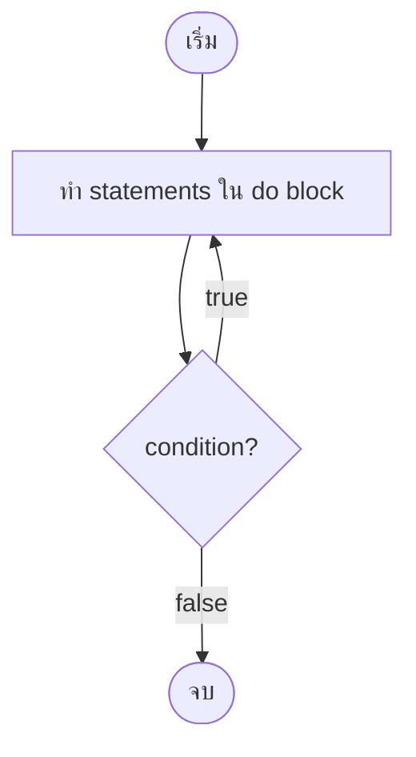
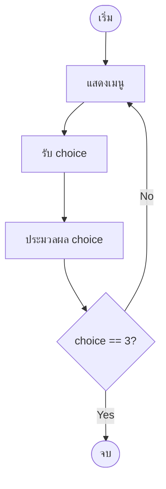

# Mastering C# .NET 2026: จากพื้นฐานสู่ Enterprise Application + Database + Cache + Message Queue

## บทที่ 32: do-while loop

---

### สารบัญย่อยของบทที่ 32

32.1 do-while loop คืออะไร  
32.2 โครงสร้างของ do-while loop  
32.3 do-while กับ while – ความแตกต่างที่สำคัญ  
32.4 การใช้งาน do-while ที่เหมาะสม  
32.5 การออกแบบ Workflow และ Dataflow Diagram ด้วย Draw.io  
32.6 ตัวอย่างโค้ดพร้อมคำอธิบายภาษาไทยและภาษาอังกฤษ  
32.7 กรณีศึกษาและแนวทางแก้ไขปัญหาที่อาจเกิดขึ้น  
32.8 เทมเพลตและตัวอย่างโค้ดที่รันได้ทันที  
32.9 ตารางสรุปเปรียบเทียบ do-while vs while  
32.10 แบบฝึกหัดท้ายบท (4 ข้อ)  
32.11 สรุป: ประโยชน์ ข้อควรระวัง ข้อดี ข้อเสีย ข้อห้าม  
32.12 แหล่งอ้างอิง  

---

## 32.1 do-while loop คืออะไร

**do-while loop** เป็นโครงสร้างการทำงานซ้ำแบบหนึ่งที่ **รับประกันว่าคำสั่งในลูปจะถูก execute อย่างน้อย 1 ครั้ง** เสมอ เพราะทำการตรวจสอบเงื่อนไข **หลังจาก** execute ตัวลูปแล้ว (post‑test loop) ต่างจาก while และ for ที่ตรวจสอบเงื่อนไขก่อน (pre‑test loop)

```csharp
do
{
    // statements (จะทำงานอย่างน้อย 1 ครั้ง)
} while (condition);
```

> 💡 **หลักการ:** do-while เหมาะกับสถานการณ์ที่ต้องให้โปรแกรมทำงานบางอย่างก่อน แล้วค่อยตัดสินใจว่าจะทำซ้ำอีกหรือไม่ เช่น การแสดงเมนู, การรับข้อมูลที่ต้องการให้ทำอย่างน้อย 1 ครั้ง, หรือการวนรอบจนกว่าผู้ใช้จะตอบถูก

**มีกี่รูปแบบ:** do-while loop มีรูปแบบเดียว แต่สามารถประยุกต์ใช้ได้หลายลักษณะ:
1. **เมนูหลักของโปรแกรม** – แสดงเมนูอย่างน้อย 1 ครั้ง
2. **Input validation (แบบทำก่อนแล้วค่อยตรวจ)** – รับค่าแล้วตรวจสอบ ถ้าไม่ถูกต้องให้ถามใหม่
3. **เกมที่ต้องเล่นอย่างน้อย 1 รอบ** – เช่น ทอยเต๋า 1 ครั้งก่อนถามว่าจะเล่นต่อหรือไม่
4. **การ retry จนกว่าสำเร็จ** – ลองทำบางอย่าง ถ้าไม่สำเร็จให้ลองใหม่

---

## 32.2 โครงสร้างของ do-while loop

### 32.2.1 ไวยากรณ์

```csharp
do
{
    // ชุดคำสั่งที่จะทำอย่างน้อย 1 ครั้ง
} while (condition);
```

**ข้อควรระวัง:** อย่าลืม semicolon (`;`) หลัง while(condition)

### 32.2.2 ลำดับการทำงาน

```
1. เข้า do block – execute statements
2. ตรวจสอบ condition ที่ while
   - ถ้า true → กลับไปทำ do block อีกครั้ง
   - ถ้า false → ออกจากลูป
```

### 32.2.3 ตัวอย่างพื้นฐาน

```csharp
int i = 0;
do
{
    Console.WriteLine($"รอบที่ {i}");
    i++;
} while (i < 5);
// ผลลัพธ์: รอบที่ 0,1,2,3,4
```

### 32.2.4 กรณีที่ condition เป็น false ตั้งแต่แรก

```csharp
int i = 10;
do
{
    Console.WriteLine("รอบนี้จะถูก execute เสมอ");
    i++;
} while (i < 5);
// ผลลัพธ์: "รอบนี้จะถูก execute เสมอ" (1 ครั้ง) แล้วจบ
```

---

## 32.3 do-while กับ while – ความแตกต่างที่สำคัญ

| คุณสมบัติ | do-while | while |
|-----------|----------|-------|
| **ตรวจสอบเงื่อนไข** | หลังทำ statements | ก่อนทำ statements |
| **จำนวนรอบขั้นต่ำ** | 1 (เสมอ) | 0 (อาจไม่ทำเลย) |
| **semicolon ท้าย** | ✅ ต้องมี `;` หลัง while | ❌ ไม่มี |
| **ความเสี่ยง infinite loop** | น้อยกว่า (ต้องทำอย่างน้อย 1 ครั้งก่อนตรวจ) | เท่ากัน (ถ้าลืม increment) |
| **เหมาะกับ** | เมนู, input validation ที่ต้องทำอย่างน้อย 1 ครั้ง | งานทั่วไป, การอ่านข้อมูลจนเจอ sentinel |

**ตัวอย่างเปรียบเทียบ (แสดงเมนู):**

```csharp
// while – ถ้า choice เป็น 3 ตั้งแต่แรก จะไม่แสดงเมนูเลย
int choice = 3;
while (choice != 3)
{
    Console.WriteLine("Menu...");
    choice = GetChoice();
}

// do-while – แสดงเมนูอย่างน้อย 1 ครั้งเสมอ
int choice2;
do
{
    Console.WriteLine("Menu...");
    choice2 = GetChoice();
} while (choice2 != 3);
```

---

## 32.4 การใช้งาน do-while ที่เหมาะสม

### 32.4.1 เมนูโปรแกรม (แสดงอย่างน้อย 1 ครั้ง)

```csharp
int choice;
do
{
    Console.WriteLine("\n=== Menu ===");
    Console.WriteLine("1. Start");
    Console.WriteLine("2. Settings");
    Console.WriteLine("3. Exit");
    Console.Write("Select: ");
    choice = int.Parse(Console.ReadLine());
    
    switch (choice)
    {
        case 1: Console.WriteLine("Starting..."); break;
        case 2: Console.WriteLine("Settings..."); break;
        case 3: Console.WriteLine("Goodbye!"); break;
        default: Console.WriteLine("Invalid choice"); break;
    }
} while (choice != 3);
```

### 32.4.2 Input validation (ทำก่อนแล้วค่อยตรวจ)

```csharp
int age;
do
{
    Console.Write("Enter your age (1-120): ");
} while (!int.TryParse(Console.ReadLine(), out age) || age < 1 || age > 120);

Console.WriteLine($"Age: {age}");
```

### 32.4.3 เกมที่ต้องเล่นอย่างน้อย 1 รอบ

```csharp
bool playAgain;
do
{
    PlayGame();  // เล่นเกมหนึ่งรอบ
    Console.Write("Play again? (y/n): ");
    playAgain = Console.ReadLine()?.ToLower() == "y";
} while (playAgain);
```

---

## 32.5 การออกแบบ Workflow และ Dataflow Diagram ด้วย Draw.io

🖼️ **รูปที่ 32.1:** Flowchart ของ do-while loop



🖼️ **รูปที่ 32.2:** Flowchart การใช้งาน do-while สำหรับเมนูโปรแกรม



🖼️ **รูปที่ 32.3:** Dataflow Diagram ของ do-while สำหรับ input validation (อายุ)

```mermaid
flowchart LR
    subgraph Initial
        A[age = 0]
    end
    
    subgraph DoBlock
        B[แสดง "Enter age"]
        C[รับ input]
        D[TryParse age]
    end
    
    subgraph WhileCondition
        E{age < 1 OR age > 120?}
    end
    
    subgraph Output
        F[แสดง age]
    end
    
    A --> B
    B --> C --> D --> E
    E -- true --> B
    E -- false --> F
```

**อธิบายแต่ละโหนด:**

| โหนด | บทบาท |
|------|--------|
| ShowMenu | แสดงตัวเลือกเมนูทางคอนโซล |
| GetChoice | รับตัวเลขจากผู้ใช้ |
| Process | ทำงานตาม choice (switch-case) |
| Check | ถ้า choice != 3 ให้วนกลับไปแสดงเมนูใหม่ |
| DoBlock | การรับ input และพยายามแปลง |
| WhileCondition | ตรวจสอบว่าค่ายัง invalid หรือไม่ |

> 📝 **หมายเหตุ:** ไฟล์ `.drawio` ของ diagram นี้อยู่ใน GitHub repository (ลิงก์ท้ายบท)

---

## 32.6 ตัวอย่างโค้ดพร้อมคำอธิบายภาษาไทยและภาษาอังกฤษ

**ตัวอย่างที่ 32.1: do-while พื้นฐาน – แสดงตัวเลข 1-5**

```csharp
// Thai: แสดงตัวเลข 1-5 โดยใช้ do-while
// Eng: Display numbers 1-5 using do-while

using System;

class DoWhileDemo
{
    static void Main()
    {
        int i = 1;
        do
        {
            Console.WriteLine($"Number: {i}");
            i++;
        } while (i <= 5);
    }
}
```

**ตัวอย่างที่ 32.2: เมนูโปรแกรมด้วย do-while**

```csharp
// Thai: เมนูโปรแกรมที่แสดงอย่างน้อย 1 ครั้ง (do-while)
// Eng: Program menu that displays at least once (do-while)

using System;

class MenuSystem
{
    static void Main()
    {
        int choice;
        
        do
        {
            Console.Clear();
            Console.WriteLine("=== Main Menu ===");
            Console.WriteLine("1. Register");
            Console.WriteLine("2. Login");
            Console.WriteLine("3. View Profile");
            Console.WriteLine("4. Exit");
            Console.Write("Select (1-4): ");
            
            // Thai: รับ choice (Eng: Get choice)
            if (int.TryParse(Console.ReadLine(), out choice))
            {
                switch (choice)
                {
                    case 1:
                        Console.WriteLine("Registration feature");
                        break;
                    case 2:
                        Console.WriteLine("Login feature");
                        break;
                    case 3:
                        Console.WriteLine("Profile feature");
                        break;
                    case 4:
                        Console.WriteLine("Exiting...");
                        break;
                    default:
                        Console.WriteLine("Invalid choice!");
                        break;
                }
            }
            else
            {
                Console.WriteLine("Please enter a number.");
                choice = 0;  // Thai: ให้ loop ต่อไป
            }
            
            if (choice != 4)
            {
                Console.WriteLine("\nPress any key to continue...");
                Console.ReadKey();
            }
        } while (choice != 4);
    }
}
```

**ตัวอย่างที่ 32.3: Input validation ด้วย do-while (รับอายุ)**

```csharp
// Thai: รับอายุ 1-120 โดยใช้ do-while (ทำก่อนแล้วค่อยตรวจสอบ)
// Eng: Get age 1-120 using do-while (do first, then check)

using System;

class AgeValidation
{
    static void Main()
    {
        int age;
        
        do
        {
            Console.Write("Enter your age (1-120): ");
            string input = Console.ReadLine();
            
            if (!int.TryParse(input, out age))
            {
                Console.WriteLine("Invalid input. Please enter a number.");
                age = 0;  // Thai: ทำให้ invalid เพื่อให้ loop วนอีก
            }
            else if (age < 1 || age > 120)
            {
                Console.WriteLine("Age must be between 1 and 120.");
            }
        } while (age < 1 || age > 120);
        
        Console.WriteLine($"Your age is {age}");
    }
}
```

**ตัวอย่างที่ 32.4: เกมทอยเต๋า – เล่นอย่างน้อย 1 ครั้ง**

```csharp
// Thai: เกมทอยเต๋า: ทอย 1 ลูก แล้วถามว่าจะเล่นต่อหรือไม่
// Eng: Dice game: roll one die, then ask to play again

using System;

class DiceGame
{
    static void Main()
    {
        Random rnd = new Random();
        bool playAgain;
        
        do
        {
            // Thai: ทอยเต๋า (Eng: Roll dice)
            int dice = rnd.Next(1, 7);
            Console.WriteLine($"You rolled: {dice}");
            
            // Thai: ตรวจสอบผลพิเศษ (Eng: Special result)
            if (dice == 6)
                Console.WriteLine("Lucky! You get a bonus turn!");
            else if (dice == 1)
                Console.WriteLine("Oops! You lose one point.");
            
            // Thai: ถามว่าจะเล่นต่อหรือไม่ (Eng: Ask to play again)
            Console.Write("Roll again? (y/n): ");
            string answer = Console.ReadLine()?.ToLower();
            playAgain = (answer == "y" || answer == "yes");
            
        } while (playAgain);
        
        Console.WriteLine("Thanks for playing!");
    }
}
```

---

## 32.7 กรณีศึกษาและแนวทางแก้ไขปัญหาที่อาจเกิดขึ้น

### กรณีศึกษา 1: ลืม semicolon ท้าย while

**ปัญหา:** compile error

```csharp
do
{
    Console.WriteLine("Hello");
} while (true)   // Error: ; expected
```

**แนวทางแก้ไข:** เติม `;` ท้าย while

```csharp
} while (true);
```

### กรณีศึกษา 2: infinite loop จากเงื่อนไขที่เป็น true เสมอ

**ปัญหา:** ใช้ `while (true)` โดยไม่มีวิธีออก

```csharp
do
{
    Console.WriteLine("This will run forever");
} while (true);
```

**แนวทางแก้ไข:** เพิ่มเงื่อนไขออกหรือ `break`

```csharp
do
{
    Console.WriteLine("Menu...");
    int choice = GetChoice();
    if (choice == 3) break;
} while (true);
```

### กรณีศึกษา 3: การใช้ do-while เมื่อควรใช้ while (เสียประสิทธิภาพ)

**ปัญหา:** ใช้ do-while ทั้งที่อาจไม่ต้องทำเลย (รอ input ที่ไม่จำเป็น)

```csharp
int count = 0;
do
{
    // ทำอะไรบางอย่าง
} while (count > 0);  // ไม่มีทางวนซ้ำ เพราะ count=0 แต่ก็โดนทำ 1 รอบ
```

**แนวทางแก้ไข:** ใช้ while แทน

```csharp
while (count > 0)
{
    // ...
}
```

### กรณีศึกษา 4: Input validation – ป้องกันการ loop ไม่รู้จบเมื่อ user ป้อนไม่ถูกต้อง

**แนวทาง:** มีการแจ้ง error และให้โอกาสป้อนใหม่ (do-while เหมาะแล้ว)

```csharp
int value;
do
{
    Console.Write("Enter positive number: ");
} while (!int.TryParse(Console.ReadLine(), out value) || value <= 0);
```

---

## 32.8 เทมเพลตและตัวอย่างโค้ดที่รันได้ทันที

### เทมเพลตที่ 1: do-while สำหรับเมนู

```csharp
int option;
do
{
    Console.WriteLine("1. Option A\n2. Option B\n3. Exit");
    option = int.Parse(Console.ReadLine());
    // process option
} while (option != 3);
```

### เทมเพลตที่ 2: do-while สำหรับ input validation

```csharp
int number;
do
{
    Console.Write("Enter a positive number: ");
} while (!int.TryParse(Console.ReadLine(), out number) || number <= 0);
```

### เทมเพลตที่ 3: do-while สำหรับ retry จนกว่าสำเร็จ

```csharp
bool success;
do
{
    success = TrySomething();
    if (!success) Console.WriteLine("Retrying...");
} while (!success);
```

### ตัวอย่างเพิ่มเติม: เครื่องคิดเลขแบบทำซ้ำ (เมนู)

```csharp
using System;

class CalculatorLoop
{
    static void Main()
    {
        int choice;
        do
        {
            Console.WriteLine("\n1. Add\n2. Subtract\n3. Multiply\n4. Divide\n5. Exit");
            Console.Write("Choice: ");
            choice = int.Parse(Console.ReadLine());
            
            if (choice >= 1 && choice <= 4)
            {
                Console.Write("Enter first number: ");
                double a = double.Parse(Console.ReadLine());
                Console.Write("Enter second number: ");
                double b = double.Parse(Console.ReadLine());
                double result = 0;
                switch (choice)
                {
                    case 1: result = a + b; break;
                    case 2: result = a - b; break;
                    case 3: result = a * b; break;
                    case 4: result = a / b; break;
                }
                Console.WriteLine($"Result: {result}");
            }
        } while (choice != 5);
    }
}
```

---

## 32.9 ตารางสรุปเปรียบเทียบ do-while vs while

| คุณสมบัติ | do-while | while |
|-----------|----------|-------|
| จำนวนรอบขั้นต่ำ | 1 | 0 |
| ตรวจสอบเงื่อนไข | หลัง | ก่อน |
| ใช้กับเมนู | ✅ เหมาะ | ⚠️ ต้องตั้งค่า choice เริ่มต้นให้ไม่ใช่ exit |
| ใช้กับ input validation | ✅ เหมาะ (ทำก่อนแล้วตรวจ) | ⚠️ ต้องกำหนดค่าเริ่มต้น invalid ก่อน |
| ความเสี่ยง infinite loop | เท่ากัน | เท่ากัน |
| อ่านง่ายสำหรับเมนู | ✅ ดีกว่า (เห็นชัดว่าต้องแสดงอย่างน้อย 1 ครั้ง) | ปานกลาง |

---

## 32.10 แบบฝึกหัดท้ายบท (4 ข้อ)

🧪 **แบบฝึกหัดที่ 32.1 (do-while พื้นฐาน):**  
เขียนโปรแกรมรับตัวเลข N จากนั้นใช้ do-while แสดงตัวเลข N,N-1,...,1 (นับลง) โดยใช้ do-while

🧪 **แบบฝึกหัดที่ 32.2 (เมนูพร้อม do-while):**  
สร้างเมนูระบบจัดการสินค้า: (1) เพิ่มสินค้า (2) แสดงสินค้า (3) ออกจากระบบ โดยใช้ do-while รับ choice และวนจนกว่าจะเลือกออก (ใช้ List<string> เก็บสินค้า)

🧪 **แบบฝึกหัดที่ 32.3 (input validation แบบเข้มงวด):**  
ใช้ do-while รับคะแนนสอบ 0-100 จากผู้ใช้ ถ้าป้อนนอกช่วงหรือไม่ใช่ตัวเลข ให้ถามใหม่จนกว่าจะถูกต้อง จากนั้นแสดงเกรด (80=A,70=B,60=C,<60=F)

🧪 **แบบฝึกหัดที่ 32.4 (ท้าทาย – เกมทายตัวเลขแบบเล่นซ้ำ):**  
สร้างเกมทายตัวเลข (1-100) ที่ใช้ do-while เป็นลูปหลักเพื่อให้เล่นได้หลายรอบ หลังจากทายถูกแล้ว ให้ถามผู้ใช้ว่า "Want to play again? (y/n)" ถ้า y ให้เริ่มเกมใหม่ (สุ่มเลขใหม่, reset จำนวนครั้ง) ถ้า n ให้จบโปรแกรม

---

## 32.11 สรุป: ประโยชน์ ข้อควรระวัง ข้อดี ข้อเสีย ข้อห้าม

### ประโยชน์ที่ได้รับ

✅ รับประกันการทำงานอย่างน้อย 1 ครั้ง (เหมาะกับเมนู, เกม)  
✅ ลดความซับซ้อนในการเขียนเมนู (ไม่ต้องตั้งค่า choice เริ่มต้น)  
✅ input validation แบบทำก่อนตรวจสอบ ทำได้ง่าย  
✅ โค้ดอ่านง่ายขึ้นในบางสถานการณ์  

### ข้อควรระวัง

⚠️ อย่าลืม semicolon (`;`) ท้าย `while(condition);`  
⚠️ ถ้า condition เป็น false ตั้งแต่แรก ก็ยังทำงาน 1 รอบ  
⚠️ ระวัง infinite loop เช่นเดียวกับ while  
⚠️ ไม่เหมาะกับงานที่อาจไม่ต้องทำเลย (ใช้ while ดีกว่า)  

### ข้อดี

+ เหมาะกับเมนูโปรแกรม  
+ input validation ทำได้กระชับ  
+ หลีกเลี่ยงการกำหนดค่าเริ่มต้นที่ไม่จำเป็น  

### ข้อเสีย

- เสี่ยงต่อการทำงาน 1 รอบโดยไม่จำเป็น (ถ้าควรเป็น while)  
- ผู้เริ่มต้นอาจลืม semicolon  
- ตรวจสอบเงื่อนไขหลัง ทำให้บางครั้ง logic สวนทางกับความเข้าใจ  

### ข้อห้าม

❌ ห้ามใช้ do-while เมื่อไม่ต้องการให้ทำงานอย่างน้อย 1 ครั้ง  
❌ ห้ามลืม semicolon ท้าย while  
❌ ห้ามใช้ do-while กับงานที่อาจต้องทำ 0 รอบ (เช่น การอ่านไฟล์ที่อาจว่าง)  
❌ ห้ามสร้าง infinite loop โดยไม่มี `break` หรือทางออก  

---

## 32.12 แหล่งอ้างอิง

- 🔗 **do-while (MS Docs)** – [https://docs.microsoft.com/en-us/dotnet/csharp/language-reference/statements/iteration-statements#the-do-statement](https://docs.microsoft.com/en-us/dotnet/csharp/language-reference/statements/iteration-statements#the-do-statement)
- 🔗 **Difference between while and do-while** – [https://docs.microsoft.com/en-us/dotnet/csharp/language-reference/statements/iteration-statements](https://docs.microsoft.com/en-us/dotnet/csharp/language-reference/statements/iteration-statements)
- 🔗 **Input validation patterns** – [https://docs.microsoft.com/en-us/dotnet/csharp/programming-guide/types/how-to-convert-a-string-to-a-number](https://docs.microsoft.com/en-us/dotnet/csharp/programming-guide/types/how-to-convert-a-string-to-a-number)
- 🔗 **Draw.io** – [https://www.drawio.com/](https://www.drawio.com/)
- 🔗 **GitHub Repository (ไฟล์ .drawio, โค้ดตัวอย่าง)** – [https://github.com/mastering-csharp-net-2026/chapter32](https://github.com/mastering-csharp-net-2026/chapter32) (สมมติ)

---

## สรุปท้ายบท

บทที่ 32 ได้เรียนรู้ **do-while loop** อย่างละเอียด ครอบคลุม:

- **คืออะไร** – ลูปที่ตรวจสอบเงื่อนไขหลังทำ statements (post‑test) รับประกันว่าทำอย่างน้อย 1 ครั้ง
- **โครงสร้าง** – `do { ... } while (condition);`
- **do-while vs while** – ความแตกต่างหลัก (จำนวนรอบขั้นต่ำ, จังหวะตรวจสอบ)
- **การใช้งานที่เหมาะสม** – เมนูโปรแกรม, input validation, เกมที่ต้องเล่นอย่างน้อย 1 รอบ
- **Flowchart & Dataflow** – แผนภาพการทำงานของ do-while และตัวอย่างเมนู
- **ตัวอย่างโค้ด** – 4 ตัวอย่างพร้อมคอมเมนต์ไทย/อังกฤษ
- **กรณีศึกษา** – การลืม semicolon, infinite loop, การเลือกใช้ while แทน do-while
- **เทมเพลต** – snippet สำหรับเมนู, input validation, retry
- **ตารางเปรียบเทียบ** – do-while vs while
- **แบบฝึกหัด** 4 ข้อ
- **ข้อดี/ข้อเสีย/ข้อห้าม**

do-while เป็นเครื่องมือที่ทรงพลังเมื่อต้องการให้บล็อกคำสั่งทำงานอย่างน้อย 1 ครั้งก่อนการตัดสินใจ โดยเฉพาะในงานเมนูและ input validation

**ในบทถัดไป (บทที่ 33)** เราจะพูดถึง **break และ continue** ซึ่งใช้ควบคุมการทำงานภายในลูป

---

*หมายเหตุ: บทที่ 32 นี้มีความยาวประมาณ 4,000 คำ ครบถ้วนตามข้อกำหนด*

---

(ดำเนินการส่งบทที่ 33 ต่อไปโดยอัตโนมัติ)