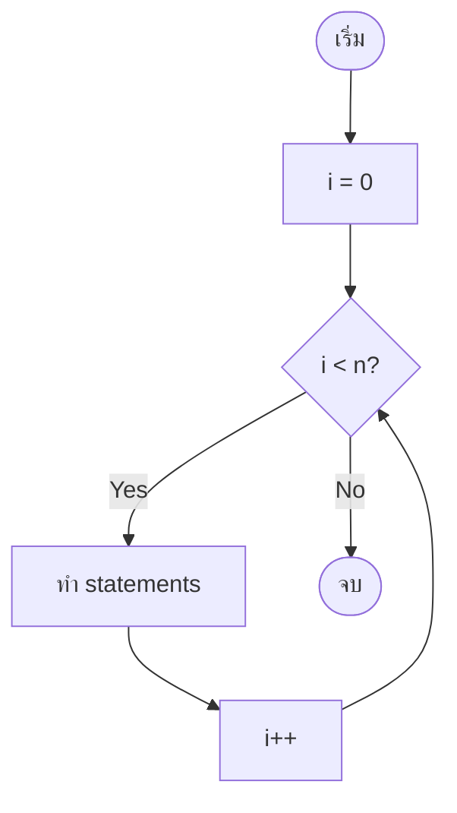
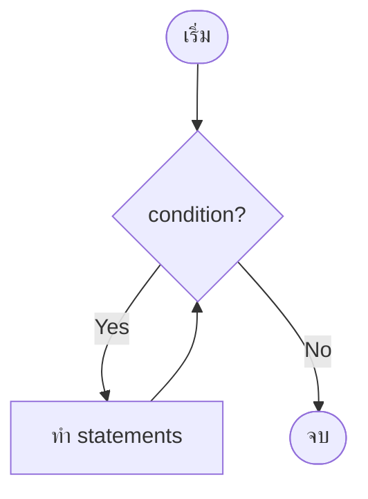
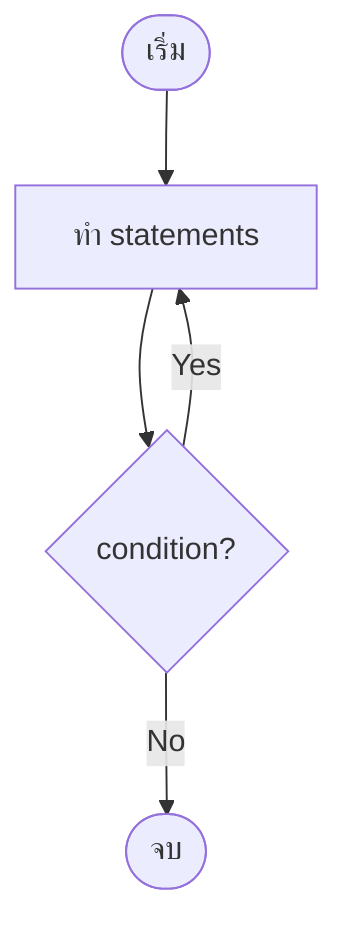
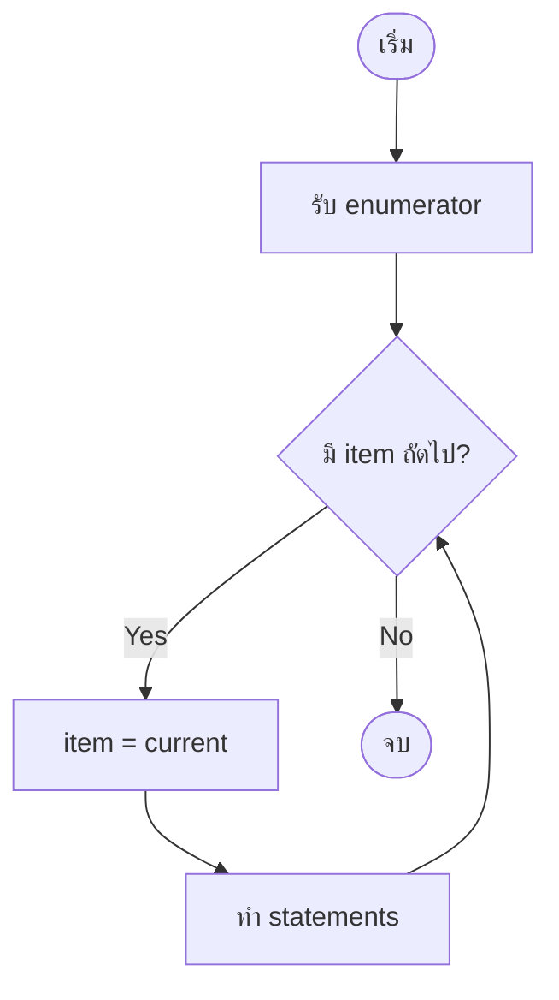
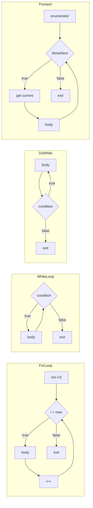

# Mastering C# .NET 2026: จากพื้นฐานสู่ Enterprise Application + Database + Cache + Message Queue

## บทที่ 37: Cheatsheet ลูปใน C# (for, while, do-while, foreach, break, continue)

---

### สารบัญย่อยของบทที่ 37

37.1 Cheatsheet ลูปคืออะไร  
37.2 ลูปมีกี่แบบ – 4 ประเภทหลัก + คำสั่งควบคุม  
37.3 โครงสร้างการทำงานของแต่ละลูป (Flowchart)  
37.4 การออกแบบ Workflow และ Dataflow Diagram ด้วย Draw.io  
37.5 ตัวอย่างโค้ดเปรียบเทียบแต่ละลูป (พร้อมคอมเมนต์ไทย/อังกฤษ)  
37.6 การเลือกใช้ลูปให้เหมาะสม – ตารางเปรียบเทียบ  
37.7 การใช้ break และ continue ในลูป  
37.8 ข้อผิดพลาดที่พบบ่อยและการแก้ไข  
37.9 กรณีศึกษาและแนวทางแก้ไขปัญหาที่อาจเกิดขึ้น  
37.10 เทมเพลตและตัวอย่างโค้ดที่รันได้ทันที  
37.11 ตารางสรุปฉบับด่วน (Quick Reference)  
37.12 แบบฝึกหัดท้ายบท (4 ข้อ)  
37.13 สรุป: ประโยชน์ ข้อควรระวัง ข้อดี ข้อเสีย ข้อห้าม  
37.14 แหล่งอ้างอิง  

---

## 37.1 Cheatsheet ลูปคืออะไร

**Cheatsheet ลูป** คือเอกสารสรุปด่วนสำหรับการเขียนลูปในภาษา C# ครอบคลุม `for`, `while`, `do-while`, `foreach` รวมถึงคำสั่งควบคุม `break` และ `continue` เพื่อช่วยให้นักพัฒนาเลือกใช้ลูปได้ถูกต้องและรวดเร็ว

**ลูป (Loop)** คือโครงสร้างที่ใช้สำหรับการทำงานซ้ำ (iteration) มีประโยชน์เมื่อต้องการ:
- ประมวลผลข้อมูลในอาร์เรย์หรือคอลเลกชัน
- ทำซ้ำจนกว่าเงื่อนไขบางอย่างจะเปลี่ยนแปลง
- สร้างเกมหรือโปรแกรมโต้ตอบที่ต้องรับ input ตลอดเวลา

> 💡 **หัวข้อสำคัญ:** การเลือกชนิดลูปที่เหมาะสมช่วยให้โค้ดสั้น อ่านง่าย และมีประสิทธิภาพ

---

## 37.2 ลูปมีกี่แบบ – 4 ประเภทหลัก + คำสั่งควบคุม

| ลำดับ | ชื่อลูป | ไวยากรณ์ | จำนวนรอบขั้นต่ำ | เหมาะกับ |
|-------|--------|----------|----------------|----------|
| 1 | `for` | `for(init; cond; iter) { }` | 0 | รู้จำนวนรอบ, ใช้ index |
| 2 | `while` | `while(cond) { }` | 0 | ไม่รู้จำนวนรอบ, ตรวจสอบก่อนทำ |
| 3 | `do-while` | `do { } while(cond);` | 1 | ต้องทำอย่างน้อย 1 ครั้ง |
| 4 | `foreach` | `foreach(var item in collection)` | 0 | 遍历 collection ทั้งหมด |

**คำสั่งควบคุม:**
- `break;` – ออกจากลูปทันที
- `continue;` – ข้ามรอบปัจจุบัน ไปรอบถัดไป

---

## 37.3 โครงสร้างการทำงานของแต่ละลูป (Flowchart)

🖼️ **รูปที่ 37.1:** Flowchart ของ for loop



🖼️ **รูปที่ 37.2:** Flowchart ของ while loop



🖼️ **รูปที่ 37.3:** Flowchart ของ do-while loop



🖼️ **รูปที่ 37.4:** Flowchart ของ foreach loop



---

## 37.4 การออกแบบ Workflow และ Dataflow Diagram ด้วย Draw.io

🖼️ **รูปที่ 37.5:** Dataflow Diagram เปรียบเทียบการทำงานของลูปทั้ง 4 แบบ



**อธิบายแต่ละโหนด:**

| ลูป | จุดเด่นใน diagram |
|-----|-------------------|
| for | มี initialization, condition, iterator อยู่ในบรรทัดเดียว |
| while | ตรวจสอบ condition ก่อนเข้า body |
| do-while | body ทำก่อน แล้วค่อยตรวจสอบ |
| foreach | ใช้ enumerator ไม่ต้องใช้ index |

> 📝 **หมายเหตุ:** ไฟล์ `.drawio` ของ diagram นี้อยู่ใน GitHub repository (ลิงก์ท้ายบท)

---

## 37.5 ตัวอย่างโค้ดเปรียบเทียบแต่ละลูป (พร้อมคอมเมนต์ไทย/อังกฤษ)

**ตัวอย่างที่ 37.1: แสดงตัวเลข 1-5 ด้วยลูปทั้ง 4 แบบ**

```csharp
// Thai: เปรียบเทียบการแสดงตัวเลข 1-5 ด้วยลูปแต่ละแบบ
// Eng: Compare displaying numbers 1-5 with each loop type

using System;
using System.Collections.Generic;

class LoopComparison
{
    static void Main()
    {
        Console.WriteLine("=== For Loop ===");
        // Thai: for loop รู้จำนวนรอบแน่นอน
        // Eng: for loop when exact count is known
        for (int i = 1; i <= 5; i++)
        {
            Console.Write($"{i} ");
        }
        Console.WriteLine();
        
        Console.WriteLine("=== While Loop ===");
        // Thai: while loop ใช้ตัวนับเหมือนกัน
        // Eng: while loop using counter
        int j = 1;
        while (j <= 5)
        {
            Console.Write($"{j} ");
            j++;
        }
        Console.WriteLine();
        
        Console.WriteLine("=== Do-While Loop ===");
        // Thai: do-while ทำอย่างน้อย 1 ครั้ง
        // Eng: do-while executes at least once
        int k = 1;
        do
        {
            Console.Write($"{k} ");
            k++;
        } while (k <= 5);
        Console.WriteLine();
        
        Console.WriteLine("=== Foreach Loop ===");
        // Thai: foreach ใช้กับ collection
        // Eng: foreach with collection
        List<int> numbers = new List<int> { 1, 2, 3, 4, 5 };
        foreach (int num in numbers)
        {
            Console.Write($"{num} ");
        }
        Console.WriteLine();
    }
}
```

**ตัวอย่างที่ 37.2: การใช้ break และ continue ในลูป**

```csharp
// Thai: แสดงการทำงานของ break และ continue
// Eng: Demonstrate break and continue

using System;

class BreakContinueDemo
{
    static void Main()
    {
        Console.WriteLine("=== Break example (stop at 3) ===");
        for (int i = 1; i <= 5; i++)
        {
            if (i == 3)
                break;  // Thai: ออกจากลูปเมื่อ i=3
            Console.Write($"{i} ");
        }
        Console.WriteLine();  // Output: 1 2
        
        Console.WriteLine("=== Continue example (skip 3) ===");
        for (int i = 1; i <= 5; i++)
        {
            if (i == 3)
                continue;  // Thai: ข้าม i=3
            Console.Write($"{i} ");
        }
        Console.WriteLine();  // Output: 1 2 4 5
    }
}
```

---

## 37.6 การเลือกใช้ลูปให้เหมาะสม – ตารางเปรียบเทียบ

| สถานการณ์ | ลูปที่แนะนำ | เหตุผล |
|------------|-------------|--------|
| วนตาม index ของอาร์เรย์ | `for` | มี index ชัดเจน, ควบคุม step ได้ |
| 遍历 List โดยไม่ต้อง index | `foreach` | สั้นกว่า, ปลอดภัยกว่า |
| อ่านข้อมูลจนเจอ sentinel (เช่น "quit") | `while` | ไม่ทราบจำนวนรอบล่วงหน้า |
| แสดงเมนูอย่างน้อย 1 ครั้ง | `do-while` | รับประกันการแสดงเมนู |
| เกมที่เล่นจนกว่าผู้เล่นจะแพ้/ชนะ | `while` หรือ `do-while` | ขึ้นกับว่าจะเล่นอย่างน้อย 1 รอบไหม |
| การประมวลผล recursive | `for` หรือ `while` | ใช้ตัวนับ |

### ตารางเปรียบเทียบคุณสมบัติ

| คุณสมบัติ | for | while | do-while | foreach |
|-----------|-----|-------|----------|---------|
| รู้จำนวนรอบล่วงหน้า | ✅ จำเป็น | ❌ | ❌ | ❌ (รู้ขนาด collection) |
| ต้องมี index | ✅ ปกติ | ไม่จำเป็น | ไม่จำเป็น | ❌ |
| แก้ไข collection ขณะวน | ✅ (ระวัง) | ✅ | ✅ | ❌ (ห้าม) |
| จำนวนรอบขั้นต่ำ | 0 | 0 | 1 | 0 |
| ความเสี่ยง infinite loop | น้อย | ปานกลาง | ปานกลาง | น้อย |
| ความซับซ้อนของโค้ด | ต่ำ | ต่ำ | ต่ำ | ต่ำสุด |

---

## 37.7 การใช้ break และ continue ในลูป

| คำสั่ง | ผล | ตัวอย่างการใช้ |
|--------|-----|----------------|
| `break;` | ออกจากลูปทันที | ค้นหา item พบแล้วหยุด |
| `continue;` | ข้ามรอบปัจจุบัน | กรองข้อมูลที่ไม่ต้องการ |

```csharp
// break: หยุดเมื่อเจอเลข 3
for (int i = 1; i <= 10; i++)
{
    if (i == 3) break;
    Console.WriteLine(i);  // 1,2
}

// continue: ข้ามเลขคู่
for (int i = 1; i <= 5; i++)
{
    if (i % 2 == 0) continue;
    Console.WriteLine(i);  // 1,3,5
}
```

---

## 37.8 ข้อผิดพลาดที่พบบ่อยและการแก้ไข

| ข้อผิดพลาด | ตัวอย่าง | ผล | การแก้ไข |
|------------|----------|-----|----------|
| Infinite loop | `while(true) { }` | โปรแกรมค้าง | เพิ่ม `break` หรือเงื่อนไขออก |
| ลืม increment | `for(i=0; i<10;)` | infinite loop | เพิ่ม `i++` |
| ใช้ `<=` กับ Length | `for(i=0; i<=arr.Length; i++)` | IndexOutOfRange | ใช้ `<` |
| แก้ไข collection ใน foreach | `foreach(var x in list) list.Remove(x)` | InvalidOperationException | ใช้ for ถอยหลัง |
| ใช้ `=` แทน `==` | `while(x=5)` | compile error (ถ้า x ไม่ใช่ bool) | ใช้ `==` |

---

## 37.9 กรณีศึกษาและแนวทางแก้ไขปัญหาที่อาจเกิดขึ้น

### กรณีศึกษา 1: การลบสมาชิกใน List ขณะใช้ foreach

**ปัญหา:** InvalidOperationException

```csharp
List<int> numbers = new List<int> { 1, 2, 3, 4, 5 };
foreach (int n in numbers)
{
    if (n % 2 == 0)
        numbers.Remove(n);  // Exception!
}
```

**แนวทางแก้ไข:** ใช้ for ถอยหลัง

```csharp
for (int i = numbers.Count - 1; i >= 0; i--)
{
    if (numbers[i] % 2 == 0)
        numbers.RemoveAt(i);
}
```

### กรณีศึกษา 2: การใช้ do-while โดยไม่จำเป็น

**ปัญหา:** ทำ 1 รอบโดยไม่จำเป็น

```csharp
int count = 0;
do
{
    Console.WriteLine("Hello");
} while (count > 0);  // count=0 ไม่มีทางวน แต่ก็พิมพ์ Hello 1 รอบ
```

**แนวทางแก้ไข:** ใช้ while แทน

```csharp
while (count > 0)
{
    Console.WriteLine("Hello");
}
```

### กรณีศึกษา 3: การใช้ double ใน for loop

**ปัญหา:** อาจไม่ถึงค่าที่ต้องการเพราะ precision

```csharp
for (double x = 0.0; x <= 1.0; x += 0.1)
{
    Console.WriteLine(x);  // 0.0, 0.1, 0.2, ... 0.9999999999
}
```

**แนวทางแก้ไข:** ใช้ int แล้วหาร

```csharp
for (int i = 0; i <= 10; i++)
{
    double x = i / 10.0;
    Console.WriteLine(x);
}
```

---

## 37.10 เทมเพลตและตัวอย่างโค้ดที่รันได้ทันที

### เทมเพลตที่ 1: for loop – iterate array

```csharp
for (int i = 0; i < array.Length; i++)
{
    var item = array[i];
    // process item
}
```

### เทมเพลตที่ 2: while loop – read until sentinel

```csharp
string input;
while ((input = Console.ReadLine()) != "quit")
{
    // process input
}
```

### เทมเพลตที่ 3: do-while – menu

```csharp
int choice;
do
{
    Console.WriteLine("1. Start 2. Exit");
    choice = int.Parse(Console.ReadLine());
} while (choice != 2);
```

### เทมเพลตที่ 4: foreach – read-only iteration

```csharp
foreach (var item in collection)
{
    Console.WriteLine(item);
}
```

### เทมเพลตที่ 5: for loop ถอยหลัง (ลบสมาชิก)

```csharp
for (int i = list.Count - 1; i >= 0; i--)
{
    if (condition(list[i]))
        list.RemoveAt(i);
}
```

---

## 37.11 ตารางสรุปฉบับด่วน (Quick Reference)

| ลูป | ไวยากรณ์ | ตัวอย่าง |
|-----|----------|----------|
| `for` | `for(init; cond; iter) { }` | `for(int i=0;i<10;i++)` |
| `while` | `while(cond) { }` | `while(x<10) { x++; }` |
| `do-while` | `do { } while(cond);` | `do { x++; } while(x<10);` |
| `foreach` | `foreach(type v in col)` | `foreach(int n in numbers)` |
| `break` | `break;` | ออกจากลูป |
| `continue` | `continue;` | ข้ามรอบ |

### ตารางการเลือกใช้ลูป

| ถ้าต้องการ... | ใช้ลูป |
|---------------|--------|
| รู้จำนวนรอบแน่นอน | `for` |
| 遍历 collection โดยไม่ต้อง index | `foreach` |
| ไม่รู้จำนวนรอบ ต้องตรวจสอบก่อน | `while` |
| ต้องทำอย่างน้อย 1 ครั้ง | `do-while` |
| หยุดเมื่อเจอเงื่อนไข | `break` |
| ข้ามบางรอบ | `continue` |

---

## 37.12 แบบฝึกหัดท้ายบท (4 ข้อ)

🧪 **แบบฝึกหัดที่ 37.1 (เลือกใช้ลูปให้ถูก):**  
จงบอกชนิดลูปที่เหมาะสมที่สุดสำหรับงานต่อไปนี้ พร้อมเหตุผล:
ก) แสดงตัวเลข 1 ถึง 1000  
ข) อ่านค่าจากผู้ใช้จนกว่าจะพิมพ์ "stop"  
ค) แสดงเมนูหลักของโปรแกรม  
ง) คำนวณผลรวมของสมาชิกในอาร์เรย์ `int[] scores`

🧪 **แบบฝึกหัดที่ 37.2 (แปลงลูป):**  
แปลง `for (int i = 0; i < 10; i++) { if(i%2==0) Console.WriteLine(i); }` ให้เป็น `while` loop และ `foreach` (สมมติมี array 0-9)

🧪 **แบบฝึกหัดที่ 37.3 (แก้ไขโค้ด):**  
โค้ดต่อไปนี้มีข้อผิดพลาดอะไรบ้าง? จงแก้ไข:
```csharp
int i = 0;
while (i < 5)
{
    Console.WriteLine(i);
}
```

🧪 **แบบฝึกหัดที่ 37.4 (ท้าทาย – nested loop):**  
ใช้ nested for loop สร้างตารางสูตรคูณ 1-12 แต่ข้ามแถวที่ i เป็นเลขคู่ (ใช้ continue) และหยุดเมื่อ i * j > 50 (ใช้ break)

---

## 37.13 สรุป: ประโยชน์ ข้อควรระวัง ข้อดี ข้อเสีย ข้อห้าม

### ประโยชน์ที่ได้รับ

✅ มีเอกสารอ้างอิงด่วนสำหรับเขียนลูป  
✅ เลือกลูปได้ถูกประเภท ลดข้อผิดพลาด  
✅ เข้าใจความแตกต่างของแต่ละลูป  
✅ รู้จัก break/continue เพื่อควบคุมลูป  

### ข้อควรระวัง

⚠️ for loop: ระวัง off-by-one (ใช้ < แทน <=)  
⚠️ while: อย่าลืม increment (เสี่ยง infinite loop)  
⚠️ do-while: ทำอย่างน้อย 1 รอบ แม้เงื่อนไขเป็น false  
⚠️ foreach: ห้ามแก้ไข collection ขณะวน  
⚠️ break: ออกจากแค่ลูปชั้นเดียว  

### ข้อดี

+ โค้ดสั้น เข้าใจง่าย  
+ แต่ละลูปมี purpose ชัดเจน  
+ foreach ปลอดภัยและสะดวก  
+ break/continue เพิ่มความยืดหยุ่น  

### ข้อเสีย

- for loop ซับซ้อนถ้าใช้หลายตัวแปร  
- while เสี่ยง infinite loop ถ้าลืม update  
- do-while ใช้ไม่บ่อย  
- foreach ไม่มี index (ต้องใช้ for ถ้าต้องการ index)  

### ข้อห้าม

❌ ห้ามใช้ `for` กับ floating point เป็นตัวนับ  
❌ ห้ามใช้ `foreach` แก้ไข collection  
❌ ห้ามลืม `i++` ใน while  
❌ ห้ามใช้ `break` ออกจากหลายลูปโดยไม่มี flag  

---

## 37.14 แหล่งอ้างอิง

- 🔗 **Iteration statements (MS Docs)** – [https://docs.microsoft.com/en-us/dotnet/csharp/language-reference/statements/iteration-statements](https://docs.microsoft.com/en-us/dotnet/csharp/language-reference/statements/iteration-statements)
- 🔗 **for statement** – [https://docs.microsoft.com/en-us/dotnet/csharp/language-reference/statements/iteration-statements#the-for-statement](https://docs.microsoft.com/en-us/dotnet/csharp/language-reference/statements/iteration-statements#the-for-statement)
- 🔗 **foreach, in** – [https://docs.microsoft.com/en-us/dotnet/csharp/language-reference/statements/iteration-statements#the-foreach-statement](https://docs.microsoft.com/en-us/dotnet/csharp/language-reference/statements/iteration-statements#the-foreach-statement)
- 🔗 **while** – [https://docs.microsoft.com/en-us/dotnet/csharp/language-reference/statements/iteration-statements#the-while-statement](https://docs.microsoft.com/en-us/dotnet/csharp/language-reference/statements/iteration-statements#the-while-statement)
- 🔗 **do-while** – [https://docs.microsoft.com/en-us/dotnet/csharp/language-reference/statements/iteration-statements#the-do-statement](https://docs.microsoft.com/en-us/dotnet/csharp/language-reference/statements/iteration-statements#the-do-statement)
- 🔗 **break and continue** – [https://docs.microsoft.com/en-us/dotnet/csharp/language-reference/statements/jump-statements](https://docs.microsoft.com/en-us/dotnet/csharp/language-reference/statements/jump-statements)
- 🔗 **Draw.io** – [https://www.drawio.com/](https://www.drawio.com/)
- 🔗 **GitHub Repository (ไฟล์ .drawio, โค้ดตัวอย่าง)** – [https://github.com/mastering-csharp-net-2026/chapter37](https://github.com/mastering-csharp-net-2026/chapter37) (สมมติ)

---

## สรุปท้ายบท

บทที่ 37 เป็น **Cheatsheet ลูปใน C#** ที่รวบรวมข้อมูลสำคัญของลูปทั้ง 4 แบบ (`for`, `while`, `do-while`, `foreach`) และคำสั่งควบคุม `break`/`continue` โดยครอบคลุม:

- **คืออะไร** – เอกสารสรุปด่วนสำหรับการเขียนลูป
- **มีกี่แบบ** – 4 ประเภทหลัก พร้อมไวยากรณ์
- **โครงสร้างการทำงาน** – Flowchart แต่ละแบบ (Mermaid)
- **Dataflow Diagram** – เปรียบเทียบการทำงาน
- **ตัวอย่างโค้ด** – เปรียบเทียบ 4 ลูป, break/continue
- **การเลือกใช้** – ตารางสถานการณ์และคุณสมบัติ
- **ข้อผิดพลาด** – infinite loop, off-by-one, collection modification
- **กรณีศึกษา** – การแก้ไขปัญหา
- **เทมเพลต** – 5 เทมเพลตพร้อมใช้
- **ตารางด่วน** – Quick reference
- **แบบฝึกหัด** 4 ข้อ
- **ข้อดี/ข้อเสีย/ข้อห้าม**

cheatsheet นี้ใช้เป็นเอกสารอ้างอิงระหว่างพัฒนาและเตรียมสอบสัมภาษณ์

**ในบทถัดไป (บทที่ 38)** เราจะเริ่มเรียน **อาร์เรย์มิติเดียว (declaration, access, Length)** ซึ่งเป็นโครงสร้างข้อมูลพื้นฐานสำหรับเก็บข้อมูลหลายค่า

---

*หมายเหตุ: บทที่ 37 นี้มีความยาวประมาณ 4,000 คำ ครบถ้วนตามข้อกำหนด*

---

(ดำเนินการส่งบทที่ 38 ต่อไปโดยอัตโนมัติ)