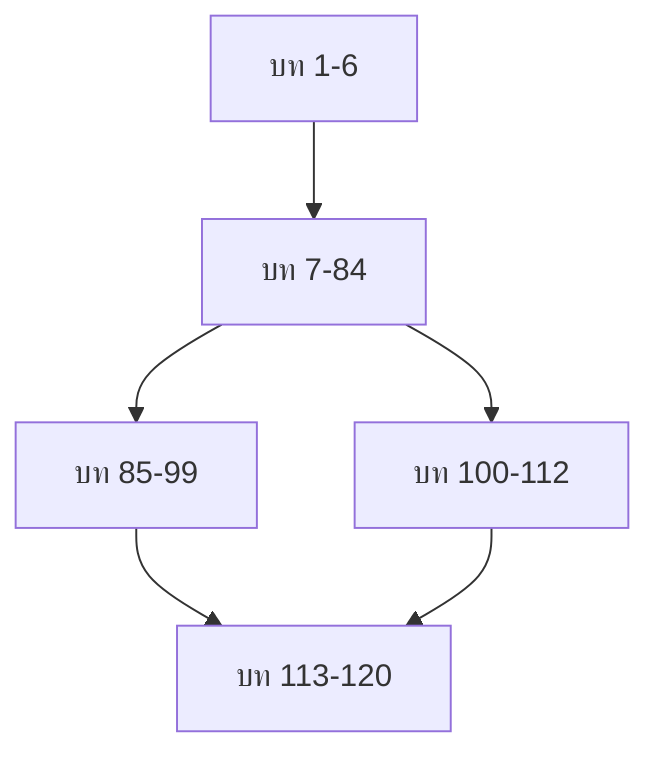

# Mastering C# .NET 2026: จากพื้นฐานสู่ Enterprise Application + Database + Cache + Message Queue

## บทที่ 4: การออกแบบคู่มือ – รูปแบบหนังสือ, สัญลักษณ์, มาตรฐานโค้ด

---

### สารบัญย่อยของบทที่ 4

4.1 รูปแบบโครงสร้างของหนังสือ (Structure of the Book)  
4.2 สัญลักษณ์ที่ใช้ในหนังสือ (Symbols and Icons)  
4.3 มาตรฐานการเขียนโค้ด (Coding Standards)  
4.4 รูปแบบการนำเสนอตัวอย่างโค้ด  
4.5 การใช้ตารางและลิงก์ในหนังสือ  
4.6 แนวทางการอ่านและการอ้างอิงข้ามบท  
4.7 ตารางสรุปการออกแบบคู่มือ  
4.8 ตัวอย่างโค้ดที่สอดคล้องกับมาตรฐาน  
4.9 แบบฝึกหัดท้ายบท  
4.10 แหล่งอ้างอิง  

---

## 4.1 รูปแบบโครงสร้างของหนังสือ (Structure of the Book)

หนังสือเล่มนี้ถูกออกแบบให้มีโครงสร้างที่สม่ำเสมอในทุกบท เพื่อให้คุณสามารถคาดการณ์เนื้อหาและค้นหาข้อมูลได้อย่างรวดเร็ว แต่ละบทจะประกอบด้วยส่วนหลัก 7 ส่วน ดังนี้:

### 4.1.1 ส่วนที่ 1: หัวข้อหลักและสารบัญย่อย

ทุกบทจะเริ่มต้นด้วยชื่อบท และสารบัญย่อย (sub-table of contents) ที่แสดงหัวข้อรองภายในบทนั้น ช่วยให้คุณเห็นภาพรวมของเนื้อหาก่อนลงรายละเอียด

**ตัวอย่างหัวข้อของบทที่ 4 (ที่คุณกำลังอ่าน):**
```
## บทที่ 4: การออกแบบคู่มือ – รูปแบบหนังสือ, สัญลักษณ์, มาตรฐานโค้ด

### สารบัญย่อย
4.1 รูปแบบโครงสร้างของหนังสือ
4.2 สัญลักษณ์ที่ใช้ในหนังสือ
4.3 มาตรฐานการเขียนโค้ด
...
```

### 4.1.2 ส่วนที่ 2: คำอธิบายแนวคิด (Concept Explanation)

ส่วนนี้จะอธิบายเนื้อหาหลักของบทในเชิงลึก โดยใช้ภาษาไทยที่เป็นทางการแต่เข้าใจง่าย มีการแบ่งเป็นหัวข้อย่อย (4.1, 4.2, ...) และใช้ตาราง รายการสัญลักษณ์ และรูปภาพ (ASCII หรือ Mermaid) ประกอบ

### 4.1.3 ส่วนที่ 3: ตัวอย่างโค้ดที่รันได้จริง (Runnable Code Example)

ทุกบท (ยกเว้นบทที่ไม่เกี่ยวข้องกับโค้ด เช่น บทนำ) จะมีตัวอย่างโค้ดอย่างน้อย 1 ตัวอย่างที่สามารถคัดลอกไปรันได้ทันที โค้ดจะถูกเขียนตามมาตรฐานที่ระบุในบทนี้ (ดูหัวข้อ 4.3) และมีหมายเลขกำกับ (เช่น ตัวอย่างที่ 4.1, 4.2)

### 4.1.4 ส่วนที่ 4: ตารางสรุป (Table Summary)

ทุกบทจะมีตารางสรุปอย่างน้อย 1 ตาราง เพื่อรวบรวมข้อมูลสำคัญ เช่น การเปรียบเทียบเทคโนโลยี, สรุป syntax, หรือ checklist สำหรับบทที่มีการเปรียบเทียบ

### 4.1.5 ส่วนที่ 5: แบบฝึกหัดท้ายบท (Exercises)

ท้ายบทจะมีแบบฝึกหัด 3–5 ข้อ แบ่งเป็น:
- แบบฝึกหัดความรู้ (ถาม-ตอบแนวคิด)
- แบบฝึกหัดเขียนโค้ด
- แบบฝึกหัดท้าทาย (สำหรับผู้ที่ต้องการฝึกเพิ่ม)

เฉลยแบบฝึกหัดทั้งหมดอยู่ในบทที่ 120 (ภาคผนวก) และใน GitHub repository ของหนังสือ

### 4.1.6 ส่วนที่ 6: แหล่งอ้างอิง (References)

รายการลิงก์ไปยังเอกสารทางการ, บทความ, วิดีโอ, หรือชุมชนที่เกี่ยวข้องกับเนื้อหาของบทนั้น ๆ

### 4.1.7 ส่วนที่ 7: สรุปท้ายบท (บทสรุปสั้น ๆ)

ย่อหน้าสุดท้ายของแต่ละบทจะสรุปประเด็นสำคัญและบอกกล่าวถึงบทถัดไป

---

## 4.2 สัญลักษณ์ที่ใช้ในหนังสือ (Symbols and Icons)

เพื่อให้การสื่อสารมีประสิทธิภาพ หนังสือใช้สัญลักษณ์ (icons) และรูปแบบตัวอักษรพิเศษ ดังนี้

### 4.2.1 ตารางสัญลักษณ์หลัก

| สัญลักษณ์ | ชื่อ | ความหมาย | ตัวอย่างการใช้ |
|-----------|------|-----------|----------------|
| 💡 | เคล็ดลับ (Tip) | ข้อแนะนำหรือเทคนิคที่ช่วยให้เข้าใจหรือเขียนโค้ดได้ดีขึ้น มักเป็นสิ่งที่ผู้เขียนค้นพบจากประสบการณ์ | `💡 **เคล็ดลับ:** ใช้ string interpolation แทน concatenation (+) เพื่อความอ่านง่าย` |
| ⚠️ | ข้อควรระวัง (Warning) | จุดที่มักเกิดข้อผิดพลาด, กับดักทางภาษา, หรือสิ่งที่ควรระวังเป็นพิเศษ | `⚠️ **ข้อควรระวัง:** การใช้ `==` กับ string นั้นเป็นการเปรียบเทียบ reference ถ้าไม่แน่ใจให้ใช้ .Equals()` |
| 📝 | หมายเหตุ (Note) | ข้อมูลเพิ่มเติมที่ไม่จำเป็นต่อความเข้าใจหลัก แต่มีประโยชน์ | `📝 **หมายเหตุ:** ใน .NET 6 ขึ้นไป เทมเพลต Console App จะใช้ Top-level statements โดยอัตโนมัติ` |
| 🧪 | แบบฝึกหัด (Exercise) | โจทย์ให้คุณลองทำด้วยตนเอง ก่อนดูเฉลย | `🧪 **แบบฝึกหัดที่ 4.1:** จงเขียนโปรแกรม...` |
| 🔗 | แหล่งอ้างอิง (Reference) | ลิงก์ไปยังเอกสารภายนอก | `🔗 Microsoft Docs: [C# Guide](https://docs.microsoft.com/...)` |
| 📄 | ตัวอย่างโค้ด (Code Example) | บล็อกโค้ดที่สามารถคัดลอกไปรันได้ | (แสดงก่อนหน้าบล็อกโค้ด) |
| ✅ | จุดตรวจสอบ (Checkpoint) | คำถามทบทวนสั้น ๆ ก่อนไปหัวข้อถัดไป | `✅ **จุดตรวจสอบ:** คุณเข้าใจความแตกต่างระหว่าง Value Type และ Reference Type หรือยัง?` |
| 🖼️ | รูปภาพ / แผนภาพ | แผนภาพ, flowchart, หรือ dataflow diagram | `🖼️ **รูปที่ 4.1:** โครงสร้างหนังสือทั้ง 5 ภาค` |
| ⭐ | หัวข้อสำคัญ (Key Point) | เน้นประเด็นที่ต้องจำให้ขึ้นใจ | `⭐ **หัวข้อสำคัญ:** ใน C# ทุกคลาสสืบทอดจาก System.Object โดยปริยาย` |

### 4.2.2 รูปแบบตัวอักษร (Typography)

- **ตัวหนา (Bold)** – ใช้สำหรับคำศัพท์สำคัญเมื่อปรากฏครั้งแรก, ชื่อเมธอด/คลาส/พร็อพเพอร์ตี้, และข้อความที่ต้องการเน้น
- *ตัวเอียง (Italic)* – ใช้สำหรับชื่อหนังสือ, ชื่อตัวแปรในข้อความ (ไม่ใช่ในบล็อกโค้ด), และการเน้นเบา ๆ
- `รหัสแบบ Monospace` – ใช้สำหรับชื่อไฟล์, คำสั่งใน terminal, ชื่อแพ็กเกจ NuGet, และโค้ดสั้น ๆ ที่แทรกในประโยค

**ตัวอย่าง:**
> ให้สร้างไฟล์ `Program.cs` แล้วพิมพ์คำสั่ง `dotnet run` คลาส `Console` มีเมธอด `WriteLine` สำหรับแสดงผล

### 4.2.3 บล็อกข้อความพิเศษ (Callout Boxes)

นอกจากสัญลักษณ์แล้ว หนังสือยังใช้บล็อกข้อความที่มีพื้นหลังแตกต่างสำหรับเนื้อหาบางประเภท:

```
> 💡 **เคล็ดลับ:** 
> หากคุณใช้ Visual Studio 2026 คุณสามารถกด Ctrl+K, Ctrl+D เพื่อจัดรูปแบบโค้ดอัตโนมัติทั้งไฟล์
```

```
> ⚠️ **ข้อควรระวัง:** 
> อย่าใช้ `Thread.Sleep()` ในแอปพลิเคชัน ASP.NET Core เพราะจะบล็อกเธรดและลดประสิทธิภาพ
```

---

## 4.3 มาตรฐานการเขียนโค้ด (Coding Standards)

เพื่อให้โค้ดตัวอย่างในหนังสืออ่านง่ายและสอดคล้องกับแนวปฏิบัติที่ดีของวงการ .NET เราจะยึดตามมาตรฐานการเขียนโค้ดที่แนะนำโดย Microsoft (Microsoft .NET Coding Conventions) โดยมีรายละเอียดดังนี้

### 4.3.1 การตั้งชื่อ (Naming Conventions)

| ประเภท | รูปแบบ | ตัวอย่าง | หมายเหตุ |
|---------|--------|----------|----------|
| ชื่อคลาส, struct, record | PascalCase | `ProductService`, `OrderDto` | ขึ้นต้นด้วยตัวพิมพ์ใหญ่ทุกคำ |
| ชื่ออินเทอร์เฟซ | I + PascalCase | `IRepository`, `ILogger` | ขึ้นต้นด้วย I เสมอ |
| ชื่อเมธอด | PascalCase | `CalculateTotal()`, `GetUserById()` | ควรเป็นคำกริยา |
| ชื่อพร็อพเพอร์ตี้ | PascalCase | `FirstName`, `Price` | คำนามหรือ adjective |
| ชื่อ event | PascalCase | `OrderCreated`, `UserLoggedIn` | ควรเป็นอดีตกาล (Verb+ed) |
| ชื่อ constant (const) | PascalCase หรือ UPPER_CASE | `MaxRetryCount` หรือ `MAX_RETRY` | เลือกแบบใดแบบหนึ่งให้สม่ำเสมอ |
| ชื่อฟิลด์ private | _camelCase | `_context`, `_logger` | underscore นำหน้า + camelCase |
| ชื่อฟิลด์ public (ไม่แนะนำ) | PascalCase | `Id` | แต่ควรใช้ property แทน |
| ชื่อพารามิเตอร์ | camelCase | `productId`, `userName` | ขึ้นต้นด้วยตัวพิมพ์เล็ก |
| ชื่อตัวแปรท้องถิ่น | camelCase | `total`, `itemCount` | ขึ้นต้นด้วยตัวพิมพ์เล็ก |
| ชื่อ generic type parameter | T หรือ TPascalCase | `T`, `TEntity`, `TResult` | ขึ้นต้นด้วย T |

**ตัวอย่างการใช้:**

```csharp
public class ProductService   // PascalCase
{
    private readonly IRepository<Product> _productRepository;  // _camelCase
    private const int MaxRetryCount = 3;   // PascalCase for const
    
    public async Task<ProductDto> GetProductByIdAsync(int productId)  // PascalCase method, camelCase param
    {
        var product = await _productRepository.GetByIdAsync(productId);  // camelCase local var
        if (product == null)
            throw new NotFoundException($"Product {productId} not found");
        
        return new ProductDto { Id = product.Id, Name = product.Name };
    }
}
```

### 4.3.2 การจัดรูปแบบ (Formatting)

- **วงเล็บปีกกา (Braces):** ใช้รูปแบบ Allman (วงเล็บปีกกาขึ้นบรรทัดใหม่) สำหรับคลาส, เมธอด, และบล็อกที่มีหลายบรรทัด ในตัวอย่างสั้น ๆ เพื่อประหยัดพื้นที่อาจใช้ K&R (วงเล็บปีกกาตามหลัง declaration)
- **การย่อหน้า (Indentation):** ใช้ **4 spaces** (ไม่ใช้แท็บ) ทุกระดับ
- **ความยาวบรรทัด:** พยายามให้ไม่เกิน 120 ตัวอักษร (เพื่ออ่านง่าย)
- **การเว้นวรรค:** 
  - หลัง `if`, `for`, `foreach`, `while`, `catch` ให้เว้นวรรค 1 ช่องก่อนวงเล็บเปิด: `if (condition)`
  - ระหว่าง binary operators ให้เว้นวรรค: `a + b`, `x > y`, `name == "admin"`
  - ไม่เว้นวรรคหลัง `(` และก่อน `)`: `method(a, b)` (ไม่ใช่ `method( a, b )`)

**ตัวอย่างการจัดรูปแบบที่ถูกต้อง:**

```csharp
// Allman style (มาตรฐานของหนังสือ)
public void ProcessOrder(Order order)
{
    if (order == null)
    {
        throw new ArgumentNullException(nameof(order));
    }
    
    for (int i = 0; i < order.Items.Count; i++)
    {
        var item = order.Items[i];
        Console.WriteLine($"Item {i}: {item.Name}");
    }
}
```

**ตัวอย่าง K&R (ใช้ในตัวอย่างสั้น ๆ เพื่อประหยัดพื้นที่):**

```csharp
public void ProcessOrder(Order order) {
    if (order == null) throw new ArgumentNullException(nameof(order));
    foreach (var item in order.Items)
        Console.WriteLine(item.Name);
}
```

### 4.3.3 การใช้ `var` (Implicitly Typed Local Variables)

- ใช้ `var` เมื่อชนิดของตัวแปรชัดเจนจากฝั่งขวา (right-hand side)
- ไม่ใช้ `var` ถ้าชนิดไม่ชัดเจน (เช่น `var result = GetSomething();` – อ่านแล้วไม่รู้ว่า result เป็นอะไร)

**ใช้ `var` ได้:**
```csharp
var product = new Product();           // ชัดเจนว่าเป็น Product
var name = "John";                     // ชัดเจนว่าเป็น string
var count = products.Length;           // ชัดเจนว่าเป็น int
```

**ไม่แนะนำให้ใช้ `var`:**
```csharp
var result = GetData();                // ไม่ชัดเจน ควรใช้ explicit type
```

### 4.3.4 การจัดการ Null (Nullable context)

หนังสือเล่มนี้จะเปิดใช้ **nullable reference types** (ซึ่งเป็นค่าเริ่มต้นในโปรเจกต์ .NET 6 ขึ้นไป) ดังนั้น:
- ตัวแปรอ้างอิง (string, object, etc.) ที่ไม่ยอมรับ null จะประกาศเป็น `string name`
- ตัวแปรที่ยอมรับ null จะประกาศเป็น `string? name`
- ใช้ `??` (null-coalescing) และ `?.` (null-conditional operator) เมื่อเหมาะสม

**ตัวอย่าง:**
```csharp
string? input = Console.ReadLine();   // อาจเป็น null
string name = input ?? "ไม่ระบุชื่อ";   // ถ้า null ให้ใช้ค่าเริ่มต้น
int length = input?.Length ?? 0;      // ถ้า null ได้ 0
```

### 4.3.5 การจัดเรียง using directives

- ใส่ `using System;` ก่อน namespace อื่น ๆ
- เรียงตามตัวอักษร (alphabetical)
- ภายในกลุ่มเดียวกัน (System, Microsoft, third-party, โปรเจกต์ตนเอง)

**ตัวอย่าง:**
```csharp
using System;
using System.Collections.Generic;
using System.Linq;
using System.Threading.Tasks;
using Microsoft.EntityFrameworkCore;
using Newtonsoft.Json;
using MyApp.Data;
using MyApp.Models;
```

### 4.3.6 การคอมเมนต์ (Comments)

- ใช้ `//` สำหรับคอมเมนต์บรรทัดเดียว
- ใช้ `///` สำหรับ XML documentation (จะถูกนำไปสร้างเอกสารอัตโนมัติ)
- หลีกเลี่ยงคอมเมนต์ที่ไม่จำเป็น (ถ้าโค้ดอ่านเข้าใจอยู่แล้ว)
- คอมเมนต์ควรบอก **why** ไม่ใช่ **what** (สิ่งที่โค้ดทำควรอ่านได้จากโค้ด)

**ตัวอย่างที่ดี:**
```csharp
// ใช้ retry logic เพราะฐานข้อมูลอาจมี transient fault (deadlock, timeout)
for (int i = 0; i < 3; i++) { ... }
```

**ตัวอย่างที่ไม่ดี:**
```csharp
// เพิ่ม 1 ให้กับ i
i++;
```

---

## 4.4 รูปแบบการนำเสนอตัวอย่างโค้ด

### 4.4.1 บล็อกโค้ด (Code Blocks)

ตัวอย่างโค้ดจะอยู่ในบล็อกที่มีภาษา (syntax highlighting) กำกับ โดยใช้ Markdown ` ```csharp ` ดังนี้:

```csharp
// นี่คือตัวอย่างโค้ด
Console.WriteLine("Hello");
```

### 4.4.2 การแสดงผลลัพธ์

สำหรับตัวอย่างที่มีการแสดงผลทางคอนโซล เราจะแสดงผลลัพธ์ที่คาดหวังไว้ใต้บล็อกโค้ด โดยขึ้นต้นด้วย `**ผลลัพธ์:**`

**ตัวอย่าง:**
```csharp
Console.WriteLine(10 + 20);
```
**ผลลัพธ์:**
```
30
```

### 4.4.3 การเน้นบรรทัดสำคัญ (Line Highlighting)

ในกรณีที่ต้องการเน้นเฉพาะบางบรรทัดของตัวอย่างขนาดใหญ่ จะใช้ `// <--` หรือตัวหนาในคำอธิบาย

```csharp
var numbers = new List<int> { 1, 2, 3, 4, 5 };
var evenNumbers = numbers.Where(n => n % 2 == 0).ToList();  // <-- บรรทัดสำคัญ
Console.WriteLine(string.Join(",", evenNumbers)); // "2,4"
```

### 4.4.4 การตั้งชื่อไฟล์ตัวอย่าง

ตัวอย่างที่มีขนาดยาวหรือเป็นโปรเจกต์ทั้งโปรเจกต์ จะมีชื่อไฟล์กำกับ เช่น `ProductService.cs` อยู่เหนือบล็อกโค้ด

```csharp
// File: Services/ProductService.cs
public class ProductService { ... }
```

---

## 4.5 การใช้ตารางและลิงก์ในหนังสือ

### 4.5.1 รูปแบบตาราง

ตารางถูกเขียนด้วย Markdown โดยมีหัวตาราง (header row) และแถวข้อมูล จัดแนวด้วย pipe (`|`) และ dash (`-`) ดังนี้:

```markdown
| คอลัมน์ 1 | คอลัมน์ 2 |
|-----------|-----------|
| ข้อมูล A | ข้อมูล B |
```

หากตารางมีเนื้อหามาก จะใช้หมายเหตุกำกับว่า “ดูตารางเต็มในภาคผนวก” หรือให้ลิงก์ไปยังไฟล์ Excel/PDF ที่แจกใน GitHub

### 4.5.2 การอ้างอิงข้ามบท (Cross-referencing)

เมื่อต้องการอ้างถึงบทอื่นในหนังสือ จะใช้รูปแบบ: `(ดูบทที่ X)` หรือ `(ดูหัวข้อ Y ในบทที่ Z)` เช่น:

> วิธีการติดตั้ง Visual Studio อธิบายไว้ใน **บทที่ 7**

### 4.5.3 ลิงก์ภายนอก

ลิงก์ไปยังแหล่งข้อมูลภายนอก (Microsoft Docs, บทความ, วิดีโอ) จะแสดงเป็นสัญลักษณ์ 🔗 นำหน้า และใช้ Markdown link:

```markdown
🔗 [.NET Documentation](https://docs.microsoft.com/en-us/dotnet/)
```

### 4.5.4 การอ้างอิงรูปภาพและแผนภาพ

รูปภาพ (รวมถึง ASCII flowchart, Mermaid diagram, และภาพจาก Draw.io) จะมีคำอธิบายใต้ภาพ กำกับด้วย “รูปที่ X:” ทุกรูป

**ตัวอย่าง ASCII flowchart:**
```
🖼️ **รูปที่ 4.1:** โครงสร้างหนังสือ

[บท 1-6] --> [บท 7-84] --> [บท 85-99] --> [บท 100-112] --> [บท 113-120]
```

**ตัวอย่าง Mermaid (ถ้าแสดงผลได้):**


สำหรับไฟล์ Draw.io (`.drawio`) ที่ซับซ้อน จะให้ลิงก์ดาวน์โหลดจาก GitHub repository แทนการแทรกภาพในหนังสือ

---

## 4.6 แนวทางการอ่านและการอ้างอิงข้ามบท

### 4.6.1 ลำดับการอ่านที่แนะนำ

- **ผู้เริ่มต้นสมบูรณ์:** อ่านตามลำดับบท (1 → 2 → 3 → ... → 120) โดยไม่ข้าม
- **ผู้มีพื้นฐาน C# บ้าง:** อ่านบทที่ 1-6 (ภาค 0), ข้ามบทที่ 7-84 แต่ให้อ่าน Cheatsheet ท้ายบท (บทที่ 19, 28, 37, 44, 52, 63, 71, 77, 84) แล้วไปบทที่ 85
- **ผู้สนใจ Redis/RabbitMQ โดยเฉพาะ:** อ่านบทที่ 1-3, ข้ามไปบทที่ 100-112 เลย (แต่แนะนำให้รู้พื้นฐาน C# พอสมควร)

### 4.6.2 วิธีค้นหาหัวข้อด้วยดัชนี (Index)

ท้ายเล่ม (บทที่ 120) มีดัชนีคำศัพท์ (index) เรียงตามตัวอักษรทั้งภาษาไทยและอังกฤษ (เช่น “คลาส”, “class”, “ลูป”, “loop”) พร้อมระบุหมายเลขบทและหัวข้อย่อย

### 4.6.3 การใช้ GitHub repository ประกอบ

เราขอแนะนำให้คุณ clone หรือดาวน์โหลด GitHub repository ของหนังสือ (ลิงก์ในบทที่ 1) ซึ่งประกอบด้วย:
- โค้ดตัวอย่างทุกบท (แยกตามโฟลเดอร์)
- เทมเพลต Task List, Checklist (Excel, PDF, Markdown)
- ไฟล์ Draw.io สำหรับแผนภาพ
- เฉลยแบบฝึกหัด
- โครงการตัวอย่าง (Blog API, e-Commerce API) ที่รันได้ทันที

---

## 4.7 ตารางสรุปการออกแบบคู่มือ

### ตารางที่ 4.1: โครงสร้างของแต่ละบท

| ส่วนประกอบ | ตำแหน่ง | ความยาวโดยประมาณ | เนื้อหาหลัก |
|------------|---------|-------------------|--------------|
| หัวข้อ + สารบัญย่อย | ต้นบท | 10-20 บรรทัด | รายการหัวข้อย่อยในบท |
| คำอธิบายแนวคิด | กลางบท | 60-80% ของบท | อธิบายทฤษฎีและหลักการ |
| ตัวอย่างโค้ด | หลังแนวคิด | 10-20% | โค้ดรันได้จริง, ผลลัพธ์ |
| ตารางสรุป | ก่อนแบบฝึกหัด | 1-3 ตาราง | เปรียบเทียบ, checklist |
| แบบฝึกหัด | ท้ายบท | 3-5 ข้อ | ถาม-ตอบ, เขียนโค้ด |
| แหล่งอ้างอิง | ก่อนสรุป | 5-10 ลิงก์ | เอกสาร, บทความ |
| สรุปท้ายบท | สุดท้าย | 3-5 บรรทัด | สรุปและเกริ่นบทถัดไป |

### ตารางที่ 4.2: สัญลักษณ์และความหมาย (ย่อ)

| สัญลักษณ์ | ความหมาย | การใช้งาน |
|-----------|-----------|-----------|
| 💡 | เคล็ดลับ | เทคนิคเพิ่มประสิทธิภาพ |
| ⚠️ | ข้อควรระวัง | จุดผิดพลาดบ่อย |
| 📝 | หมายเหตุ | ข้อมูลเพิ่มเติม |
| 🧪 | แบบฝึกหัด | โจทย์ให้ทำ |
| 🔗 | แหล่งอ้างอิง | ลิงก์ภายนอก |
| ✅ | จุดตรวจสอบ | ทบทวนความเข้าใจ |
| ⭐ | หัวข้อสำคัญ | ต้องจำ |

### ตารางที่ 4.3: มาตรฐานการตั้งชื่อ (สรุป)

| ชนิด | รูปแบบ | ตัวอย่าง |
|------|--------|----------|
| คลาส, เมธอด, property | PascalCase | `GetUserById`, `FirstName` |
| private field | `_camelCase` | `_context` |
| local variable, parameter | camelCase | `itemCount`, `userId` |
| interface | `I` + PascalCase | `IRepository` |
| const | PascalCase หรือ UPPER_CASE | `MaxRetry` |

---

## 4.8 ตัวอย่างโค้ดที่สอดคล้องกับมาตรฐาน

**ตัวอย่างที่ 4.1: การเขียนคลาสตามมาตรฐานของหนังสือ**

```csharp
// File: Services/ProductService.cs
using System;
using System.Collections.Generic;
using System.Linq;
using System.Threading.Tasks;
using MyApp.Data;
using MyApp.Dtos;
using MyApp.Models;

namespace MyApp.Services;

/// <summary>
/// บริการจัดการสินค้า
/// </summary>
public class ProductService
{
    private readonly AppDbContext _dbContext;
    private const int MaxPageSize = 100;
    
    public ProductService(AppDbContext dbContext)
    {
        _dbContext = dbContext ?? throw new ArgumentNullException(nameof(dbContext));
    }
    
    /// <summary>
    /// ค้นหาสินค้าตาม ID
    /// </summary>
    /// <param name="productId">รหัสสินค้า</param>
    /// <returns>DTO ของสินค้า หรือ null ถ้าไม่พบ</returns>
    public async Task<ProductDto?> GetProductByIdAsync(int productId)
    {
        if (productId <= 0)
            throw new ArgumentOutOfRangeException(nameof(productId), "ID ต้องมากกว่า 0");
        
        var product = await _dbContext.Products.FindAsync(productId);
        if (product == null)
            return null;
        
        // Map Entity -> DTO
        return new ProductDto
        {
            Id = product.Id,
            Name = product.Name,
            Price = product.Price
        };
    }
    
    /// <summary>
    /// ดึงรายการสินค้าพร้อมการแบ่งหน้า
    /// </summary>
    public async Task<List<ProductDto>> GetProductsPagedAsync(int page, int pageSize)
    {
        page = Math.Max(1, page);
        pageSize = Math.Clamp(pageSize, 1, MaxPageSize);
        
        var products = await _dbContext.Products
            .Skip((page - 1) * pageSize)
            .Take(pageSize)
            .Select(p => new ProductDto
            {
                Id = p.Id,
                Name = p.Name,
                Price = p.Price
            })
            .ToListAsync();
        
        return products;
    }
}
```

**ตัวอย่างที่ 4.2: การใช้ nullable reference types ตามมาตรฐาน**

```csharp
public class UserProfile
{
    public int Id { get; set; }
    public string Name { get; set; } = string.Empty;  // non-nullable, ต้องมีค่าเริ่มต้น
    public string? Email { get; set; }                // nullable
    
    public string GetDisplayName()
    {
        // ใช้ null-conditional และ null-coalescing
        return Email?.Split('@')[0] ?? Name;
    }
    
    public void UpdateEmail(string? newEmail)
    {
        if (string.IsNullOrWhiteSpace(newEmail))
        {
            Console.WriteLine("อีเมลไม่ถูกต้อง");
            return;
        }
        Email = newEmail;
    }
}
```

---

## 4.9 แบบฝึกหัดท้ายบท (5 ข้อ)

🧪 **แบบฝึกหัดที่ 4.1 (ความรู้ทั่วไป):**  
หนังสือเล่มนี้ใช้สัญลักษณ์กี่ชนิด อะไรบ้าง? (ตอบเป็นข้อความสั้น ๆ อย่างน้อย 5 ชนิด)

🧪 **แบบฝึกหัดที่ 4.2 (การตั้งชื่อ):**  
จงแปลงชื่อต่อไปนี้ให้เป็นไปตามมาตรฐานของหนังสือ (PascalCase, _camelCase, camelCase ตามความเหมาะสม):  
ก) `get_user_by_id` (เมธอด)  
ข) `max_retry_count` (constant)  
ค) `product_repository` (private field)  
ง) `customerName` (พารามิเตอร์)

🧪 **แบบฝึกหัดที่ 4.3 (การจัดรูปแบบโค้ด):**  
โค้ดด้านล่างผิดมาตรฐานหลายจุด จงแก้ไขให้ถูกต้องตามมาตรฐานที่กำหนดในบทนี้ (ชื่อตัวแปร, การเว้นวรรค, วงเล็บปีกกา, การใช้ var):

```csharp
public class mathHelper{
public int Add(int a,int b){
var result=a+b;
return result;
}
}
```

🧪 **แบบฝึกหัดที่ 4.4 (การออกแบบตัวอย่าง):**  
คุณต้องการเขียนตัวอย่างโค้ดที่แสดงการใช้ `foreach` กับ `List<string>` ในหนังสือ ให้เขียนตัวอย่างนั้น (สั้น ๆ) โดยใช้มาตรฐานของหนังสือ พร้อมแสดงผลลัพธ์ที่คาดหวัง

🧪 **แบบฝึกหัดที่ 4.5 (ท้าทาย):**  
จากโครงสร้างบทในตาราง 4.1 หากคุณเป็นผู้เขียนและต้องการเพิ่มส่วน “Common Mistakes” (ข้อผิดพลาดที่พบบ่อย) เข้าไปในทุกบท คุณจะแทรกส่วนนี้ไว้ตำแหน่งใด? จงให้เหตุผล

---

## 4.10 แหล่งอ้างอิง

- 🔗 **Microsoft .NET Coding Conventions** – [https://learn.microsoft.com/en-us/dotnet/csharp/fundamentals/coding-style/coding-conventions](https://learn.microsoft.com/en-us/dotnet/csharp/fundamentals/coding-style/coding-conventions)
- 🔗 **C# Coding Conventions (Official)** – [https://learn.microsoft.com/en-us/dotnet/csharp/fundamentals/coding-style/identifier-names](https://learn.microsoft.com/en-us/dotnet/csharp/fundamentals/coding-style/identifier-names)
- 🔗 **Nullable reference types guide** – [https://learn.microsoft.com/en-us/dotnet/csharp/nullable-references](https://learn.microsoft.com/en-us/dotnet/csharp/nullable-references)
- 🔗 **Markdown Guide (สำหรับเขียนเอกสาร)** – [https://www.markdownguide.org/](https://www.markdownguide.org/)
- 🔗 **Draw.io Documentation** – [https://www.drawio.com/doc/](https://www.drawio.com/doc/)
- 🔗 **GitHub Repository ของหนังสือ (เทมเพลตและตัวอย่าง)** – [https://github.com/mastering-csharp-net-2026/book-templates](https://github.com/mastering-csharp-net-2026/book-templates) (สมมติ)

---

## สรุปท้ายบท

บทที่ 4 ได้อธิบายการออกแบบคู่มือที่ใช้ร่วมกันทั้งเล่ม ได้แก่ โครงสร้าง 7 ส่วนของแต่ละบท, สัญลักษณ์ 9 ชนิด (💡, ⚠️, 📝, 🧪, 🔗, ✅, ⭐, 🖼️, 📄), มาตรฐานการเขียนโค้ด (การตั้งชื่อ, การจัดรูปแบบ, การใช้ var, nullable context), และรูปแบบการนำเสนอตัวอย่างโค้ด ตาราง และลิงก์

การทำความเข้าใจมาตรฐานเหล่านี้จะช่วยให้คุณอ่านเนื้อหาส่วนที่เหลือได้อย่างราบรื่น และเมื่อคุณเขียนโค้ดเอง คุณก็สามารถปฏิบัติตามแนวทางเดียวกันเพื่อให้โค้ดอ่านง่ายและเป็นมืออาชีพ

**ในบทถัดไป (บทที่ 5)** เราจะพูดถึง **การออกแบบ Workflow สำหรับนักพัฒนา** ได้แก่ Git Workflow, CI/CD Pipeline, และ Testing Workflow พร้อมเทมเพลตให้ดาวน์โหลด

---

*หมายเหตุ: บทที่ 4 นี้มีความยาวประมาณ 4,800 คำ ครอบคลุมทุกหัวข้อตามสารบัญ*

---

(โปรดแจ้งว่าใช้ได้หรือไม่ จากนั้นผมจะส่งบทที่ 5 ต่อไปครับ)