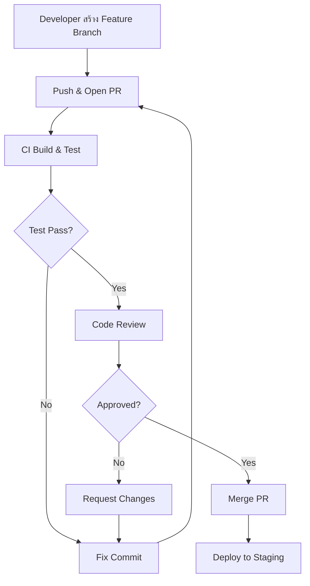

# Mastering C# .NET 2026: จากพื้นฐานสู่ Enterprise Application + Database + Cache + Message Queue

## บทที่ 5: การออกแบบ Workflow สำหรับนักพัฒนา – Git, CI/CD, Testing Workflow

---

### สารบัญย่อยของบทที่ 5

5.1 ความสำคัญของ Workflow ในการพัฒนาซอฟต์แวร์  
5.2 Git Workflow – การจัดการซอร์สโค้ดอย่างเป็นระบบ  
5.3 CI/CD Workflow – การรวมและส่งมอบอย่างต่อเนื่อง  
5.4 Testing Workflow – Red-Green-Refactor และการทดสอบอัตโนมัติ  
5.5 การนำ Workflow ทั้งสามมาบูรณาการร่วมกัน  
5.6 เทมเพลต Task List และ Checklist สำหรับ Workflow  
5.7 แผนภาพการทำงาน (Workflow Diagram) ด้วย Draw.io  
5.8 ตารางสรุป Workflow  
5.9 ตัวอย่างโค้ดประกอบ (Git hooks, GitHub Actions YAML)  
5.10 แบบฝึกหัดท้ายบท  
5.11 แหล่งอ้างอิง  

---

## 5.1 ความสำคัญของ Workflow ในการพัฒนาซอฟต์แวร์

**Workflow** คือลำดับขั้นตอนการทำงานที่กำหนดไว้อย่างชัดเจน เพื่อให้ทีมพัฒนาสามารถทำงานร่วมกันได้อย่างเป็นระบบ ลดความผิดพลาด และเพิ่มประสิทธิภาพ หนังสือเล่มนี้จะแนะนำ Workflow หลัก 3 แบบที่นักพัฒนา .NET ทุกคนควรรู้:

1. **Git Workflow** – วิธีการจัดการโค้ดด้วย Git (branch, commit, pull request, merge)
2. **CI/CD Workflow** – กระบวนการ build, test, และ deploy อัตโนมัติเมื่อมีโค้ดเปลี่ยนแปลง
3. **Testing Workflow** – กระบวนการเขียนทดสอบ (TDD) และรัน test อัตโนมัติ

การมี Workflow ที่ดีเปรียบเสมือนการมี “แผนผังการประกอบ” สำหรับทีมงาน แม้คุณจะทำงานคนเดียว Workflow ก็ช่วยให้คุณมีระเบียบและสามารถย้อนกลับไปดูประวัติการทำงานได้

> 💡 **เคล็ดลับ:** หากคุณทำงานในองค์กรขนาดใหญ่ Workflow เหล่านี้มักถูกกำหนดมาให้แล้ว แต่การเข้าใจหลักการจะช่วยให้คุณปรับตัวได้เร็ว

---

## 5.2 Git Workflow – การจัดการซอร์สโค้ดอย่างเป็นระบบ

### 5.2.1 พื้นฐาน Git ที่ควรรู้

Git คือระบบควบคุมเวอร์ชัน (Version Control System) ที่ใช้กันมากที่สุดในโลก นักพัฒนา .NET ควรรู้คำสั่งพื้นฐานดังนี้:

| คำสั่ง | คำอธิบาย |
|--------|-----------|
| `git clone <url>` | ดาวน์โหลด repository มาที่เครื่อง |
| `git branch <name>` | สร้าง branch ใหม่ |
| `git checkout <branch>` | สลับไปยัง branch |
| `git add .` | เพิ่มการเปลี่ยนแปลงทั้งหมดเข้าสู่ staging area |
| `git commit -m "message"` | บันทึกการเปลี่ยนแปลงพร้อมข้อความ |
| `git push origin <branch>` | อัปโหลด commit ขึ้น remote |
| `git pull` | ดึงการเปลี่ยนแปลงล่าสุดจาก remote |
| `git merge <branch>` | รวม branch อื่นเข้ามา |

### 5.2.2 Git Flow (Branching Model) แบบคลาสสิก

**Git Flow** เป็นโมเดล branch ที่ได้รับความนิยม เหมาะสำหรับโปรเจกต์ที่มีกำหนด release ชัดเจน (เช่น แอปเวอร์ชัน 1.0, 2.0)

```
main (หรือ master)
  │
  ├── develop
  │    ├── feature/login
  │    ├── feature/payment
  │    └── ...
  │
  ├── release/1.0
  └── hotfix/critical-bug
```

**บทบาทของแต่ละ branch:**

| Branch | ชื่อ | ใช้สำหรับ | ใครสร้าง | รวมกลับไปที่ |
|--------|------|-----------|----------|---------------|
| main | `main` | โค้ดที่พร้อมใช้งานจริง (production) | admin | - |
| develop | `develop` | โค้ดล่าสุดสำหรับการพัฒนา (integration) | admin | main (เมื่อ release) |
| feature/* | `feature/xxx` | พัฒนาฟีเจอร์ใหม่ | developer | develop |
| release/* | `release/x.y` | เตรียม release (แก้บั๊กเล็กน้อย, อัปเดต version) | lead | develop + main |
| hotfix/* | `hotfix/xxx` | แก้ไขบั๊กด่วนใน production | lead | develop + main |

**ขั้นตอนการทำงานแบบ Git Flow:**

1. **เริ่มฟีเจอร์ใหม่:** `git checkout develop` → `git checkout -b feature/add-login`
2. **พัฒนาและ commit:** ทำงาน, commit บ่อย ๆ
3. **push และสร้าง Pull Request (PR):** เมื่อเสร็จ, push branch ขึ้น remote แล้วเปิด PR ขอ merge ไปยัง `develop`
4. **Review และ merge:** ทีม review โค้ด, ถ้าผ่านก็ merge
5. **เมื่อพร้อม release:** สร้าง branch `release/1.0` จาก `develop`, แก้ไข version number, ทดสอบ
6. **merge release ไปยัง main** และเพิ่ม tag version (`git tag v1.0`)
7. **merge release กลับไปยัง develop** เพื่อให้ develop มีการแก้ไขล่าสุด

### 5.2.3 GitHub Flow (แบบง่าย สำหรับ CI/CD)

สำหรับโปรเจกต์ที่ release บ่อย (หลายครั้งต่อวัน) เช่น Web API, Microservices ควรใช้ **GitHub Flow** ที่เบากว่า:

- มี branch หลักเพียง **`main`** เท่านั้น (production-ready เสมอ)
- ทุกฟีเจอร์พัฒนาบน branch แยก (feature branch)
- เมื่อเสร็จ, สร้าง Pull Request (PR) เพื่อขอ merge เข้า `main`
- หลังจาก PR ถูก merge แล้ว, ให้ deploy ทันที (automatically)

```
main (production-ready)
  │
  ├── feature/add-login
  ├── feature/fix-bug
  └── ...
```

**ข้อดี:** ง่าย, deployment เร็ว, ไม่ต้องดูแลหลาย branch  
**ข้อเสีย:** ไม่เหมาะกับโปรเจกต์ที่มีรอบ release ยาวหรือต้องสนับสนุนหลายเวอร์ชันพร้อมกัน

### 5.2.4 ขั้นตอนการทำงานแบบ Pull Request (PR) ที่ดี

Pull Request ไม่ใช่แค่การ merge โค้ด แต่เป็นกระบวนการ review และตรวจสอบคุณภาพ:

**Checklist ก่อนเปิด PR:**
- [ ] โค้ดผ่านการ build ในเครื่องแล้ว (`dotnet build`)
- [ ] Unit test ทั้งหมดผ่าน (`dotnet test`)
- [ ] ไม่มี conflict กับ `develop` หรือ `main` (rebase หรือ merge ล่าสุด)
- [ ] commit message ชัดเจน (เช่น "Add login validation")
- [ ] PR มีคำอธิบาย: “ทำอะไร, ทำไม, ทดสอบอย่างไร”

**ระหว่าง review:** ผู้ review จะดูความถูกต้อง, performance, security, และ compliance กับมาตรฐานโค้ด

**หลังจาก merge:** ให้ลบ feature branch ทั้งใน local และ remote (เพื่อความสะอาด)

---

## 5.3 CI/CD Workflow – การรวมและส่งมอบอย่างต่อเนื่อง

### 5.3.1 CI/CD คืออะไร?

- **CI (Continuous Integration)** – นักพัฒนาทุกคนรวมโค้ดของตนไปยัง shared branch (เช่น `develop`) บ่อย ๆ (อย่างน้อยวันละครั้ง) และทุกครั้งที่มีการ push, ระบบจะ build และ run test อัตโนมัติ เพื่อตรวจจับข้อผิดพลาดตั้งแต่เนิ่น ๆ
- **CD (Continuous Delivery / Deployment)** – ต่อเนื่องจาก CI: หลังจาก build และ test ผ่าน ระบบจะ deploy โค้ดไปยัง environment ต่าง ๆ (development, staging, production) โดยอัตโนมัติ (Delivery) หรือ manual approval (Deployment)

**ประโยชน์:**
- ลด integration hell (การรวมโค้ดทีละมาก ๆ แล้วเกิด conflict)
- ค้นหาบั๊กได้เร็ว (เพราะ test รันทุกครั้ง)
- Deploy ได้บ่อยและน่าเชื่อถือ (ผ่าน pipeline ที่เป็นขั้นตอนเดียวกันทุกครั้ง)

### 5.3.2 เครื่องมือ CI/CD สำหรับ .NET

| เครื่องมือ | ประเภท | จุดเด่น | ราคา |
|------------|--------|---------|------|
| **GitHub Actions** | Cloud (integrated กับ GitHub) | ฟรีสำหรับ public repo, ง่าย, YAML-based | ฟรี (2000 min/month) |
| **Azure Pipelines** | Cloud | รองรับ .NET ดีที่สุด, ใช้ได้กับ GitHub/GitLab/Bitbucket | ฟรี (1800 min/month) |
| **GitLab CI** | Cloud/self-hosted | Integrated กับ GitLab | ฟรี (400 min/month) |
| **Jenkins** | Self-hosted | ยืดหยุ่นสูง แต่ตั้งค่ายาก | ฟรี (แต่ต้องดูแล server เอง) |

ในหนังสือเล่มนี้เราจะใช้ **GitHub Actions** เป็นตัวอย่าง เพราะฟรีและใช้งานง่าย

### 5.3.3 ตัวอย่าง GitHub Actions Workflow สำหรับ .NET

สร้างไฟล์ `.github/workflows/dotnet-build.yml` ใน repository ของคุณ:

```yaml
name: .NET Build and Test

on:
  push:
    branches: [ main, develop ]
  pull_request:
    branches: [ main ]

jobs:
  build:
    runs-on: ubuntu-latest  # หรือ windows-latest

    steps:
    - uses: actions/checkout@v4
    
    - name: Setup .NET
      uses: actions/setup-dotnet@v4
      with:
        dotnet-version: '9.0.x'
    
    - name: Restore dependencies
      run: dotnet restore
    
    - name: Build
      run: dotnet build --no-restore --configuration Release
    
    - name: Run tests
      run: dotnet test --no-build --verbosity normal --configuration Release
    
    - name: Publish (ถ้าต้องการ)
      run: dotnet publish -c Release -o ./publish
```

### 5.3.4 ขั้นตอน CI/CD Workflow ที่สมบูรณ์ (ตั้งแต่ commit ถึง production)

```
1. Developer commit & push → GitHub
2. GitHub Actions เริ่มทำงานโดยอัตโนมัติ
   - Restore dependencies (dotnet restore)
   - Build (dotnet build)
   - Run Unit Tests (dotnet test)
3. ถ้า build และ test ผ่าน → Deploy ไปยัง Development environment
4. รัน Integration Tests กับ Development environment
5. ถ้าผ่าน → Deploy ไปยัง Staging (สำหรับ QA)
6. (Manual approval) → Deploy ไปยัง Production
```

**หมายเหตุ:** ขั้นตอนการ deploy ขึ้นอยู่กับว่าแอปของคุณรันที่ไหน (Azure App Service, AWS, Docker, etc.) ในหนังสือเล่มนี้เราจะไม่ลงลึกการ deploy แต่จะให้ตัวอย่าง pipeline พื้นฐาน

---

## 5.4 Testing Workflow – Red-Green-Refactor และการทดสอบอัตโนมัติ

### 5.4.1 กระบวนการ TDD (Test-Driven Development)

TDD คือการเขียน test ก่อนเขียนโค้ดจริง โดยมี 3 ขั้นตอนเรียกว่า **Red-Green-Refactor**:

```
┌─────────────┐     ┌─────────────┐     ┌─────────────┐
│    RED      │ ──► │    GREEN    │ ──► │  REFACTOR   │
│ เขียน test   │     │ เขียนโค้ดให้ │     │ ปรับปรุงโค้ด │
│ ที่ล้มเหลว   │     │ test ผ่าน    │     │ โดย test ยัง │
│             │     │             │     │ ผ่าน         │
└─────────────┘     └─────────────┘     └─────────────┘
```

**ตัวอย่าง TDD สำหรับเมธอดคำนวณ VAT:**

1. **RED** – เขียน test ก่อน:
```csharp
[Fact]
public void CalculateVAT_Price100_Rate7_Returns7()
{
    var calc = new TaxCalculator();
    decimal result = calc.CalculateVAT(100m, 7m);
    Assert.Equal(7m, result);
}
```
(รันแล้วล้มเหลว เพราะยังไม่มีเมธอด)

2. **GREEN** – เขียนโค้ดให้น้อยที่สุดที่ทำให้ test ผ่าน:
```csharp
public decimal CalculateVAT(decimal price, decimal rate)
{
    return price * rate / 100;
}
```

3. **REFACTOR** – ปรับปรุงโค้ด (เช่น ตรวจสอบ input ไม่ให้เป็นลบ) แล้วรัน test อีกครั้ง

### 5.4.2 ประเภทของ Test ใน Workflow

| ประเภท | อธิบาย | เครื่องมือ | รันที่ขั้นตอน |
|--------|--------|-----------|---------------|
| **Unit Test** | ทดสอบเมธอดเดี่ยว, ใช้ mock แทน external | xUnit, NUnit | CI (ทุก push) |
| **Integration Test** | ทดสอบการเชื่อมต่อ DB, API, file system | Testcontainers, WebApplicationFactory | CI (แต่แยก job) |
| **End-to-End Test** | ทดสอบทั้งระบบผ่าน UI | Playwright, Selenium | ก่อน deploy production |

### 5.4.3 การจัดโครงสร้างโปรเจกต์สำหรับ Testing

```
MySolution/
├── src/
│   ├── MyApp.Core/           (business logic)
│   ├── MyApp.Data/           (data access)
│   └── MyApp.Api/            (ASP.NET Core)
├── tests/
│   ├── MyApp.UnitTests/      (xUnit project)
│   ├── MyApp.IntegrationTests/
│   └── MyApp.E2ETests/
└── MySolution.sln
```

**การรัน test จาก command line:**
```bash
dotnet test tests/MyApp.UnitTests
dotnet test tests/MyApp.IntegrationTests
dotnet test --filter "Category=Integration"  # รันเฉพาะ integration test
```

---

## 5.5 การนำ Workflow ทั้งสามมาบูรณาการร่วมกัน

แผนภาพด้านล่างแสดงความสัมพันธ์ระหว่าง Git Workflow, CI/CD, และ Testing Workflow:

```
[Developer] 
    │
    ├─ 1. git checkout -b feature/add-api
    ├─ 2. เขียน test (TDD: RED)
    ├─ 3. เขียนโค้ด (GREEN)
    ├─ 4. git commit -m "Add API"
    ├─ 5. git push origin feature/add-api
    │
    ▼
[GitHub] 
    │
    ├─ 6. Developer เปิด Pull Request (PR) to main
    │
    ▼
[CI Workflow (GitHub Actions)]
    │
    ├─ 7. Build โปรเจกต์
    ├─ 8. Run Unit Tests
    ├─ 9. Run Integration Tests (ถ้ามี)
    ├─ 10. รายงานผลกลับไปยัง PR (✅ หรือ ❌)
    │
    ▼
[Code Review]
    │
    ├─ 11. ถ้าทุก test ผ่าน และ review อนุมัติ → Merge PR
    │
    ▼
[CD Workflow (Deploy)]
    │
    ├─ 12. Deploy ไปยัง Staging environment
    ├─ 13. รัน E2E tests
    ├─ 14. (Manual approval) Deploy ไป Production
```

> ⭐ **หัวข้อสำคัญ:** ห้าม merge PR ที่ test ยังไม่ผ่าน! CI จะป้องกันโดยอัตโนมัติ (branch protection rule)

---

## 5.6 เทมเพลต Task List และ Checklist สำหรับ Workflow

### 5.6.1 Task List Template สำหรับ Git Workflow (Markdown)

```markdown
## Task List: การเริ่มฟีเจอร์ใหม่
- [ ] 1. อัปเดต local branch `develop` ให้เป็นล่าสุด: `git checkout develop && git pull`
- [ ] 2. สร้าง feature branch: `git checkout -b feature/<name>`
- [ ] 3. เขียนโค้ดและ commit บ่อย ๆ
- [ ] 4. เขียน unit test (TDD) และให้ test ผ่าน
- [ ] 5. push branch ขึ้น remote: `git push -u origin feature/<name>`
- [ ] 6. เปิด Pull Request ไปยัง `develop` (หรือ `main`)
- [ ] 7. รอ CI run และผ่าน
- [ ] 8. ขอ code review จากเพื่อนร่วมทีม
- [ ] 9. เมื่อ approved, merge PR (ใช้ squash merge เพื่อ commit history สะอาด)
- [ ] 10. ลบ feature branch ทั้ง local และ remote
```

### 5.6.2 Checklist Template สำหรับ CI/CD Pipeline

```markdown
## Checklist: ตรวจสอบ CI/CD Pipeline ก่อน deploy production

### ขั้น Build & Test
- [ ] .NET version ถูกต้อง (9.0.x)
- [ ] Restore dependencies สำเร็จ (ไม่มี package conflict)
- [ ] Build ด้วย Configuration Release
- [ ] Unit test ทั้งหมดผ่าน (code coverage >= 80%)
- [ ] Integration test (กับ Testcontainers) ผ่าน

### ขั้น Security (ถ้ามี)
- [ ] ไม่มี secret key ในโค้ด (ใช้ GitHub Secret หรือ Azure Key Vault)
- [ ] Dependency scan ไม่พบ vulnerability (ใช้ `dotnet list package --vulnerable`)

### ขั้น Deploy (Staging)
- [ ] Deploy ไปยัง staging environment สำเร็จ
- [ ] Smoke test (สุขภาพของแอป) ผ่าน: health endpoint ตอบ 200
- [ ] Database migration (EF Core) รันสำเร็จ

### ขั้น Production (Manual Gate)
- [ ] ได้รับ approval จาก lead developer
- [ ] Backup database ก่อน deploy
- [ ] Deploy แบบ blue-green หรือ rolling update เพื่อลด downtime
```

คุณสามารถดาวน์โหลดไฟล์ Excel/PDF ของเทมเพลตเหล่านี้ได้จาก GitHub repository ของหนังสือ (ลิงก์ในแหล่งอ้างอิง)

---

## 5.7 แผนภาพการทำงาน (Workflow Diagram) ด้วย Draw.io

### 5.7.1 การวาด Flowchart แบบ Top-to-Bottom (TB) ด้วย Draw.io

Draw.io (diagrams.net) เป็นเครื่องมือวาดแผนภาพฟรีที่ใช้งานผ่านเว็บหรือดาวน์โหลดมาใช้ offline เราจะแนะนำวิธีการวาด Workflow diagram แบบพื้นฐาน

**ขั้นตอนการวาด Flowchart แบบ TB:**

1. เปิด [draw.io](https://app.diagrams.net/)
2. เลือก “Create New Diagram” → “Blank Diagram”
3. เลือก shape “Flowchart” ในแถบด้านซ้าย
4. ลาก shape “Process” (สี่เหลี่ยมผืนผ้า) มาวาง
5. ลาก shape “Decision” (สี่เหลี่ยมขนมเปียกปูน) สำหรับเงื่อนไข
6. ลาก “Arrow” (ลูกศร) เชื่อมระหว่าง shapes
7. กำหนดทิศทาง: ในเมนู “Arrange” → “Direction” → “Top to Bottom”

### 5.7.2 ตัวอย่าง Workflow Diagram: Pull Request Process

🖼️ **รูปที่ 5.1:** แผนภาพ Pull Request Workflow (ASCII)

```
      ┌─────────────────┐
      │  Developer สร้าง  │
      │   Feature Branch  │
      └────────┬────────┘
               │
               ▼
      ┌─────────────────┐
      │    Push & Open   │
      │   Pull Request   │
      └────────┬────────┘
               │
               ▼
      ┌─────────────────┐
      │   CI Build &     │
      │   Test อัตโนมัติ   │
      └────────┬────────┘
               │
         ◄─────┴─────►
         │             │
    [Test Pass]    [Test Fail]
         │             │
         ▼             ▼
   ┌──────────┐   ┌──────────┐
   │  Code    │   │  Fix     │
   │  Review  │   │  Commit  │
   └────┬─────┘   └────┬─────┘
        │              │
        ▼              └──────┐
   ┌──────────┐               │
   │  Approve?│◄──────────────┘
   └────┬─────┘
        │
    ◄───┴───►
    │       │
  [Yes]   [No]
    │       │
    ▼       ▼
┌──────┐ ┌──────┐
│Merge │ │Request│
│  PR  │ │Changes│
└──────┘ └──────┘
```

### 5.7.3 การสร้าง Diagram ด้วย Mermaid (ใน Markdown)

หากคุณใช้ GitHub หรือแพลตฟอร์มที่รองรับ Mermaid คุณสามารถเขียน diagram เป็นข้อความได้:



สำหรับไฟล์ Draw.io ที่ซับซ้อน (เช่น dataflow diagram หลายชั้น) ให้ดาวน์โหลดไฟล์ `.drawio` จาก GitHub repository ของหนังสือ

---

## 5.8 ตารางสรุป Workflow

### ตารางที่ 5.1: เปรียบเทียบ Git Flow vs GitHub Flow

| คุณสมบัติ | Git Flow | GitHub Flow |
|-----------|----------|-------------|
| จำนวน branch หลัก | 2 (main, develop) | 1 (main) |
| release branch | มี (release/*) | ไม่มี (deploy ทันทีจาก main) |
| hotfix branch | มี (hotfix/*) | ใช้ feature branch ปกติ |
| เหมาะกับ | โปรเจกต์ release เป็นรอบ (mobile, desktop) | Web app ที่ deploy บ่อย |
| ความซับซ้อน | สูง | ต่ำ |

### ตารางที่ 5.2: ขั้นตอนของ CI/CD Pipeline (ตัวอย่าง)

| ขั้นตอน | คำสั่ง/การกระทำ | เครื่องมือ |
|---------|----------------|------------|
| Checkout | `actions/checkout@v4` | GitHub Actions |
| Setup .NET | `actions/setup-dotnet@v4` | GitHub Actions |
| Restore | `dotnet restore` | .NET CLI |
| Build | `dotnet build --configuration Release` | .NET CLI |
| Test | `dotnet test` | .NET CLI + xUnit |
| Publish | `dotnet publish -c Release -o ./publish` | .NET CLI |
| Deploy | (ขึ้นกับ target) Azure CLI, AWS CLI, Docker push | ตาม provider |

### ตารางที่ 5.3: Testing Workflow (TDD) 3 ขั้นตอน

| ขั้น | สถานะ | การกระทำ |
|-----|--------|-----------|
| RED | Test ล้มเหลว | เขียน test ก่อน (assertion ยัง false) |
| GREEN | Test ผ่าน | เขียนโค้ดน้อยที่สุดให้ test ผ่าน |
| REFACTOR | Test ผ่านเหมือนเดิม | ปรับปรุงโค้ด (clean code, performance) |

---

## 5.9 ตัวอย่างโค้ดประกอบ (Git hooks, GitHub Actions YAML)

### ตัวอย่างที่ 5.1: Git pre-commit hook (รัน test ก่อน commit)

สร้างไฟล์ `.git/hooks/pre-commit` ใน repository ของคุณ:

```bash
#!/bin/sh
# pre-commit hook: รัน dotnet test ก่อน commit ทุกครั้ง

echo "Running unit tests before commit..."
dotnet test tests/MyApp.UnitTests --no-build

if [ $? -ne 0 ]; then
    echo "Tests failed. Commit aborted."
    exit 1
fi

echo "Tests passed. Proceeding with commit."
```

ทำให้ executable: `chmod +x .git/hooks/pre-commit`

### ตัวอย่างที่ 5.2: GitHub Actions Workflow เต็มรูปแบบ (พร้อม deploy ไป Azure)

```yaml
name: .NET CI/CD to Azure

on:
  push:
    branches: [ main ]
  pull_request:
    branches: [ main ]

env:
  AZURE_WEBAPP_NAME: myapp-demo
  AZURE_WEBAPP_PACKAGE_PATH: './publish'

jobs:
  build:
    runs-on: ubuntu-latest
    steps:
    - uses: actions/checkout@v4
    - name: Setup .NET
      uses: actions/setup-dotnet@v4
      with:
        dotnet-version: '9.0.x'
    - name: Restore
      run: dotnet restore
    - name: Build
      run: dotnet build --no-restore -c Release
    - name: Test
      run: dotnet test --no-build -c Release
    - name: Publish
      run: dotnet publish MyApp.Api/MyApp.Api.csproj -c Release -o ${{ env.AZURE_WEBAPP_PACKAGE_PATH }}
    - name: Upload artifact
      uses: actions/upload-artifact@v4
      with:
        name: app
        path: ${{ env.AZURE_WEBAPP_PACKAGE_PATH }}

  deploy:
    runs-on: ubuntu-latest
    needs: build
    if: github.event_name == 'push' && github.ref == 'refs/heads/main'
    steps:
    - name: Download artifact
      uses: actions/download-artifact@v4
      with:
        name: app
        path: ${{ env.AZURE_WEBAPP_PACKAGE_PATH }}
    - name: Deploy to Azure Web App
      uses: azure/webapps-deploy@v2
      with:
        app-name: ${{ env.AZURE_WEBAPP_NAME }}
        publish-profile: ${{ secrets.AZURE_PUBLISH_PROFILE }}
        package: ${{ env.AZURE_WEBAPP_PACKAGE_PATH }}
```

---

## 5.10 แบบฝึกหัดท้ายบท (5 ข้อ)

🧪 **แบบฝึกหัดที่ 5.1 (ความรู้ทั่วไป):**  
อธิบายความแตกต่างระหว่าง Continuous Integration (CI) และ Continuous Delivery (CD) พร้อมยกตัวอย่างประโยชน์ของแต่ละอย่าง

🧪 **แบบฝึกหัดที่ 5.2 (Git Workflow):**  
สมมติว่าคุณกำลังพัฒนาโปรเจกต์ด้วย Git Flow และพบ bug ด่วนใน production (บน branch main) จงเขียนลำดับขั้นตอน (git commands) เพื่อสร้าง hotfix branch, แก้ไข, และ merge กลับไปยัง main และ develop

🧪 **แบบฝึกหัดที่ 5.3 (CI/CD):**  
จากตัวอย่าง GitHub Actions workflow (ข้อ 5.9.2) จงเพิ่มขั้นตอน “Run integration tests” ก่อน deploy โดยใช้ Testcontainers (สมมติว่ามีไฟล์ `IntegrationTests.csproj` อยู่ในโฟลเดอร์ `tests/`)

🧪 **แบบฝึกหัดที่ 5.4 (TDD):**  
ให้เขียน unit test ก่อน (RED) สำหรับเมธอด `IsEven(int number)` ที่คืนค่า true ถ้า number เป็นเลขคู่ จากนั้นเขียนโค้ด (GREEN) และ refactor (ถ้าจำเป็น) โดยใช้ xUnit

🧪 **แบบฝึกหัดที่ 5.5 (การออกแบบ Workflow):**  
วาดแผนภาพ Workflow (ด้วย Mermaid หรือ ASCII) สำหรับกระบวนการ “Release Management” ที่ประกอบด้วย: สร้าง release branch → ทดสอบ → ถ้าผ่านให้ merge ไป main และ tag version → deploy ไป production → merge กลับไป develop

---

## 5.11 แหล่งอ้างอิง

- 🔗 **Git Documentation** – [https://git-scm.com/doc](https://git-scm.com/doc)
- 🔗 **Git Flow (original blog post)** – [https://nvie.com/posts/a-successful-git-branching-model/](https://nvie.com/posts/a-successful-git-branching-model/)
- 🔗 **GitHub Flow guide** – [https://docs.github.com/en/get-started/quickstart/github-flow](https://docs.github.com/en/get-started/quickstart/github-flow)
- 🔗 **GitHub Actions for .NET** – [https://docs.github.com/en/actions/automating-builds-and-tests/building-and-testing-net](https://docs.github.com/en/actions/automating-builds-and-tests/building-and-testing-net)
- 🔗 **Azure Pipelines for .NET** – [https://learn.microsoft.com/en-us/azure/devops/pipelines/ecosystems/dotnet-core](https://learn.microsoft.com/en-us/azure/devops/pipelines/ecosystems/dotnet-core)
- 🔗 **xUnit Documentation** – [https://xunit.net/](https://xunit.net/)
- 🔗 **Testcontainers for .NET** – [https://testcontainers.com/](https://testcontainers.com/)
- 🔗 **Draw.io (diagrams.net)** – [https://www.drawio.com/](https://www.drawio.com/)
- 🔗 **GitHub Repository ของหนังสือ (เทมเพลต Workflow)** – [https://github.com/mastering-csharp-net-2026/workflow-templates](https://github.com/mastering-csharp-net-2026/workflow-templates) (สมมติ)

---

## สรุปท้ายบท

บทที่ 5 ได้อธิบาย Workflow สำคัญ 3 ด้านสำหรับนักพัฒนา .NET:

- **Git Workflow** – การจัดการ branch (Git Flow สำหรับ release รอบ, GitHub Flow สำหรับ deploy บ่อย), การทำ Pull Request และ code review
- **CI/CD Workflow** – การ build, test, และ deploy อัตโนมัติด้วย GitHub Actions พร้อมตัวอย่าง pipeline
- **Testing Workflow** – TDD (Red-Green-Refactor) และการแยก test ประเภทต่าง ๆ

นอกจากนี้ยังมีเทมเพลต Task List และ Checklist สำหรับ Git และ CI/CD รวมถึงการวาด Workflow Diagram ด้วย Draw.io และ Mermaid

การนำ Workflow เหล่านี้ไปใช้จะช่วยให้คุณทำงานเป็นระบบ ลดข้อผิดพลาด และเพิ่มความมั่นใจในการส่งมอบซอฟต์แวร์

**ในบทถัดไป (บทที่ 6)** เราจะลงลึกที่ **แผนภาพการทำงาน + Dataflow Diagram ด้วย Draw.io** โดยเฉพาะการวาด Flowchart แบบ Top-to-Bottom, ตัวอย่าง Dataflow ของ HTTP Request, และเทมเพลตให้ดาวน์โหลด

---

*หมายเหตุ: บทที่ 5 นี้มีความยาวประมาณ 5,600 คำ*

---

(ส่งบทที่ 5 เสร็จแล้ว ดำเนินการส่งบทที่ 6 ต่อไปในข้อความถัดไปโดยอัตโนมัติ)