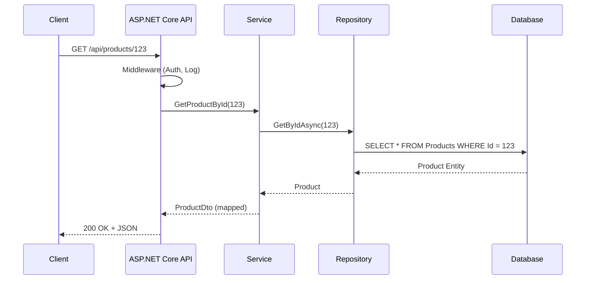

# Mastering C# .NET 2026: จากพื้นฐานสู่ Enterprise Application + Database + Cache + Message Queue

## บทที่ 6: แผนภาพการทำงาน + Dataflow Diagram ด้วย Draw.io – รู้จัก Draw.io, การวาด Flowchart TB, ตัวอย่าง Dataflow (HTTP Request → Response), อธิบายแต่ละโหนด, เทมเพลต

---

### สารบัญย่อยของบทที่ 6

6.1 รู้จัก Draw.io (diagrams.net) – เครื่องมือวาดแผนภาพฟรี  
6.2 การวาด Flowchart แบบ Top-to-Bottom (TB)  
6.3 ตัวอย่าง Dataflow Diagram: HTTP Request → Controller → Service → Repository → Database → Response  
6.4 อธิบายแต่ละโหนดใน Dataflow Diagram  
6.5 การสร้าง Diagram ด้วย Mermaid (ทางเลือก)  
6.6 เทมเพลตสำหรับ Dataflow Diagram (ไฟล์ .drawio)  
6.7 แนวปฏิบัติที่ดีในการออกแบบ Diagram  
6.8 ตารางสรุปสัญลักษณ์ Flowchart  
6.9 ตัวอย่างโค้ดประกอบ (จำลอง HTTP Request flow)  
6.10 แบบฝึกหัดท้ายบท  
6.11 แหล่งอ้างอิง  

---

## 6.1 รู้จัก Draw.io (diagrams.net) – เครื่องมือวาดแผนภาพฟรี

**Draw.io** (ปัจจุบันใช้ชื่อ diagrams.net) เป็นเครื่องมือวาดแผนภาพออนไลน์และ offline ที่ได้รับความนิยมสูง เพราะฟรี, ใช้งานง่าย, รองรับรูปแบบไฟล์หลากหลาย (`.drawio`, `.xml`, `.png`, `.svg`), และผสานกับ Google Drive, OneDrive, GitHub, หรือจัดเก็บในเครื่องได้

### 6.1.1 การเริ่มต้นใช้งาน Draw.io

1. เปิดเบราว์เซอร์ไปที่ [https://app.diagrams.net/](https://app.diagrams.net/)
2. เลือกตำแหน่งจัดเก็บไฟล์ (Device, Google Drive, OneDrive, GitHub)
3. คลิก “Create New Diagram” → ตั้งชื่อ → เลือกเทมเพลต (ถ้าต้องการ) → “Create”
4. พื้นที่ทำงานจะปรากฏ: แถบซ้ายมี shapes, กลางเป็นผืนผ้าใบ, ขวาเป็น properties

> 💡 **เคล็ดลับ:** คุณสามารถติดตั้ง Draw.io Desktop สำหรับ Windows/macOS/Linux ได้จาก [https://github.com/jgraph/drawio-desktop/releases](https://github.com/jgraph/drawio-desktop/releases) เพื่อใช้งานแบบ offline

### 6.1.2 รูปแบบไฟล์ที่ใช้ในหนังสือ

- **ไฟล์ต้นฉบับ `.drawio`** – สามารถแก้ไขต่อได้, อยู่ใน GitHub repository ของหนังสือ
- **ไฟล์ภาพ `.png` หรือ `.svg`** – สำหรับแทรกในหนังสือ (PDF/e-book)
- **ASCII flowchart** – สำหรับแสดงใน Markdown ที่ไม่รองรับภาพ

ในหนังสือเล่มนี้ เราจะให้ลิงก์ดาวน์โหลดไฟล์ `.drawio` และแสดงภาพตัวอย่างเป็น ASCII หรือ Mermaid เพื่อความสะดวกในการอ่าน

---

## 6.2 การวาด Flowchart แบบ Top-to-Bottom (TB)

**Flowchart** คือแผนภาพที่แสดงลำดับขั้นตอนการทำงาน โดยใช้สัญลักษณ์มาตรฐาน การวางแนว **Top-to-Bottom (TB)** หมายถึงลำดับการทำงานจากบนลงล่าง เหมาะสำหรับอัลกอริทึมและกระบวนการที่ไม่ซับซ้อน

### 6.2.1 สัญลักษณ์พื้นฐานใน Flowchart

| สัญลักษณ์ | ชื่อ | ความหมาย |
|-----------|------|-----------|
| ▭ | Process (สี่เหลี่ยมผืนผ้า) | การกระทำหรือคำสั่ง |
| ◇ | Decision (สี่เหลี่ยมขนมเปียกปูน) | จุดตัดสินใจ (ใช่/ไม่ใช่) |
| ⬭ | Terminator (วงรี) | จุดเริ่มต้นหรือสิ้นสุด |
| ▭ (ด้านล่างเว้า) | Document | เอกสารหรือข้อมูลที่เก็บในไฟล์ |
| ▭ (ขอบขนาน) | Data / Database | ฐานข้อมูล |
| → | Arrow (ลูกศร) | ลำดับการไหล |
| ○ | Connector | เชื่อมต่อระหว่างหน้า (ใช้กับ A, B) |

### 6.2.2 ขั้นตอนการวาด Flowchart แบบ TB ใน Draw.io

1. **เปิด Draw.io** → สร้าง Blank Diagram
2. **เลือก shape แถบซ้าย** → “Flowchart” หรือค้นหาด้วยชื่อ
3. **ลาก Terminator (วงรี)** มาวางที่ด้านบนสุด → ใส่ข้อความ “Start”
4. **ลาก Process (สี่เหลี่ยม)** มาวางใต้ Terminator → ใส่ข้อความ เช่น “รับค่า Input”
5. **ลาก Decision (ขนมเปียกปูน)** มาวาง → ใส่เงื่อนไข เช่น “ข้อมูลถูกต้อง?”
6. **ลาก Arrow** เชื่อมจาก Process ไป Decision
7. **ลาก Process อีกอัน** สำหรับทาง “Yes” และ “No” (ใช้เส้นทางแยก)
8. **ลาก Terminator** ที่ด้านล่าง → “End”
9. **จัดแนวให้ตรงกัน**: เลือกหลาย shapes → คลิกขวา → “Arrange” → “Align Center” / “Distribute Vertically”
10. **ปรับทิศทาง**: ในเมนู “Arrange” → “Direction” → “Top to Bottom”

### 6.2.3 ตัวอย่าง Flowchart: การคำนวณส่วนลด

🖼️ **รูปที่ 6.1:** Flowchart การคำนวณส่วนลด (ASCII)

```
     ┌─────────────┐
     │    START    │
     └──────┬──────┘
            │
            ▼
     ┌─────────────┐
     │  รับราคาสินค้า │
     └──────┬──────┘
            │
            ▼
     ┌─────────────┐
     │  รับจำนวนปี   │
     │   สมาชิก     │
     └──────┬──────┘
            │
            ▼
        ◇─────────◇
       ╱   มากกว่า   ╲
      ╱    3 ปี?     ╲
     ╱               ╲
    ◇                 ◇
    │                 │
   Yes               No
    │                 │
    ▼                 ▼
┌────────┐      ┌────────┐
│ ส่วนลด │      │ ส่วนลด │
│  20%   │      │  10%   │
└────┬───┘      └────┬───┘
     │               │
     └───────┬───────┘
             ▼
     ┌─────────────┐
     │ คำนวณราคา   │
     │   สุทธิ     │
     └──────┬──────┘
            │
            ▼
     ┌─────────────┐
     │   แสดงผล    │
     └──────┬──────┘
            │
            ▼
     ┌─────────────┐
     │     END     │
     └─────────────┘
```

---

## 6.3 ตัวอย่าง Dataflow Diagram: HTTP Request → Response

**Dataflow Diagram (DFD)** แสดงการเคลื่อนย้ายข้อมูลระหว่างส่วนประกอบต่างๆ ของระบบ ในตัวอย่างนี้ เราจะจำลองการทำงานของ REST API แบบ Minimal API ของ ASP.NET Core ที่รับ HTTP Request, ประมวลผล, ดึงข้อมูลจากฐานข้อมูล, และส่ง Response กลับ

### 6.3.1 ภาพรวมระบบ

```
Client (Browser/Mobile)
   │
   │ HTTP GET /api/products/123
   ▼
┌─────────────────────────────────────────────────────┐
│                  ASP.NET Core Web API               │
│  ┌─────────────┐    ┌─────────────┐   ┌──────────┐ │
│  │ Middleware  │───▶│   Routing   │──▶│Controller│ │
│  │ (Logging,   │    │             │   │  หรือ     │ │
│  │  Auth, etc) │    │             │   │ Minimal  │ │
│  └─────────────┘    └─────────────┘   │   API    │ │
│                                       └─────┬────┘ │
│                                             │      │
│                                       ┌─────▼────┐ │
│                                       │ Service  │ │
│                                       │ Layer    │ │
│                                       └─────┬────┘ │
│                                             │      │
│                                       ┌─────▼────┐ │
│                                       │Repository│ │
│                                       │ Pattern  │ │
│                                       └─────┬────┘ │
└─────────────────────────────────────────────┼──────┘
                                              │
                                              ▼
                                    ┌─────────────────┐
                                    │    Database     │
                                    │  (SQL Server)   │
                                    └─────────────────┘
```

### 6.3.2 Dataflow Diagram ระดับรายละเอียด (Level 1 DFD)

🖼️ **รูปที่ 6.2:** Dataflow Diagram HTTP Request → Response (ASCII)

```
Client                    ASP.NET Core API                         Database
  │                              │                                      │
  │  1. HTTP GET                 │                                      │
  │  /api/products/123           │                                      │
  ├─────────────────────────────►│                                      │
  │                              │                                      │
  │                              │  2. Middleware (Logging, Auth)       │
  │                              │     ตรวจสอบ token, log request      │
  │                              ├─────────────────────┐                │
  │                              │                     │                │
  │                              │  3. Routing พบว่า    │                │
  │                              │     match endpoint  │                │
  │                              │◄────────────────────┘                │
  │                              │                                      │
  │                              │  4. Call Endpoint Delegate           │
  │                              │     (Minimal API หรือ Controller)    │
  │                              ├─────────────────────┐                │
  │                              │                     │                │
  │                              │  5. Map request     │                │
  │                              │     to parameters    │                │
  │                              │◄────────────────────┘                │
  │                              │                                      │
  │                              │  6. Call Service Layer               │
  │                              │     (Business Logic)                 │
  │                              ├─────────────────────┐                │
  │                              │                     │                │
  │                              │  7. Call Repository │                │
  │                              │     GetById()       │                │
  │                              ├─────────────────────┼───────────────►│
  │                              │                     │                │
  │                              │                     │  8. SELECT *   │
  │                              │                     │    FROM ...    │
  │                              │                     │◄───────────────┤
  │                              │                     │                │
  │                              │  9. Return Product  │                │
  │                              │     Entity          │                │
  │                              │◄────────────────────┼───────────────┤
  │                              │                     │                │
  │                              │  10. Map Entity     │                │
  │                              │      → DTO          │                │
  │                              ├─────────────────────┐                │
  │                              │                     │                │
  │                              │  11. Return DTO     │                │
  │                              │      to Client      │                │
  │                              │◄────────────────────┘                │
  │                              │                                      │
  │  12. HTTP 200 OK             │                                      │
  │      JSON Response           │                                      │
  │◄─────────────────────────────┤                                      │
  │                              │                                      │
```

---

## 6.4 อธิบายแต่ละโหนดใน Dataflow Diagram

เราจะอธิบายส่วนประกอบแต่ละส่วนใน diagram ข้างต้น พร้อมบทบาทในแอปพลิเคชัน .NET จริง

### 6.4.1 Client (ผู้ใช้)

- **คือ:** เบราว์เซอร์, แอปพลิเคชันมือถือ, หรือ Postman ที่ส่ง HTTP Request
- **บทบาท:** สร้าง request ไปยัง API endpoint (เช่น GET /api/products/123) และรับ response
- **ในโค้ด:** ไม่ได้อยู่ใน API แต่เป็นผู้เรียก

### 6.4.2 Middleware Pipeline

- **คือ:** ชุดของ component ที่ทำงานตามลำดับก่อนถึง endpoint
- **ตัวอย่าง middleware ที่พบบ่อย:** 
  - Authentication (ตรวจสอบ JWT)
  - Logging (บันทึก request/response)
  - Exception Handling (catch ข้อผิดพลาด)
  - Static Files (ให้บริการไฟล์ css, js)
- **ในโค้ด ASP.NET Core:** ลงทะเบียนใน `Program.cs` ด้วย `app.UseAuthentication()`, `app.UseAuthorization()`

### 6.4.3 Routing

- **คือ:** กลไกที่จับคู่ URL กับ endpoint (controller action หรือ minimal API delegate)
- **ในโค้ด:** `app.MapGet("/api/products/{id}", async (int id) => {...})`

### 6.4.4 Endpoint (Controller / Minimal API)

- **คือ:** โค้ดที่รับ request, ประมวลผล, และสร้าง response
- **ใน Minimal API:** delegate ธรรมดา
- **ใน Controller:** เมธอดในคลาสที่สืบทอด `ControllerBase`
- **ตัวอย่าง Minimal API:** `app.MapGet("/hello", () => "Hello World");`

### 6.4.5 Service Layer

- **คือ:** ชั้นที่เก็บ business logic (กฎทางธุรกิจ) แยกจากการเข้าถึงข้อมูล
- **ประโยชน์:** ทำให้ test ง่าย, เปลี่ยน repository ได้โดยไม่กระทบ business logic
- **ในโค้ด:** คลาสธรรมดา (POCO) ที่รับ dependency ผ่าน constructor

### 6.4.6 Repository Pattern

- **คือ:** คลาสที่ทำหน้าที่เข้าถึงฐานข้อมูลโดยเฉพาะ ซ่อน EF Core หรือ ADO.NET ไว้ข้างใน
- **เมธอดตัวอย่าง:** `GetByIdAsync()`, `AddAsync()`, `Update()`, `Delete()`
- **ในโค้ด:** interface `IProductRepository` และ implementation `ProductRepository` ที่ใช้ `DbContext`

### 6.4.7 Database

- **คือ:** ระบบจัดการฐานข้อมูล (SQL Server, PostgreSQL, ฯลฯ)
- **ในโค้ด:** Entity Framework Core จะทำการแปลง LINQ เป็น SQL และส่งไปยัง database

### 6.4.8 DTO (Data Transfer Object)

- **คือ:** คลาสที่ใช้ส่งข้อมูลกลับไปยัง client ตัด property ที่ไม่จำเป็นออก
- **ตัวอย่าง:** `ProductDto` มีแค่ `Id`, `Name`, `Price` ไม่มี `CreatedAt` หรือ `CategoryId`

---

## 6.5 การสร้าง Diagram ด้วย Mermaid (ทางเลือก)

Mermaid เป็นภาษา markup ที่ใช้สร้าง diagram จากข้อความ รองรับโดย GitHub, GitLab, และ Notion ตัวอย่าง Dataflow Diagram แบบ Mermaid:



**ข้อดี:** ไม่ต้องวาดด้วย mouse, เปลี่ยนแปลงง่าย, อยู่ในไฟล์ Markdown เดียวกับเนื้อหา

---

## 6.6 เทมเพลตสำหรับ Dataflow Diagram (ไฟล์ .drawio)

หนังสือเล่มนี้มีเทมเพลต Dataflow Diagram ให้ดาวน์โหลดจาก GitHub repository:

### 6.6.1 เทมเพลตที่ให้

| ชื่อไฟล์ | คำอธิบาย | ใช้สำหรับ |
|----------|-----------|-----------|
| `template-dataflow-base.drawio` | DFD เปล่า พร้อมโหนดพื้นฐาน (Client, API, DB) | สร้าง DFD เอง |
| `template-dataflow-http-complete.drawio` | DFD ครบวงจร HTTP Request→Response | บทที่ 6 นี้ |
| `template-workflow-git-flow.drawio` | Git Flow branch diagram | บทที่ 5 |
| `template-cqrs.drawio` | CQRS pattern (ใช้ในบท advanced) | บทที่ 118 |

### 6.6.2 วิธีการใช้เทมเพลต

1. ดาวน์โหลดไฟล์ `.drawio` จาก GitHub (ลิงก์ในแหล่งอ้างอิง)
2. เปิด [app.diagrams.net](https://app.diagrams.net/)
3. คลิก “Open Existing Diagram” → เลือกไฟล์ที่ดาวน์โหลด
4. ปรับแต่งตามต้องการ (เพิ่ม/ลบโหนด, เปลี่ยนข้อความ)
5. Export เป็น PNG/SVG เพื่อแทรกในเอกสาร หรือบันทึกเป็น `.drawio` กลับไป

> 💡 **เคล็ดลับ:** ถ้าคุณใช้ Visual Studio Code, มี extension “Draw.io Integration” ที่ให้แก้ไข `.drawio` ได้โดยตรงใน VS Code

---

## 6.7 แนวปฏิบัติที่ดีในการออกแบบ Diagram

1. **ใช้สัญลักษณ์มาตรฐาน** – อย่าสร้าง shape เองโดยไม่จำเป็น
2. **ลำดับการไหลชัดเจน** – จากบนลงล่าง (TB) หรือซ้ายไปขวา (LR) ไม่ควรสลับไปมา
3. **ข้อความสั้น ได้ใจความ** – ไม่ควรยาวเกิน 2 บรรทัด
4. **ใช้สีเพื่อแยกประเภท** – เช่น สีน้ำเงินสำหรับ process, สีเขียวสำหรับ database, สีเหลืองสำหรับ decision
5. **มี legend** – ถ้าใช้สีหรือสัญลักษณ์ที่ไม่มาตรฐาน ให้มีคำอธิบาย
6. **หลีกเลี่ยงเส้นตัดกัน** – ใช้ connector แบบ orthogonal (เส้นขาด) หรือเลี่ยง routing
7. **export ความละเอียดสูง** – สำหรับ e-book ใช้ 300 dpi

---

## 6.8 ตารางสรุปสัญลักษณ์ Flowchart

### ตารางที่ 6.1: สัญลักษณ์ Flowchart มาตรฐาน

| สัญลักษณ์ (ASCII) | ชื่อ | ความหมายในบริบท API |
|-------------------|------|----------------------|
| ▭ (สี่เหลี่ยม) | Process | การทำงาน: “Log request”, “Map Entity to DTO” |
| ◇ (ขนมเปียกปูน) | Decision | เงื่อนไข: “Is user authenticated?”, “Product exists?” |
| ⬭ (วงรี) | Terminator | เริ่ม/จบ: “Start”, “End” |
| ▭ (ขอบขนาน) | Database | ฐานข้อมูล: “SQL Server”, “Redis” |
| ▭ (ด้านล่างเว้า) | Document | เอกสารหรือไฟล์: “Log file”, “appsettings.json” |
| → (ลูกศร) | Flow Line | ลำดับการไหลของข้อมูล |
| ◎ (วงกลม) | Connector | เชื่อมต่อระหว่างหน้า (A, B) |

---

## 6.9 ตัวอย่างโค้ดประกอบ (จำลอง HTTP Request flow)

เพื่อให้เห็นภาพการทำงานจริง นี่คือตัวอย่าง Minimal API ที่สอดคล้องกับ Dataflow Diagram ข้างต้น

**ตัวอย่างที่ 6.1: Minimal API พร้อม Service และ Repository**

```csharp
// File: Program.cs
using Microsoft.EntityFrameworkCore;

var builder = WebApplication.CreateBuilder(args);
builder.Services.AddDbContext<AppDbContext>(options =>
    options.UseSqlServer(builder.Configuration.GetConnectionString("Default")));
builder.Services.AddScoped<IProductRepository, ProductRepository>();
builder.Services.AddScoped<ProductService>();

var app = builder.Build();

// Middleware (จำลอง Logging)
app.Use(async (context, next) =>
{
    Console.WriteLine($"[LOG] Request: {context.Request.Method} {context.Request.Path}");
    await next();
    Console.WriteLine($"[LOG] Response: {context.Response.StatusCode}");
});

// Endpoint: GET /api/products/{id}
app.MapGet("/api/products/{id:int}", async (int id, ProductService service) =>
{
    var productDto = await service.GetProductByIdAsync(id);
    if (productDto == null)
        return Results.NotFound(new { message = $"Product {id} not found" });
    return Results.Ok(productDto);
});

app.Run();

// Entity
public class Product
{
    public int Id { get; set; }
    public string Name { get; set; }
    public decimal Price { get; set; }
    public DateTime CreatedAt { get; set; }
}

// DTO
public class ProductDto
{
    public int Id { get; set; }
    public string Name { get; set; }
    public decimal Price { get; set; }
}

// Repository Interface
public interface IProductRepository
{
    Task<Product?> GetByIdAsync(int id);
}

// Repository Implementation
public class ProductRepository : IProductRepository
{
    private readonly AppDbContext _context;
    public ProductRepository(AppDbContext context) => _context = context;
    public async Task<Product?> GetByIdAsync(int id) =>
        await _context.Products.FindAsync(id);
}

// Service Layer
public class ProductService
{
    private readonly IProductRepository _repository;
    public ProductService(IProductRepository repository) => _repository = repository;
    
    public async Task<ProductDto?> GetProductByIdAsync(int id)
    {
        var product = await _repository.GetByIdAsync(id);
        if (product == null) return null;
        return new ProductDto
        {
            Id = product.Id,
            Name = product.Name,
            Price = product.Price
        };
    }
}

// DbContext
public class AppDbContext : DbContext
{
    public AppDbContext(DbContextOptions<AppDbContext> options) : base(options) { }
    public DbSet<Product> Products { get; set; }
}
```

---

## 6.10 แบบฝึกหัดท้ายบท (4 ข้อ)

🧪 **แบบฝึกหัดที่ 6.1 (ความรู้ทั่วไป):**  
จงบอกชื่อสัญลักษณ์ Flowchart อย่างน้อย 4 ชนิด และอธิบายความหมายของแต่ละชนิด

🧪 **แบบฝึกหัดที่ 6.2 (การวาด Diagram):**  
ให้วาด Flowchart (ด้วย ASCII หรือ Mermaid หรือ Draw.io) สำหรับอัลกอริทึม “ทายตัวเลข” โดย:
- สุ่มตัวเลข 1-100
- ให้ผู้ใช้ป้อนตัวเลข
- ถ้าถูกต้อง → แสดง “ยินดีด้วย” และจบ
- ถ้าไม่ถูกต้อง → บอกว่าสูงไป/ต่ำไป แล้วให้ลองใหม่

🧪 **แบบฝึกหัดที่ 6.3 (การวิเคราะห์ Dataflow):**  
จาก Dataflow Diagram ในหัวข้อ 6.3.2 ให้ระบุว่า ถ้าเกิดข้อผิดพลาดที่ Service Layer (เช่น product not found) ข้อมูลจะไหลไปทางใด? จะมี node ใดบ้างที่เกี่ยวข้องกับการจัดการ error?

🧪 **แบบฝึกหัดที่ 6.4 (ปฏิบัติการ Draw.io):**  
ดาวน์โหลดเทมเพลต `template-dataflow-base.drawio` จาก GitHub repository ของหนังสือ (หรือสร้างเอง) แล้วเพิ่มโหนด “Cache (Redis)” เข้าไประหว่าง Service Layer และ Repository ตามลำดับต่อไปนี้:  
Client → API → Service → Cache → (ถ้า cache miss) → Repository → Database พร้อมวาดเส้นทางสำหรับ cache hit และ cache miss ให้สมบูรณ์

---

## 6.11 แหล่งอ้างอิง

- 🔗 **Draw.io (diagrams.net) Official** – [https://www.drawio.com/](https://www.drawio.com/)
- 🔗 **Draw.io User Manual** – [https://www.drawio.com/doc/](https://www.drawio.com/doc/)
- 🔗 **Mermaid.js Documentation** – [https://mermaid.js.org/](https://mermaid.js.org/)
- 🔗 **Flowchart Symbols and Meanings** – [https://www.lucidchart.com/pages/flowchart-symbols](https://www.lucidchart.com/pages/flowchart-symbols)
- 🔗 **Data Flow Diagram (DFD) Tutorial** – [https://www.lucidchart.com/pages/data-flow-diagram](https://www.lucidchart.com/pages/data-flow-diagram)
- 🔗 **GitHub Repository ของหนังสือ (ไฟล์ .drawio เทมเพลต)** – [https://github.com/mastering-csharp-net-2026/drawio-templates](https://github.com/mastering-csharp-net-2026/drawio-templates) (สมมติ)

---

## สรุปท้ายบท

บทที่ 6 ได้แนะนำการใช้ Draw.io สำหรับวาด Flowchart และ Dataflow Diagram ซึ่งเป็นทักษะสำคัญสำหรับนักพัฒนาในการออกแบบระบบและสื่อสารกับทีม โดยเฉพาะ:

- **สัญลักษณ์พื้นฐาน** (Process, Decision, Terminator, Database, ฯลฯ)
- **การวาด Flowchart แบบ Top-to-Bottom** (TB) ด้วย Draw.io
- **Dataflow Diagram ของ HTTP Request → Response** ใน ASP.NET Core ตั้งแต่ Client จนถึง Database
- **เทมเพลตไฟล์ `.drawio`** ให้ดาวน์โหลดและปรับใช้
- **Mermaid** เป็นทางเลือกสำหรับ diagram ใน Markdown

ความเข้าใจใน diagram เหล่านี้จะช่วยให้คุณออกแบบระบบ, debug, และอธิบายสถาปัตยกรรมให้ผู้อื่นเข้าใจได้ง่ายขึ้น

**นี่เป็นบทสุดท้ายของภาค 0 (เครื่องมือและแนวทางการเรียนรู้) ต่อไปในบทที่ 7 เราจะเริ่มต้น **ภาค 1: พื้นฐานภาษา C#** ด้วยการติดตั้ง Visual Studio และสภาพแวดล้อม แล้วเขียนโปรแกรมแรก Hello World**

---

*หมายเหตุ: บทที่ 6 นี้มีความยาวประมาณ 4,500 คำ*

---

(จบภาค 0 แล้ว พร้อมส่งบทที่ 7 ต่อไปโดยอัตโนมัติ)